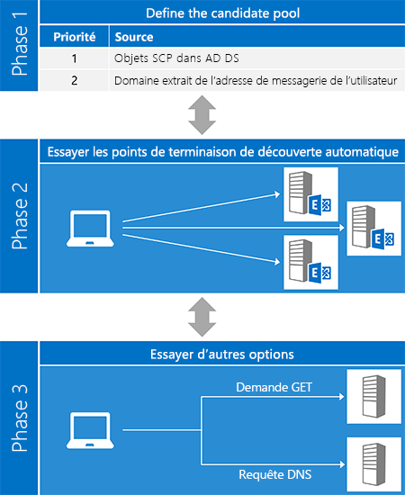
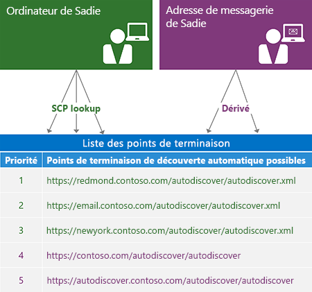
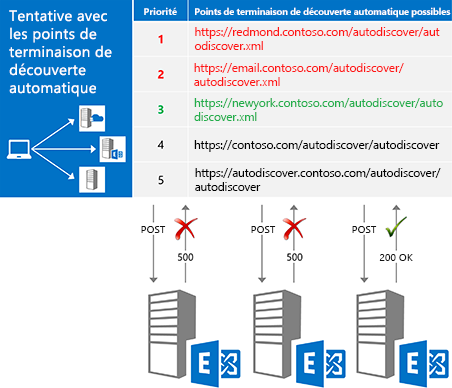
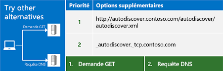

# Découverte automatique pour ExchangeAutodiscover for Exchange

Ce document peut contenir des informations liées aux fonctionnalités ou produits préliminaires qui sont sujettes à modifications avant la sortie de la version définitive. Ce document est fourni "tel quel" à titre indicatif et Microsoft exclut toute garantie, expresse ou implicite, en ce qui concerne ce document. En savoir plus sur le service de découverte automatique dans Exchange.Learn about the Autodiscover service in Exchange.
  
Le service de découverte automatique d'Exchange offre un moyen facile pour votre application cliente de se configurer elle-même avec une entrée utilisateur minimale. La plupart des utilisateurs connaissent leur adresse de messagerie et leur mot de passe, et avec ces deux informations, vous pouvez récupérer tous les autres détails nécessaires pour être opérationnel. Pour les clients des services web Exchange (EWS), la découverte automatique est généralement utilisée pour rechercher l'URL du point de terminaison EWS. Mais la découverte automatique peut également fournir des informations permettant de configurer les clients qui utilisent d'autres protocoles. Le service de découverte automatique fonctionne pour les applications clientes qui sont à l'intérieur ou à l'extérieur des pare-feu, ainsi que dans des scénarios de forêt de ressources et de forêts multiples.The Exchange Autodiscover service provides an easy way for your client application to configure itself with minimal user input. Most users know their email address and password, and with those two pieces of information, you can retrieve all the other details you need to get up and running. For Exchange Web Services (EWS) clients, Autodiscover is typically used to find the EWS endpoint URL, but Autodiscover can also provide information to configure clients that use other protocols. Autodiscover works for client applications that are inside or outside firewalls and will work in resource forest and multiple forest scenarios.
  
## Vue d'ensemble du processus de découverte automatiqueOverview of the Autodiscover process

Le processus de découverte automatique est essentiellement constitué de trois phases. Dans la première phase, vous générez une liste de serveurs de découverte automatique potentiels et au cours de la deuxième phase, vous essayez chaque serveur de votre liste jusqu'à obtenir une réponse positive (espérons-le). Si aucun de vos candidats ne fonctionne, vous passez à la troisième phase, qui représente une tentative de « dernière minute » pour trouver un point de terminaison de découverte automatique.The Autodiscover process essentially has three phases. In phase one, you generate a list of potential Autodiscover servers, and in phase two, you try each server in your list until you (hopefully) get a successful response. If none of your candidates worked out, you move on to phase three, which represents a "last ditch" attempt to find an Autodiscover endpoint.
  
La méthode [ExchangeService.AutodiscoverUrl](http://msdn.microsoft.com/en-us/library/microsoft.exchange.webservices.data.exchangeservice.autodiscoverurl%28v=exchg.80%29.aspx) dans l'API managée par EWS implémente les trois phases de ce processus. Ainsi, si vous utilisez l'API managée par EWS, vous n'avez pas à vous soucier de l'implémentation de la découverte automatique. La figure suivante illustre les trois phases du processus de découverte automatique.The [ExchangeService.AutodiscoverUrl](http://msdn.microsoft.com/en-us/library/microsoft.exchange.webservices.data.exchangeservice.autodiscoverurl%28v=exchg.80%29.aspx) method in the EWS Managed API implements all three phases of this process for you, so if you are using the EWS Managed API, you don't need to worry about implementing Autodiscover yourself. The following figure shows the three phases of the Autodiscover process. 
  
**Figure 1. Les trois phases du processus de découverte automatique****Figure 1. Three phases of the Autodiscover process**

  
### Phase 1 : Définition du pool de candidatsPhase 1: Defining the candidate pool

Avant de pouvoir utiliser la découverte automatique, vous devez localiser le serveur de découverte automatique approprié pour votre utilisateur. Heureusement, la découverte automatique définit un nombre limité d'emplacements de recherche. Si plusieurs candidats sont détectés, la découverte automatique définit également [une méthode pour générer et hiérarchiser la liste](how-to-generate-a-list-of-autodiscover-endpoints.md).Before you can use Autodiscover, you have to locate the right Autodiscover server for your user. Luckily, Autodiscover defines a limited number of places for you to look. In the case where multiple candidates are found, Autodiscover also defines [a way to generate and prioritize the list](how-to-generate-a-list-of-autodiscover-endpoints.md).
  
**Tableau 1 : Sources de candidats de point de terminaison de découverte automatique****Table 1: Autodiscover endpoint candidate sources**

|**Emplacements de recherche****Place to look**|**Résultats de la recherche****What you'll find**|
|:-----|:-----|
|Services de domaine Active Directory (AD DS)Active Directory Domain Services (AD DS)    |Pour les clients joints à un domaine, il s'agit du premier emplacement de recherche. Exchange publie des objets de point de connexion de service (SCP) dans AD DS, ce qui permet aux demandes de découverte automatique d'être acheminées vers les serveurs en fonction des sites Active Directory. Les résultats d'une [recherche de SCP](how-to-find-autodiscover-endpoints-by-using-scp-lookup-in-exchange.md) doivent être situés en haut de votre liste de candidats.  For domain-joined clients, this is the first place to look. Exchange publishes service connection point (SCP) objects in AD DS, which allows Autodiscover requests to be routed to servers based on Active Directory sites. The results of an [SCP lookup](how-to-find-autodiscover-endpoints-by-using-scp-lookup-in-exchange.md) should be at the top of your candidate list.    **Remarque**: recherche SCP n’est pas disponible pour les clients qui ne sont pas liés à un domaine ou qui n’ont pas accès aux serveurs Active Directory.**NOTE**: SCP lookup isn't available for clients that are not joined to a domain or that do not have access to Active Directory servers. Dans ce cas, vous devez ignorer la recherche SCP.In this case, you should skip SCP lookup.  |
|Domaine d'adresse de messagerie de l'utilisateurThe user's email address domain    | La découverte automatique définit deux formes d'URL de point de terminaison standard dérivées de la partie domaine de l'adresse de messagerie de l'utilisateur :Autodiscover defines two standard endpoint URL forms that are derived from the domain portion of the user's email address:   `"https://" + domain + "/autodiscover/autodiscover" +  *fileExtension*`   `"https://autodiscover." + domain + "/autodiscover/autodiscover" +  *fileExtension*`    La valeur de  *fileExtension*  dépend de la méthode d'accès de découverte automatique que vous utilisez, [SOAP](http://msdn.microsoft.com/library/61c21ea9-7fea-4f56-8ada-bf80e1e6b074%28Office.15%29.aspx) ou [POX](http://msdn.microsoft.com/library/877152f0-f4b1-4f63-b2ce-924f4bdf2d20%28Office.15%29.aspx). Le service SOAP utilise une extension de fichier « .svc » ; POX utilise une extension « .xml ».  The value of  *fileExtension*  depends on which Autodiscover access method you are using, [SOAP](http://msdn.microsoft.com/library/61c21ea9-7fea-4f56-8ada-bf80e1e6b074%28Office.15%29.aspx) or [POX](http://msdn.microsoft.com/library/877152f0-f4b1-4f63-b2ce-924f4bdf2d20%28Office.15%29.aspx). The SOAP service uses a ".svc" file extension; POX uses ".xml".    |
   
La figure suivante illustre comment générer une liste de points de terminaison pour la découverte automatique.The following figure shows how to generate an Autodiscover endpoint list.
  
**Figure 2. Processus de génération d'une liste de points de terminaison pour la découverte automatique****Figure 2. Process for generating an Autodiscover endpoint list**

  
### Phase 2 : Une tentative pour chaque candidatPhase 2: Trying each candidate

Après avoir généré une liste ordonnée de candidats potentiels, l'étape suivante consiste à essayer chacun de ces candidats figurant sur la liste en [envoyant une demande à l'URL](how-to-get-user-settings-from-exchange-by-using-autodiscover.md) et en validant les résultats, comme illustré dans la figure 3. Lorsque vous recevez une réponse positive, l'opération est terminée.After you generate an ordered list of potential candidates, the next step is try each one in the list by [sending a request to the URL](how-to-get-user-settings-from-exchange-by-using-autodiscover.md) and validating the results, as shown in Figure 3. When you get a successful response, you're done! 
  
**Figure 3. Une tentative pour chaque candidat de point de terminaison, dans l'ordre****Figure 3. Trying each endpoint candidate in order**

  
Avant d'envoyer une demande à un candidat, assurez-vous de sa fiabilité. N'oubliez pas que vous envoyez les informations d'identification de l'utilisateur, il est donc important de vérifier que vous les partagez uniquement avec un serveur fiable. Vous devez vérifier au moins les éléments suivants :Before you send a request to a candidate, make sure it is trustworthy. Remember that you're sending the user's credentials, so it's important to make sure that you're only sharing them with a server you can trust. At a minimum, you should verify:
  
- Le point de terminaison est un point de terminaison HTTPS. Les applications clientes ne doivent pas être authentifiées ni envoyer des données à un point de terminaison non SSL.That the endpoint is an HTTPS endpoint. Client applications should not authenticate or send data to a non-SSL endpoint.
    
- Le certificat SSL envoyé par le serveur est valide et provient d'une autorité approuvée.That the SSL certificate presented by the server is valid and from a trusted authority.
    
> [!NOTE]
> [!REMARQUE] Il s'agit uniquement de consignes de sécurité de base. Lorsque vous utilisez une authentification, assurez-vous que le code répond aux exigences de sécurité de votre organisation.These are just basic security suggestions. Whenever you are working with authentication, make sure that your code meets the security requirements of your organization. 
  
Le type de demande que vous envoyez dépend de la manière dont vous accédez au service de découverte automatique.The type of request you send depends on how you are accessing the Autodiscover service.
  
**Tableau 2. Types de demandes de découverte automatique****Table 2. Types of Autodiscover requests**

|**Si vous utilisez...****If you are using…**|**Envoyez une demande à l'aide de...****Send a request by using…**|
|:-----|:-----|
|L'API managée par EWSThe EWS Managed API    |La méthode [GetUserSettings](http://msdn.microsoft.com/en-us/library/microsoft.exchange.webservices.autodiscover.autodiscoverservice.getusersettings%28v=exchg.80%29.aspx).The [GetUserSettings](http://msdn.microsoft.com/en-us/library/microsoft.exchange.webservices.autodiscover.autodiscoverservice.getusersettings%28v=exchg.80%29.aspx) method.    |
|Le service de découverte automatique SOAPThe SOAP Autodiscover service    |L'opération [GetUserSettings ](http://msdn.microsoft.com/library/758d965c-ef63-4de4-9120-e293abf14ff8%28Office.15%29.aspx).The [GetUserSettings](http://msdn.microsoft.com/library/758d965c-ef63-4de4-9120-e293abf14ff8%28Office.15%29.aspx) operation.    |
|Le service de découverte automatique POXThe POX Autodiscover service    |Une demande POST HTTP avec un [corps de demande de service de découverte automatique](http://msdn.microsoft.com/library/75671b1d-f35b-497b-8d8c-706f3f2535fd%28Office.15%29.aspx).An HTTP POST with an [Autodiscover request body](http://msdn.microsoft.com/library/75671b1d-f35b-497b-8d8c-706f3f2535fd%28Office.15%29.aspx).    |
   
### Phase 3 : Autres solutionsPhase 3: Trying other alternatives

Dans certains cas, vous pouvez essayer tous les points de terminaison de votre liste, uniquement pour vous rendre compte qu'ils renvoient tous une erreur. Avant de jeter l'éponge, essayez d'autres méthodes : vous pouvez envoyer une demande GET non authentifiée ou une requête DNS pour un enregistrement SRV. Si ces tentatives ne produisent aucun résultat, vous ne pouvez pas contacter le service de découverte automatique.In some cases you might try all the endpoints in your list, only to find that all of them return an error. Before throwing in the towel, you can try a couple more things: you can send an unauthenticated GET request, or query DNS for an SRV record. If these attempts also don't yield results, you cannot contact the Autodiscover service.
  
**Figure 4. Autres solutions****Figure 4. Trying other alternatives**

  
#### Envoi d'une demande GET non authentifiéeSending an unauthenticated GET request

La première solution consiste à envoyer une demande GET non authentifiée à un point de terminaison dérivé de l'adresse de messagerie de l'utilisateur. Le format de ce point de terminaison est « http://autodiscover. » + domaine + « /autodiscover/autodiscover.xml ». Notez qu'il ne s'agit pas d'un point de terminaison SSL. Si le serveur renvoie une réponse de redirection 302, vous pouvez ensuite essayer d'[envoyer à nouveau la demande de découverte automatique](handling-autodiscover-error-messages.md#bk_ResendRequest) à l'URL de point de terminaison dans l'en-tête de l'emplacement de la réponse.The first thing to try is to send an unauthenticated GET request to an endpoint derived from the user's email address. The format of that endpoint is "http://autodiscover." + domain + "/autodiscover/autodiscover.xml". Note that this is NOT an SSL endpoint. If the server returns a 302 redirect response, you can then attempt to [resend the Autodiscover request](handling-autodiscover-error-messages.md#bk_ResendRequest) to the endpoint URL in the Location header of the response. 
  
#### Requête DNS pour un enregistrement SRVQuerying DNS for an SRV record

Si la demande GET non authentifiée ne fonctionne pas, la dernière chose à essayer est une requête DNS pour les enregistrements SRV du service de découverte automatique. L'enregistrement prend la forme « _autodiscover._tcp. » + domaine. Cette requête peut renvoyer plusieurs enregistrements, mais vous devez utiliser uniquement les enregistrements qui pointent vers un point de terminaison SSL les plus volumineux et avec la priorité la plus élevée.If the unauthenticated GET request doesn't work out, the last thing to try is a DNS query for SRV records for the Autodiscover service. The record will take the form "_autodiscover._tcp." + domain. This query might return multiple records, but you should only use records that point to an SSL endpoint and that have the highest priority and weight.
  
## Options pour l'utilisation de la découverte automatiqueOptions for using Autodiscover

Vous pouvez accéder à la découverte automatique à l'aide du service web POX ou SOAP. La méthode utilisée dépend de vos besoins et de votre environnement. Toutefois, nous vous recommandons d'utiliser le service web SOAP, si possible. L'API managée par EWS est également une option. Elle implémente la partie client des services de découverte automatique SOAP et POX.You can access Autodiscover either by using the SOAP or the POX web service. The method you use depends on your requirements and environment; however, we recommend using the SOAP web service, if possible. The EWS Managed API is also an option. It implements the client portion of both the SOAP and POX Autodiscover services.
  
**Tableau 3 : Options pour accéder au service de découverte automatique****Table 3: Options for accessing Autodiscover**

|**Option****Option**|**Avantages****Pros**|**Inconvénients****Cons**|
|:-----|:-----|:-----|
|[API managée par EWSEWS Managed API](get-started-with-ews-managed-api-client-applications.md)   | Implémente le traitement de découverte automatique pour vous.Implements the Autodiscover process for you.  Utilise les services de découverte automatique SOAP et POX.Uses both the SOAP and POX Autodiscover services.  Fonctionne avec Exchange Online, Exchange Online dans le cadre d'Office 365 ou Exchange 2007 SP1, ou une version ultérieure.Works with Exchange Online, Exchange Online as part of Office 365, or a version of Exchange starting with Exchange 2007 SP1.  Facile à utiliser.Easy to use.    | Limité au niveau des paramètres utilisateur disponibles dans l'énumération [Microsoft.Exchange.WebServices.Autodiscover.UserSettingName](http://msdn.microsoft.com/en-us/library/microsoft.exchange.webservices.autodiscover.usersettingname%28v=EXCHG.80%29.aspx).Limited to the user settings that are available in the [Microsoft.Exchange.WebServices.Autodiscover.UserSettingName](http://msdn.microsoft.com/en-us/library/microsoft.exchange.webservices.autodiscover.usersettingname%28v=EXCHG.80%29.aspx) enumeration.  Disponible uniquement pour les applications .NET Framework.Only available for .NET Framework applications.    |
|[Découverte automatique SOAPSOAP Autodiscover](http://msdn.microsoft.com/library/61c21ea9-7fea-4f56-8ada-bf80e1e6b074%28Office.15%29.aspx)   | Indépendante de la plateforme.Platform independent.  Permet de demander uniquement les paramètres qui vous intéressent.Allows you to request just the settings you are interested in.    | Non disponible dans Exchange 2007.Not available in Exchange 2007.    |
|[Découverte automatique POXPOX Autodiscover](http://msdn.microsoft.com/library/877152f0-f4b1-4f63-b2ce-924f4bdf2d20%28Office.15%29.aspx)   | Indépendante de la plateforme.Platform independent.  Prise en charge dans Exchange Online et dans Exchange 2007 SP1, ou une version ultérieure.Supported in Exchange Online and all versions of Exchange starting with Exchange 2007 SP1.    | Ne permet pas de demander des paramètres spécifiques.Does not allow you to request specific settings.    |
   
## Dans cette sectionIn this section

- [Rechercher des points de terminaison de découverte automatique à l’aide de recherche SCP dans ExchangeFind Autodiscover endpoints by using SCP lookup in Exchange](how-to-find-autodiscover-endpoints-by-using-scp-lookup-in-exchange.md)
    
- [Générer une liste des points de terminaison de découverte automatiqueGenerate a list of Autodiscover endpoints](how-to-generate-a-list-of-autodiscover-endpoints.md)
    
- [Utiliser la découverte automatique pour rechercher les points de connexionUse Autodiscover to find connection points](how-to-use-autodiscover-to-find-connection-points.md)
    
- [Obtenir les paramètres de l’utilisateur Exchange à l’aide de découverte automatiqueGet user settings from Exchange by using Autodiscover](how-to-get-user-settings-from-exchange-by-using-autodiscover.md)
    
- [Obtenir les paramètres de domaine à partir d’un serveur ExchangeGet domain settings from an Exchange server](how-to-get-domain-settings-from-an-exchange-server.md)
    
- [Actualiser les informations de configuration à l’aide de découverte automatiqueRefresh configuration information by using Autodiscover](how-to-refresh-configuration-information-by-using-autodiscover.md)
    
- [Gestion des messages d'erreur de découverte automatiqueHandling Autodiscover error messages](handling-autodiscover-error-messages.md)
    
- [Amélioration des performances lors de l'utilisation de la fonctionnalité de découverte automatique pour ExchangeImproving performance when using Autodiscover for Exchange](improving-performance-when-using-autodiscover-for-exchange.md)
    
## Voir aussiSee also

- [Commencer à utiliser les services web dans ExchangeStart using web services in Exchange](start-using-web-services-in-exchange.md)    
- [Exchange 2013 : Obtenir des paramètres utilisateur avec la découverte automatiqueExchange 2013: Get user settings with Autodiscover](http://code.msdn.microsoft.com/Exchange-2013-Get-user-7e22c86e)
- [Exemple de vérificateur de découverte automatiqueAutodiscover Checker sample](http://code.msdn.microsoft.com/exchange/Autodiscover-Checker-e1ebca42)  
- [Développer des clients de service web pour ExchangeDevelop web service clients for Exchange](develop-web-service-clients-for-exchange.md)
    

