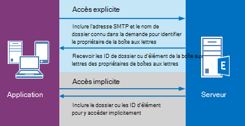

# <a name="delegate-access-and-ews-in-exchange"></a>Accès délégué et EWS dans Exchange

Découvrez comment utiliser les API managées EWS dans Exchange pour fournir un accès délégué aux boîtes aux lettres des utilisateurs.
  
Vous pouvez permettre à des utilisateurs d'accéder aux boîtes aux lettres d'autres utilisateurs de trois façons : 
  
- En ajoutant des délégués et en spécifiant des autorisations pour chacun d'entre eux.
    
- En modifiant directement les autorisations du dossier.
    
- En utilisant l'emprunt d'identité.
    
La délégation et les autorisations de dossier conviennent mieux si vous souhaitez accorder l'accès uniquement à certains utilisateurs, car vous devez ajouter les autorisations individuellement pour chaque boîte aux lettres. Emprunt d’identité est le meilleur choix lorsque vous gérez des quantités de boîtes aux lettres, car vous pouvez facilement activer un compte de service accéder à chaque boîte aux lettres dans une base de données. La Figure 1 présente quelques-unes des différences entre chaque type d'accès.
  
**Figure 1. Méthodes d'accès aux boîtes aux lettres des autres utilisateurs**


  
Lorsqu’il s’agit de l’envoi du courrier ou planifier des réunions, les délégués peuvent bénéficier d’autorisations « Envoyer de la part de », afin que le destinataire d’un message électronique ou une demande de réunion a été envoyée par un délégué s’affiche « *déléguer* au nom du *propriétaire de boîte aux lettres* » lorsque leur fenêtre e la demande de réunion ou de messagerie dans Outlook. Y compris le texte « envoyer de la part de » est un détail d’implémentation client - et peuvent être créé à l’aide de « de » et « expéditeur » les valeurs. La valeur « from » indique le propriétaire de la boîte aux lettres, et la valeur « expéditeur » indique le délégué qui a envoyé le message. Si un compte de service emprunte l’identité d’un utilisateur envoie un courrier électronique ou planifie une réunion pour le propriétaire de boîte aux lettres, le message est « envoyé en tant que « le propriétaire de la boîte aux lettres. Il n'existe aucun moyen pour le destinataire de savoir que le message a été envoyé par le compte de service. Les utilisateurs qui sont accordées des autorisations sur le dossier et non l’accès délégué ne sont pas en mesure de « Envoyer en tant que » ou « envoyer de la part de » d’un propriétaire de boîte aux lettres. Ils ont accès aux dossiers de boîte aux lettres et peuvent être en mesure de créer des éléments dans les dossiers, mais ils ne peuvent pas envoyer les éléments. 
  
Quand il est approprié modifier directement les autorisations de dossier ? En règle générale, lorsque vous souhaitez fournir un accès utilisateur à un dossier, mais ne souhaitent pas accorder les autorisations « Envoyer de la part de », l’utilisateur lors de vos besoins d’autorisations ne correspondent pas aux valeurs de l’énumération [DelegateFolderPermissionLevel](http://msdn.microsoft.com/en-us/library/microsoft.exchange.webservices.data.delegatefolderpermissionlevel%28v=exchg.80%29.aspx) API managées ou [PermissionLevel](http://msdn.microsoft.com/library/87978600-3523-451e-a725-ef092c543e2a%28Office.15%29.aspx) Valeurs des éléments EWS, ou lorsque vous souhaitez fournir un accès utilisateur à un seul dossier personnalisé. 
  
Si vous ne devez modifier les autorisations de dossier pour atteindre votre objectif et vous n’avez pas besoin d’ajouter un délégué (autrement dit, vous n’avez pas besoin des autorisations « Envoyer de la part de »), voir [définir des autorisations de dossier pour un autre utilisateur à l’aide de EWS dans Exchange](how-to-set-folder-permissions-for-another-user-by-using-ews-in-exchange.md). 
  
Notez que vous pouvez également utiliser [Outlook](http://office.microsoft.com/en-us/outlook-help/allow-someone-else-to-manage-your-mail-and-calendar-HA102749417.aspx) ou [Exchange Server PowerShell (Exchange Management Shell)](https://docs.microsoft.com/en-us/powershell/exchange/exchange-server/exchange-management-shell?view=exchange-ps) pour configurer l’accès délégué. 
  
## <a name="how-does-delegate-access-work"></a>Comment déléguer des tâches d’accès ?

Accès délégué permet aux utilisateurs d’accéder à tout ou partie des dossiers du propriétaire de la boîte aux lettres et agir au nom du propriétaire de boîte aux lettres. Le propriétaire de la boîte aux lettres peut être un utilisateur ou une ressource, comme une salle de conférence. Par exemple, un réceptionniste peut être accordé à déléguer des autorisations au dossier de calendrier d’une salle de conférence, pour gérer les demandes de réservation. Vous pouvez utiliser les API managées EWS pour que le propriétaire de la boîte aux lettres ou un administrateur ajouter un délégué, spécifiez les dossiers que le délégué peut accéder, puis spécifier les autorisations pour ce dossier. Les délégués peuvent accéder aux dossiers suivants : 
  
- Calendrier
    
- Tâches
    
- Inbox
    
- Contacts
    
- Remarques
    
- Journal
    
Lorsqu’un utilisateur a accès délégué à une ou plusieurs de ces dossiers, ils peuvent créer, obtenir, mettre à jour, supprimer, copier et rechercher des éléments dans ce dossier et tous les dossiers enfants, en fonction des [autorisations](#bk_delegateperms) définies sur le dossier. Dans lequel l’application a effectué ces actions différemment selon que l’accès [explicite](#bk_explicit) ou [implicite](#bk_implicit) est requis. 
  
## <a name="delegate-permissions"></a>Déléguer les autorisations
<a name="bk_delegateperms"> </a>

Lorsqu’un administrateur ou un propriétaire de boîte aux lettres ajoute un délégué à une boîte aux lettres, ils peuvent également définir le niveau d’autorisation pour un ou plusieurs dossiers. Si un niveau d’autorisation n’est pas défini pour un dossier, la valeur d’autorisation par défaut est None. Plusieurs utilisateurs peuvent avoir le même niveau d’autorisation sur un dossier et les utilisateurs peuvent avoir des niveaux d’autorisation différentes pour différents dossiers. Si vous utilisez l’API managée EWS, la propriété [DelegateUser.Permissions](http://msdn.microsoft.com/en-us/library/microsoft.exchange.webservices.data.delegateuser.permissions%28v=exchg.80%29.aspx) , qui contient l’une des valeurs d’énumération [DelegateFolderPermissionLevel](http://msdn.microsoft.com/en-us/library/microsoft.exchange.webservices.data.delegatefolderpermissionlevel%28v=exchg.80%29.aspx) pour chaque dossier, vous permet de définir de déléguer des autorisations sur les dossiers. Si vous utilisez EWS, vous utilisez l’élément [DelegatePermissions](http://msdn.microsoft.com/library/292badc7-bab3-4368-9d7c-9a8b7edb279b%28Office.15%29.aspx) pour définir des autorisations de délégué et l’élément [PermissionLevel](http://msdn.microsoft.com/library/87978600-3523-451e-a725-ef092c543e2a%28Office.15%29.aspx) pour définir le niveau d’autorisation. 
  
**Le tableau 2. Déléguer des niveaux d’autorisation**

|**Niveau d’autorisation**|**Description**|
|:-----|:-----|
|None  <br/> |Il s’agit de la valeur par défaut pour tous les dossiers.  <br/> |
|Auteur  <br/> |Un délégué peut lire et créer des éléments, modifier et supprimer des éléments qu’ils créent. Par exemple, un délégué peut créer des demandes de tâches et les demandes de réunion directement dans le dossier de tâches ou calendrier du propriétaire de la boîte aux lettres, puis envoyer l’élément sur le nom du propriétaire de la boîte aux lettres.  <br/> |
|Editor  <br/> |Un délégué peut faire tout ce dont un auteur peut faire, modifier et supprimer les éléments créé par le propriétaire de la boîte aux lettres.  <br/> |
|Reviewer  <br/> |Un délégué peut lire les éléments. par exemple un délégué avec une autorisation relecteur peut lire des messages dans la boîte de réception d’une autre personne.  <br/> |
|Personnalisé  <br/> |Le propriétaire de boîte aux lettres a accordé un ensemble d’autorisations personnalisé au délégué.  <br/> |
   
La propriété [DelgateUser.ViewPrivateItems](http://msdn.microsoft.com/en-us/library/microsoft.exchange.webservices.data.delegateuser.viewprivateitems%28v=exchg.80%29.aspx) API managées et l’élément EWS [ViewPrivateItems](http://msdn.microsoft.com/library/80b949ac-440c-4a01-b428-ebafb5b1b802%28Office.15%29.aspx) est un paramètre global qui affecte les dossiers de toutes les boîtes aux lettres du propriétaire, y compris tous les messages, Contacts, calendrier, tâches, Notes et Journal. Vous ne pouvez pas autoriser l’accès aux éléments privés dans un seul dossier. 
  
## <a name="explicit-access"></a>Accès explicite
<a name="bk_explicit"> </a>

Put simplement un accès explicit est la méthode d’entrée pour les délégués effectuer des actions sur les dossiers ou les éléments d’un propriétaire de boîte aux lettres. Accès Explicit est accordé à un délégué lorsqu’elles incluent le nom du dossier connu pour le dossier du propriétaire de la boîte aux lettres avec l’adresse SMTP de l’utilisateur de boîte aux lettres dans une demande au serveur. L’accès est explicite, car la demande du délégué explicitement et indique que le contexte de la méthode ou l’opération est boîte aux lettres du propriétaire de la boîte aux lettres et non la boîte aux lettres du délégué.
  
Accès explicite définit le contexte de toutes les méthodes ou les opérations effectuées sur les dossiers ou les éléments de déplacement vers l’avant. Tous les ID d’élément et le dossier renvoyés lors de l’accès explicite est défini de manière unique s’identifient comme appartenant au propriétaire de la boîte aux lettres (mais pas dans n’importe quel format lisible). Ainsi, l’application n’a pas besoin spécifier les adresses de SMTP du propriétaire de la boîte aux lettres infini ; le contexte est masqué dans les identificateurs. Une fois un élément ou un dossier est identifié, un délégué utilise réellement [accès implicite](#bk_implicit) pour modifier l’élément. La figure suivante illustre le processus d’obtention d’accès explicites et implicites. 
  
**La figure 2. Demande d’accès explicit et implicite à un élément ou un dossier**


  
Vous pouvez définir un accès explicite dans différents scénarios. En fait, chaque fois que vous envoyez un ID de dossier dans une méthode ou une opération, vous pouvez définir un accès explicite. Cela peut inclure la recherche de dossiers, rendez-vous, l’obtention d’éléments, la recherche de conversations et ainsi de suite.
  
### <a name="explicit-access-and-the-ews-managed-api"></a>Accès explicite et l’API managée EWS
<a name="bk_explicitewsma"> </a>

Vous pouvez lancer l’accès délégué explicite à l’aide d’une des méthodes suivantes surchargées qui prend un paramètre d’entrée [FolderId](http://msdn.microsoft.com/en-us/library/microsoft.exchange.webservices.data.folderid%28v=exchg.80%29.aspx) pour identifier le dossier cible : 
  
- [Folder.Bind](http://msdn.microsoft.com/en-us/library/microsoft.exchange.webservices.data.folder.bind%28v=exchg.80%29.aspx)
    
- [ExchangeService.FindItems](http://msdn.microsoft.com/en-us/library/microsoft.exchange.webservices.data.exchangeservice.finditems%28v=exchg.80%29.aspx)
    
- [ExchangeService.FindAppointments](http://msdn.microsoft.com/en-us/library/microsoft.exchange.webservices.data.exchangeservice.findappointments%28v=exchg.80%29.aspx)
    
- [ExchangeService.FindFolders](http://msdn.microsoft.com/en-us/library/microsoft.exchange.webservices.data.exchangeservice.findfolders%28v=exchg.80%29.aspx)
    
- Et bien plus encore !
    
Vous pouvez utiliser le paramètre **FolderId** dans chacune de ces méthodes pour identifier le dossier de cible du propriétaire de la boîte aux lettres, comme suit. 
  
```cs
new FolderId(WellKnownFolderName.Calendar, "primary@contoso.com");
```

Par exemple, pour lier au dossier de calendrier, l' **ID FolderId** dans cette méthode **lier** Spécifie le nom du dossier connu et l’adresse SMTP de l’utilisateur de boîte aux lettres. 
  
```cs
CalendarFolder calendar = CalendarFolder.Bind(service, new FolderId(WellKnownFolderName.Calendar, "primary@contoso.com"), new PropertySet());
```

En spécifiant le nom du dossier connu et l’adresse SMTP, le délégué peut lier au dossier de calendrier du propriétaire de la boîte aux lettres, ce qui permet l’accès explicite dans le dossier. Toutes les demandes ultérieures pour [un accès implicite](#bk_implicit) aux éléments dans le dossier puis ils s’appuient sur le contexte renvoyé dans l’élément ID et dossier. En fait, les identificateurs contiennent le contexte pour les appels d’accès délégué implicite. Ou, pour récupérer l’ID d’élément d’un élément qui répond aux critères spécifiques, utilisez la commande suivante. 
  
```cs
FindItemsResults<Item> results = service.FindItems(new FolderId(WellKnownFolderName.Calendar, "primary@contoso.com"), filter, view);
```

Dans ce cas l’ID de l’élément est retourné, puis le délégué peut utiliser puis accès implicite pour apporter des modifications à l’élément à l’aide de l’ID d’élément.
  
Vous n’êtes pas obligé d’initier un accès explicite à nouveau jusqu'à ce que vous avez besoin d’un ID d’élément ou un ID de dossier que vous n’avez pas accéder par le biais de l’accès explicite existante. 
  
### <a name="explicit-access-and-ews"></a>Accès explicite et EWS
<a name="bk_explicitewsma"> </a>

Vous pouvez lancer un accès explicite en utilisant les opérations [FindFolder](http://msdn.microsoft.com/library/7a9855aa-06cc-45ba-ad2a-645c15b7d031%28Office.15%29.aspx) [GetFolder](http://msdn.microsoft.com/library/355bcf93-dc71-4493-b177-622afac5fdb9%28Office.15%29.aspx)ou [FindItem](http://msdn.microsoft.com/library/ebad6aae-16e7-44de-ae63-a95b24539729%28Office.15%29.aspx). Ces opérations offrent la possibilité d’utiliser l’élément [DistinguishedFolderId](http://msdn.microsoft.com/library/50018162-2941-4227-8a5b-d6b4686bb32f%28Office.15%29.aspx) pour identifier le dossier cible. L’élément **DistinguishedFolderId** possède un élément enfant facultatif unique, l’élément de [boîte aux lettres](http://msdn.microsoft.com/library/befc70fd-51cb-4258-884c-80c9050f0e82%28Office.15%29.aspx) . L’élément de **boîte aux lettres** , lorsqu’elle est utilisée en tant qu’enfant de l’élément **DistinguishedFolderId** , spécifie le délégué pour accéder à la boîte aux lettres. Si l’utilisateur appelant est autorisé à accéder au dossier du propriétaire de la boîte aux lettres, la réponse contient une collection d’identificateurs à des éléments ou des dossiers de boîte aux lettres. Les identificateurs éléments et dossiers qui sont retournés dans la réponse peuvent être utilisés pour l’accès délégué implicite. 
  
## <a name="implicit-access"></a>Accès implicite
<a name="bk_implicit"> </a>

Accès implicite est utilisé après un délégué a extrait l’ID d’un élément ou d’un dossier de boîte aux lettres du propriétaire de la boîte aux lettres et le délégué souhaite mettre à jour, supprimer ou copier l’élément. Lorsque le délégué utilise cet ID d’élément ou un dossier dans une requête, les modifications sont apportées à l’élément de boîte aux lettres du propriétaire de la boîte aux lettres. Le délégué ne dispose pas d’inclure l’adresse SMTP du propriétaire de la boîte aux lettres. 
  
Par exemple, lorsqu’un délégué possède l’ID de l’un des dossiers du propriétaire de la boîte aux lettres, le délégué peut effectuer une opération **FindItem** sur ce dossier à l’aide de l’ID de dossier, sans identification explicite des boîtes aux lettres du propriétaire de la boîte aux lettres. À ce stade, le délégué peut effectuer des actions sur le dossier du propriétaire de la boîte aux lettres à l’aide de l’ID renvoyées dans les réponses. 
  
### <a name="implicit-access-and-the-ews-managed-api"></a>Accès implicite et l’API managée EWS

Si un ID d’élément a été extrait par la méthode [FindItems](http://msdn.microsoft.com/en-us/library/microsoft.exchange.webservices.data.exchangeservice.finditems%28v=exchg.80%29.aspx) , cet ID d’élément utilisable dans un appel de méthode suivant [Item.Bind](http://msdn.microsoft.com/en-us/library/microsoft.exchange.webservices.data.item.bind%28v=exchg.80%29.aspx) à lier à l’élément. Vous pouvez ensuite appeler la méthode [Item.Update](http://msdn.microsoft.com/en-us/library/office/microsoft.exchange.webservices.data.item.update%28v=exchg.80%29.aspx), [Item.Delete](http://msdn.microsoft.com/en-us/library/office/microsoft.exchange.webservices.data.item.delete%28v=exchg.80%29.aspx)ou [Item.Copy](http://msdn.microsoft.com/en-us/library/office/microsoft.exchange.webservices.data.item.copy%28v=exchg.80%29.aspx) , ou un appel de méthode qui nécessite un ID d’élément — nécessaire pour effectuer votre tâche. Tant que le délégué dispose des autorisations appropriées pour le dossier qui contient l’élément (et, le cas échéant, le dossier de l’élément se déplace vers), le délégué d’apporter des modifications en fonction de leur niveau d’autorisation. 
  
### <a name="implicit-access-and-ews"></a>Accès implicite et EWS

Si un ID d’élément a été récupéré par l’opération [FindItem](http://msdn.microsoft.com/library/ebad6aae-16e7-44de-ae63-a95b24539729%28Office.15%29.aspx) , cet ID d’élément utilisable dans les opérations suivantes [GetItem](http://msdn.microsoft.com/library/e3590b8b-c2a7-4dad-a014-6360197b68e4%28Office.15%29.aspx) pour lier à l’élément. Vous pouvez ensuite appeler l’opération [UpdateItem](http://msdn.microsoft.com/library/5d027523-e0bc-4da2-b60b-0cb9fc1fdfe4%28Office.15%29.aspx), [DeleteItem](http://msdn.microsoft.com/library/3e26c416-fa12-476e-bfd2-5c1f4bb7b348%28Office.15%29.aspx)ou [CopyItem](http://msdn.microsoft.com/library/bcc68f9e-d511-4c29-bba6-ed535524624a%28Office.15%29.aspx) — ou toute opération nécessitant un ID d’élément — nécessaire pour effectuer votre tâche. Tant que le délégué dispose des autorisations appropriées pour le dossier qui contient l’élément (et, le cas échéant, le dossier de l’élément se déplace vers), le délégué d’apporter des modifications en fonction de leur niveau d’autorisation. 
  
## <a name="in-this-section"></a>Dans cette section
<a name="bk_implicit"> </a>

- [Ajouter et supprimer des délégués à l’aide de EWS dans Exchange](how-to-add-and-remove-delegates-by-using-ews-in-exchange.md)
    
- [Accéder à un calendrier en tant que délégué à l’aide de EWS dans Exchange](how-to-access-a-calendar-as-a-delegate-by-using-ews-in-exchange.md)
    
- [Contacts Access en tant que délégué à l’aide de EWS dans Exchange](how-to-access-contacts-as-a-delegate-by-using-ews-in-exchange.md)
    
- [Accéder à la messagerie en tant que délégué à l’aide de EWS dans Exchange](how-to-access-email-as-a-delegate-by-using-ews-in-exchange.md)
    
- [Définir des autorisations de dossier pour un autre utilisateur à l’aide de EWS dans Exchange](how-to-set-folder-permissions-for-another-user-by-using-ews-in-exchange.md)
    
- [Gestion des erreurs liées à la délégation dans EWS dans Exchange](handling-delegation-related-errors-in-ews-in-exchange.md)
    
## <a name="see-also"></a>Voir aussi


- [Développer des clients de service web pour Exchange](develop-web-service-clients-for-exchange.md)
    
- [Autoriser une autre personne à gérer vos messages électroniques et calendrier](http://office.microsoft.com/en-us/outlook-help/allow-someone-else-to-manage-your-mail-and-calendar-HA102749417.aspx)
    
- [Ajouter-MailboxPermission](http://technet.microsoft.com/en-us/library/bb124097%28v=exchg.150%29.aspx)
    

