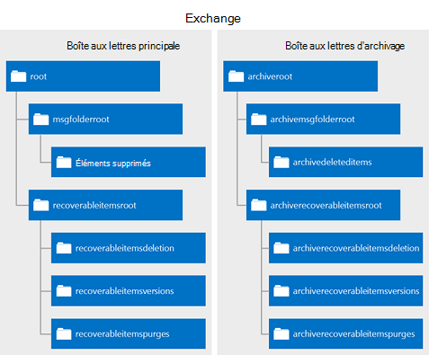

# Suppression d’éléments à l’aide de EWS dans ExchangeDeleting items by using EWS in Exchange

Découvrez comment vous pouvez utiliser l’API managée EWS ou EWS dans Exchange pour supprimer les éléments soit en les déplaçant vers le dossier éléments supprimés ou à la benne.Find out how you can use the EWS Managed API or EWS in Exchange to delete items either by moving them to the Deleted Items folder or to the dumpster.
  
Avez vous jamais demandé quel est la différence entre le déplacement d’éléments dans le dossier éléments supprimés et les déplacer vers la benne ?Have you ever asked yourself what the difference is between moving items to the Deleted Items folder, and moving them to the dumpster? Vous devez connaître les différentes options pour les éléments supprimée de gestion et comment implémenter ces options dans votre application.You might be curious about the different options for handling deleted items and how to implement those options in your application. Exchange Web Services (EWS) inclut trois options pour les éléments supprimée de gestion.Exchange Web Services (EWS) includes three options for handling deleted items. Cet article fournit effacera toute confusion, que vous devrez peut-être sur les différences entre eux.This article will hopefully clear up any confusion you might have about the differences between them.
  
## Suppression d’éléments - quelles sont mes options ?Deleting items - what are my options?

Avant de vous permettre de comprendre l’ensemble du paysage de suppression des éléments, il est important de la différence entre les éléments suivants :Before you can understand the overall landscape for deleting items, it's important to recognize the difference between the following:
  
- Le dossier éléments supprimés - lorsque vous supprimez des éléments dans une boîte aux lettres, c’est là qu’ils.The Deleted Items folder - When you delete items in a mailbox, this is where they go.
    
- La benne (alias du dossier éléments récupérables) - lorsque vous supprimez des éléments d’une boîte aux lettres, c’est là qu’ils.The dumpster (aka the Recoverable Items folder) - When you remove items from a mailbox, this is where they go.
    
Les figures 1 et 2 indiquent à quoi ressemble le processus de suppression des éléments et des dossiers dans une boîte aux lettres.Figures 1 and 2 show what the deletion process looks like for items and folders in a mailbox. 

**La figure 1. Processus de suppression des éléments à partir d’une boîte aux lettres****Figure 1. Process for deleting items from a mailbox**

 

**La figure 2. Processus de suppression des dossiers à partir d’une boîte aux lettres****Figure 2. Process for deleting folders from a mailbox**

   
Vous pouvez supprimer des éléments et les dossiers de trois façons différentes, selon « permanent », vous souhaitez que la suppression à.You can delete items and folders three different ways, depending on how "permanent" you would like the deletion to be.
  
**Tableau 1 : Options de suppression des éléments à l’aide de EWS****Table 1: Options for deleting items by using EWS**

|**Option****Option**|**Que se passe-t-il****What happens**|
|:-----|:-----|
|Déplacer vers le dossier éléments supprimésMove to the Deleted Items folder    |Il s’agit moins permanent permet de supprimer des éléments.This is the least permanent way to delete items.  Il s’agit comme le fait de placer une feuille de papier dans la Corbeille à votre bureau.This is like putting a piece of paper in the recycle bin by your desk. Vous pouvez facilement récupérer il si vous le souhaitez.You can easily grab it if you need it again.  Vous pouvez utiliser toute [opération de suppression](deleting-items-by-using-ews-in-exchange.md#bk_howdoIdeleteitems) qui implémente le déplacement à l’option du dossier éléments supprimés pour effectuer cette action.You can use any [deletion operation](deleting-items-by-using-ews-in-exchange.md#bk_howdoIdeleteitems) that implements the move to the Deleted Items folder option to perform this action.  Vous pouvez également utiliser l' [opération MoveItem](http://msdn.microsoft.com/library/dcf40fa7-7796-4a5c-bf5b-7a509a18d208%28Office.15%29.aspx) ( [Item.Move()](http://msdn.microsoft.com/fr-fr/library/microsoft.exchange.webservices.data.item.move%28v=exchg.80%29.aspx)) ou l' [opération MoveFolder](http://msdn.microsoft.com/library/c7233966-6c87-4a14-8156-b1610760176d%28Office.15%29.aspx) ( [Folder.Move()](http://msdn.microsoft.com/fr-fr/library/microsoft.exchange.webservices.data.folder.move%28v=exchg.80%29.aspx)) pour déplacer un élément ou un dossier vers le dossier éléments supprimés.You can also use the [MoveItem operation](http://msdn.microsoft.com/library/dcf40fa7-7796-4a5c-bf5b-7a509a18d208%28Office.15%29.aspx) ( [Item.Move()](http://msdn.microsoft.com/fr-fr/library/microsoft.exchange.webservices.data.item.move%28v=exchg.80%29.aspx)) or the [MoveFolder operation](http://msdn.microsoft.com/library/c7233966-6c87-4a14-8156-b1610760176d%28Office.15%29.aspx) ( [Folder.Move()](http://msdn.microsoft.com/fr-fr/library/microsoft.exchange.webservices.data.folder.move%28v=exchg.80%29.aspx)) to move an item or folder to the Deleted Items folder.    |
|Suppression réversibleSoft delete    |L’élément est déplacé vers le dossier suppressions dans la benne.The item is moved to the Deletions folder in the dumpster.  Cela équivaut à vider la Corbeille dans votre conteneur taxi.This is like emptying your recycle bin into your curbside container. Vous pouvez accéder à l’élément si vous avez besoin, c’est juste un peu plus complexe.You can still access the item if you need to, it's just a little harder.    Pour plus d’informations sur la benne (également appelé le dossier éléments récupérables) et scénarios tels que des blocages eDiscovery ou pour litige, consultez le [Dossier éléments récupérables](http://technet.microsoft.com/fr-fr/library/ee364755%28v=exchg.150%29.aspx) sur TechNet.For more about the dumpster (also called the Recoverable Items folder) and scenarios such as eDiscovery or litigation holds, see [Recoverable Items Folder](http://technet.microsoft.com/fr-fr/library/ee364755%28v=exchg.150%29.aspx) on TechNet.  Suppressions logicielles ne sont pas recommandées pour les applications qui ciblent Exchange 2007.Soft deletions aren't recommended for applications that target Exchange 2007. Dans Exchange 2007, suppressions logicielles sont gérées par les paramètre un peu sur l’élément pour indiquer qu’il sera déplacé vers la benne à un moment non spécifié.In Exchange 2007, soft deletions are handled by setting a bit on the item to indicate that it will be moved to the dumpster at an unspecified time.  Parcours de suppression réversible ou recherches d’éléments qui ont été paramétrés supprimés par le biais de l' [opération FindItem](http://msdn.microsoft.com/library/ebad6aae-16e7-44de-ae63-a95b24539729%28Office.15%29.aspx), ne sont pas pris en charge dans Exchange Online, Exchange Online dans le cadre d’Office 365 et les versions d’Exchange commençant par Exchange 2010.Soft delete traversals, or searches of items that have been soft deleted via the [FindItem operation](http://msdn.microsoft.com/library/ebad6aae-16e7-44de-ae63-a95b24539729%28Office.15%29.aspx), are not supported in Exchange Online, Exchange Online as part of Office 365, and versions of Exchange starting with Exchange 2010.    **Remarque**: les dossiers ne peuvent pas être supprimés logicielle.**NOTE**:  Folders cannot be soft deleted.           |
|Suppression définitiveHard delete    |L’élément ou le dossier est définitivement supprimé.The item or folder is permanently deleted.  Éléments supprimés définitivement sont placés dans le dossier de la purge de la benne.Hard-deleted items are placed in the Purges folder of the dumpster. Il s’agit comme lorsque le recyclage automobiles vide votre conteneur recycle taxi.This is like when the recycling truck empties your curbside recycle container. Les éléments n’est pas accessible à partir d’un client de messagerie comme Outlook ou Outlook Web App et, sauf s’il existe une suspension définie dans la boîte aux lettres, les éléments seront définitivement supprimés après un laps de temps.The items cannot be accessed from an email client like Outlook or Outlook Web App, and, unless there is a hold set on the mailbox, the items will be permanently deleted after a set period of time.  Vous pouvez en savoir plus sur la rétention des éléments dans l’article [configurer la rétention des éléments supprimés et les Quotas d’éléments récupérables](http://technet.microsoft.com/fr-fr/library/ee364752%28v=exchg.150%29.aspx).You can read more about item retention in the article [Configure Deleted Item Retention and Recoverable Items Quotas](http://technet.microsoft.com/fr-fr/library/ee364752%28v=exchg.150%29.aspx).  **Remarque**: les dossiers ne sont pas placés dans le dossier de purge lorsqu’ils sont définitivement supprimés.**NOTE**:  Folders are not placed in the Purges folder when they are hard deleted. Dossiers supprimée sont supprimés de la boîte aux lettres.Hard-deleted folders are removed from the mailbox.  |
   
Le déplacement vers le dossier éléments supprimés et les options de suppression définitive sont transactionnelles, ce qui signifie que, lors de la fin de l’appel au service web, l’élément a été déplacé vers le dossier éléments supprimés ou la benne.The move to the Deleted Items folder and the hard delete options are transactional, which means that by the time the web service call finishes, the item has been moved to the Deleted Items folder or the dumpster.
  
Pour vous aider à mieux comprendre l’écosystème des dossiers qui sont utilisés pour stocker les éléments supprimés, la figure suivante illustre la hiérarchie de dossiers qui peut contenir les éléments supprimés.To help you better understand the ecosystem of folders that are used to store deleted items, the following figure shows the hierarchy of folders that can contain deleted items. Les noms de dossier sont lorsqu’ils s’affichent dans le type de schéma **DistinguishedFolderIdNameType** , ou l’énumération **WellKnownFolderName** dans l’API managée EWS.The folder names are as they appear in the **DistinguishedFolderIdNameType** schema type, or the **WellKnownFolderName** enumeration in the EWS Managed API. 
  
**La figure 3. Hiérarchie de dossiers qui contiennent des éléments supprimés****Figure 3. Hierarchy of folders that contain deleted items**

  
**Tableau 2 : Dossiers qui contiennent les éléments supprimés****Table 2: Folders that contain deleted items**

|**Nom du dossier****Folder name**|**Introduite dans****Introduced in**|**Description****Description**|
|:-----|:-----|:-----|
|deleteditemsdeleteditems    |Exchange 2007Exchange 2007    |Le dossier éléments supprimés par défaut.The default Deleted Items folder. Éléments demeurent dans ce dossier jusqu'à ce qu’ils soient ou dur-récupérable ou jusqu'à ce qu’une période de rétention a été dépassée.Items remain in this folder until they are soft- or hard-deleted or until a retention period has been exceeded. Puis ils sont déplacés vers un dossier dans la benne.Then they are moved to a folder in the dumpster. Dossiers supprimés sont placés dans le dossier éléments supprimés, et lorsqu’ils sont ou dur-récupérable, ils sont définitivement supprimés de la boîte aux lettres et ne sont pas récupérables.Deleted folders are placed in the Deleted Items folder, and when they are soft- or hard-deleted, they are permanently removed from the mailbox and are not recoverable.    |
|recoverableitemsrootrecoverableitemsroot    |Exchange 2010Exchange 2010    |La racine de la benne, ou dans le dossier éléments récupérables.The root of the dumpster, or the Recoverable Items folder. Accès benne a implémenté dans EWS dans Exchange 2010.Dumpster access was implemented in EWS in Exchange 2010. Le nom complet de ce dossier est « Éléments récupérables ».The display name for this folder is "Recoverable Items".    |
|recoverableitemsdeletionsrecoverableitemsdeletions    |Exchange 2010Exchange 2010    |Le principal benne de dossier pour une boîte aux lettres.The main dumpster folder for a mailbox. Éléments supprimés et déplacé à partir du dossier éléments supprimés par une stratégie de rétention sont placés dans ce dossier.Soft-deleted items and items moved from the Deleted Items folder by a retention policy are placed in this folder. Le nom complet de ce dossier est « Suppression ».The display name for this folder is "Deletions".    |
|recoverableitemsversionsrecoverableitemsversions    |Exchange 2010Exchange 2010    |Où sont stockées les anciennes versions d’un élément.Where older versions of an item are stored. Anciennes versions d’un élément sont créées lorsqu’un élément est mis à jour.Old versions of an item are created when an item is updated. Versions d’éléments de brouillon ne sont pas enregistrées dans ce dossier.Draft item versions are not saved to this folder. Le nom complet de ce dossier est « Versions ».The display name of this folder is "Versions".    |
|recoverableitemspurgesrecoverableitemspurges    |Exchange 2010Exchange 2010    |Où sont stockés les éléments qui sont supprimés du dossier des suppressions.Where items that are removed from the Deletions folder are stored. Tous les éléments de la banque supprimée sont déplacés vers ce dossier.All store hard-deleted items are moved to this folder. Le nom complet de ce dossier est « Purge ».The display name for this folder is "Purges".    |
|archiveddeletedtitemsarchiveddeletedtitems    |Exchange 2010Exchange 2010    |Le dossier éléments supprimés par défaut pour une boîte aux lettres d’archive.The default Deleted Items folder for an archive mailbox.    |
|archiverecoverablesitemsrootarchiverecoverablesitemsroot    |Exchange 2010Exchange 2010    |La racine benne de dossier pour une boîte aux lettres d’archive.The root dumpster folder for an archive mailbox. Les éléments archivés sont supprimés sont déplacés vers un sous-dossier dans ce dossier.Archived items that are soft-deleted are moved to a subfolder in this folder.    |
|archiverecoverableitemsdeletionsarchiverecoverableitemsdeletions    |Exchange 2010Exchange 2010    |Le principal benne de dossier pour une boîte aux lettres d’archive.The main dumpster folder for an archive mailbox. Archiver des éléments déplacés vers la benne sont placés ici.Archived items moved to the dumpster are placed here.    |
|archiverecoverableitemsversionsarchiverecoverableitemsversions    |Exchange 2010Exchange 2010    |Où sont stockées les anciennes versions d’éléments archivés.Where older versions of archived items are stored.    |
|archiverecoverableitemspurgesarchiverecoverableitemspurges    |Exchange 2010Exchange 2010    |Où les éléments qui sont supprimés de l’archive suppressions dossier dans la benne sont stockés.Where items that are hard-deleted from the archive Deletions folder in the dumpster are stored. Tous les éléments de la banque supprimée archivé sont déplacés vers ce dossier.All store hard-deleted archived items are moved to this folder.    |
   
## Comment supprimer des élémentsHow do I delete items?

Supprimer, utilisez une des options suivantes pour indiquer si vous souhaitez déplacer un élément vers le dossier éléments supprimés ou effectuez une logicielle ou un disque dur :Use one of the following to indicate whether to move an item to the Deleted Items folder or perform a soft delete or a hard delete:
  
- Le **DisposalType** type simple, si vous utilisez EWS pour accéder à Exchange.The **DisposalType** simple type, if you use EWS to access Exchange. 
    
- L' [énumération DeleteMode](http://msdn.microsoft.com/fr-fr/library/exchange/microsoft.exchange.webservices.data.deletemode%28v=exchg.80%29.aspx), si vous utilisez l’API managée EWS.The [DeleteMode enumeration](http://msdn.microsoft.com/fr-fr/library/exchange/microsoft.exchange.webservices.data.deletemode%28v=exchg.80%29.aspx), if you use the EWS Managed API.
    
Vous pouvez utiliser un nombre de différentes opérations EWS ou méthodes API managées pour supprimer des éléments et des dossiers à partir d’une boîte aux lettres.You can use a number of different EWS operations or EWS Managed API methods to delete items and folders from a mailbox.
  
**Tableau 3 : Opérations EWS et méthodes d’API managées pour supprimer des éléments****Table 3: EWS operations and EWS Managed API methods for deleting items**

|**Opération EWS****EWS operation**|**Méthode d'API managée EWS****EWS Managed API method**|**Introduite dans****Introduced in**|**Fonction****What it does**|
|:-----|:-----|:-----|:-----|
|[Opération DeleteFolderDeleteFolder operation](http://msdn.microsoft.com/library/b0f92682-4895-4bcf-a4a1-e4c2e8403979%28Office.15%29.aspx)   |[Méthode Folder.DeleteFolder.Delete method](http://msdn.microsoft.com/fr-fr/library/exchange/microsoft.exchange.webservices.data.folder.delete%28v=exchg.80%29.aspx)   |Exchange 2007Exchange 2007    |Supprime les dossiers d’une boîte aux lettres.Deletes folders from a mailbox. Avec EWS, vous pouvez par lot Supprimer les dossiers.With EWS, you can batch delete folders. Avec l’API managée EWS, vous ne pouvez supprimer un dossier unique par appel.With the EWS Managed API, you can only delete a single folder per call.    |
|[Opération DeleteItemDeleteItem operation](http://msdn.microsoft.com/library/3e26c416-fa12-476e-bfd2-5c1f4bb7b348%28Office.15%29.aspx)   |[Méthode Item.DeleteItem.Delete method](http://msdn.microsoft.com/fr-fr/library/exchange/microsoft.exchange.webservices.data.item.delete%28v=exchg.80%29.aspx)  [Méthode ExchangeService.DeleteItemsExchangeService.DeleteItems method](http://msdn.microsoft.com/fr-fr/library/exchange/microsoft.exchange.webservices.data.exchangeservice.deleteitems%28v=exchg.80%29.aspx)   |Exchange 2007Exchange 2007    |Supprime les éléments d’une boîte aux lettres.Deletes items from a mailbox.    |
|[Opération EmptyFolderEmptyFolder operation](http://msdn.microsoft.com/library/98161486-e2f2-480f-8d5d-708ba81b208a%28Office.15%29.aspx)   |[Méthode Folder.EmptyFolder.Empty method](http://msdn.microsoft.com/fr-fr/library/exchange/microsoft.exchange.webservices.data.folder.empty%28v=exchg.80%29.aspx)   |Exchange 2010Exchange 2010    |Supprime tous les éléments dans un dossier et, le cas échéant, supprime tous les sous-dossiers dans un dossier.Deletes all the items in a folder, and, optionally, deletes all subfolders in a folder.    |
|[Opération de ApplyConversationActionApplyConversationAction operation](http://msdn.microsoft.com/library/73d7943d-d361-4f8b-9948-d85f886efa1a%28Office.15%29.aspx)   |[Méthode Conversation.EnableAlwaysDeleteItemsConversation.EnableAlwaysDeleteItems method](http://msdn.microsoft.com/fr-fr/library/exchange/microsoft.exchange.webservices.data.conversation.enablealwaysdeleteitems%28v=exchg.80%29.aspx)  [Méthode Conversation.DeleteItemsConversation.DeleteItems method](http://msdn.microsoft.com/fr-fr/library/exchange/microsoft.exchange.webservices.data.conversation.deleteitems%28v=exchg.80%29.aspx)   |Exchange 2010Exchange 2010    |Définit une suppression de traitement de l’action sur les messages électroniques dans une conversation pour qu’ils sont supprimés.Sets a delete processing action on email messages in a conversation so that they are deleted.    |
|[Opération DeleteUserConfigurationDeleteUserConfiguration operation](http://msdn.microsoft.com/library/93e44690-be2d-4fdb-96a8-4ded3c193aed%28Office.15%29.aspx)   |[Méthode UserConfiguration.DeleteUserConfiguration.Delete method](http://msdn.microsoft.com/fr-fr/library/exchange/microsoft.exchange.webservices.data.userconfiguration.delete%28v=exchg.80%29.aspx)   |Exchange 2010Exchange 2010    |Supprime un dossier associé élément et le déplace vers la benne.Deletes a folder associated item and moves it to the dumpster.    |
|[CreateItem OperationCreateItem operation](http://msdn.microsoft.com/library/78a52120-f1d0-4ed7-8748-436e554f75b6%28Office.15%29.aspx)   |[Méthode Appointment.AcceptAppointment.Accept method](http://msdn.microsoft.com/fr-fr/library/microsoft.exchange.webservices.data.appointment.accept%28v=exchg.80%29.aspx)   [Méthode Appointment.AcceptTentativelyAppointment.AcceptTentatively method](http://msdn.microsoft.com/fr-fr/library/microsoft.exchange.webservices.data.appointment.accepttentatively%28v=exchg.80%29.aspx)  [Méthode Appointment.CancelMeetingAppointment.CancelMeeting method](http://msdn.microsoft.com/fr-fr/library/microsoft.exchange.webservices.data.appointment.cancelmeeting%28v=exchg.80%29.aspx)  [Appointment.DeclineAppointment.Decline](http://msdn.microsoft.com/fr-fr/library/microsoft.exchange.webservices.data.appointment.decline%28v=exchg.80%29.aspx)  [Méthode MeetingRequest.AcceptMeetingRequest.Accept method](http://msdn.microsoft.com/fr-fr/library/microsoft.exchange.webservices.data.meetingrequest.accept%28v=exchg.80%29.aspx)  [Méthode MeetingRequest.AcceptTentativelyMeetingRequest.AcceptTentatively method](http://msdn.microsoft.com/fr-fr/library/microsoft.exchange.webservices.data.meetingrequest.accepttentatively%28v=exchg.80%29.aspx)  [Méthode MeetingRequest.DeclineMeetingRequest.Decline method](http://msdn.microsoft.com/fr-fr/library/microsoft.exchange.webservices.data.meetingrequest.decline%28v=exchg.80%29.aspx)   |Exchange 2007Exchange 2007    |Indirectement déplace un élément vers le dossier éléments supprimés lorsqu’une réponse à une demande de réunion est envoyée ou de la réponse est définie sur le rendez-vous.Indirectly moves an item to the Deleted Items folder whenever a response to a meeting request is sent or the response is set on the appointment.  Le type de suppression n’est pas défini sur cette opération.The deletion type is not set on this operation. Les messages de réunion sont déplacés vers le dossier éléments supprimés lorsqu’un objet de réponse est correctement traité par le service.The meeting messages are moved to the Deleted Items folder when a response object is successfully processed by the service.    |
   
Vous pouvez également déplacer des éléments dans le dossier éléments supprimés à l’aide de règles de boîte de réception.You can also move items to the Deleted Items folder by using Inbox rules. Par exemple, vous pouvez [créer des règles](inbox-management-and-ews-in-exchange.md) qui ont une action de suppression.For example, you can [create rules](inbox-management-and-ews-in-exchange.md) that have a delete action. 
  
Certains points à noter concernant la suppression d’éléments :Some points to note about deleting items:
  
- Suppression d’une occurrence d’un élément périodique ne déclenche pas un déplacement vers le dossier éléments supprimés ou la benne.Deleting an occurrence of a recurring item does not trigger a move to the Deleted Items folder or the dumpster. Le résultat dans une mise à jour à l’élément périodique principal de la série périodique.This results in an update to the recurring master item of the recurring series.
    
- Vous ne pouvez pas supprimer les dossiers par défaut à partir de la boîte aux lettres.You cannot delete default folders from the mailbox.
    
- Évitez de supprimer des réunions ou des messages de la réunion, telles que les demandes de réunion et ou mises à jour de la réunion.Avoid deleting meetings or meeting messages, such as meeting requests and or meeting updates. Au lieu de cela, répondre à ces éléments à l’aide des objets de réponse.Instead, respond to these items by using response objects. De cette manière, les éléments de calendrier associées sont mises à jour pour refléter les actions du répondeur ou l’organisateur.This way, the associated calendar items are updated to reflect the responder's or organizer's actions.
    
- Modifier la clé d’un élément n’est pas mis à jour lors de l’élément est déplacé vers le dossier éléments supprimés et les suppressions.An item's change key is not updated when the item is moved to the Deleted Items or Deletions folder.
    
- Si vous effectuez un disque dur supprimer un élément et ensuite appeler une [opération SyncFolderHierarchy](http://msdn.microsoft.com/library/b31916b1-bc6c-4451-a475-b7c5417f752d%28Office.15%29.aspx) ou méthode d’API managées [SyncFolderHierarchy](http://msdn.microsoft.com/fr-fr/library/microsoft.exchange.webservices.data.exchangeservice.syncfolderhierarchy%28v=exchg.80%29.aspx) ou une méthode [opération SyncFolderItems](http://msdn.microsoft.com/library/7f0de089-8876-47ec-a871-df118ceae75d%28Office.15%29.aspx) ou [SyncFolderItems](http://msdn.microsoft.com/fr-fr/library/microsoft.exchange.webservices.data.exchangeservice.syncfolderitems%28v=exchg.80%29.aspx) , une modification à **Supprimer** entrée est retournée.If you perform a hard delete on an item and then call a [SyncFolderHierarchy operation](http://msdn.microsoft.com/library/b31916b1-bc6c-4451-a475-b7c5417f752d%28Office.15%29.aspx) or [SyncFolderHierarchy](http://msdn.microsoft.com/fr-fr/library/microsoft.exchange.webservices.data.exchangeservice.syncfolderhierarchy%28v=exchg.80%29.aspx) EWS Managed API method, or a [SyncFolderItems operation](http://msdn.microsoft.com/library/7f0de089-8876-47ec-a871-df118ceae75d%28Office.15%29.aspx) or [SyncFolderItems](http://msdn.microsoft.com/fr-fr/library/microsoft.exchange.webservices.data.exchangeservice.syncfolderitems%28v=exchg.80%29.aspx) method, a **Delete** change entry will be returned. Si vous déplacez un élément vers le dossier éléments supprimés, une entrée de changement de **mise à jour** est renvoyée.If you move an item to the Deleted Items folder, an **Update** change entry is returned. Il s’agit, car l’élément ou le dossier aura une nouvelle valeur de la propriété [ParentFolderId](http://msdn.microsoft.com/library/258f4b1f-367e-4c7d-9c29-eb775a2398c7%28Office.15%29.aspx) .This is because the item or folder will have a new [ParentFolderId](http://msdn.microsoft.com/library/258f4b1f-367e-4c7d-9c29-eb775a2398c7%28Office.15%29.aspx) property value. [En savoir plus sur la synchronisation](mailbox-synchronization-and-ews-in-exchange.md) si la synchronisation des éléments supprimés fait partie de votre scénario.[Read more about synchronization](mailbox-synchronization-and-ews-in-exchange.md) if synchronizing deleted items is part of your scenario. 
    
## En savoir plus sur la suppression d’élémentsFind out more about deleting items

- [Extraction des notifications pour les événements liés à la suppression de boîte aux lettres EWS dans ExchangePull notifications for EWS deletion-related mailbox events in Exchange](pull-notifications-for-ews-deletion-related-mailbox-events-in-exchange.md)
    
- [Gestion des erreurs liées aux suppression dans EWS dans ExchangeHandling deletion-related errors in EWS in Exchange](handling-deletion-related-errors-in-ews-in-exchange.md)
    
## Voir aussiSee also

- [Dossiers et éléments dans EWS dans ExchangeFolders and items in EWS in Exchange](folders-and-items-in-ews-in-exchange.md)    
- [Développer des clients de service web pour ExchangeDevelop web service clients for Exchange](develop-web-service-clients-for-exchange.md)    
- [Dossier éléments récupérablesRecoverable Items Folder](http://technet.microsoft.com/fr-fr/library/ee364755.aspx)    
- [Récupération d’élément unique dans Exchange Server 2010Single Item Recovery in Exchange Server 2010](http://blogs.technet.com/b/exchange/archive/2009/09/25/3408389.aspx#_Single_Item_Recovery)    
- [Exchange 2013 : Supprimer par programme une série périodique à partir des serveurs ExchangeExchange 2013: Delete a recurring series programmatically from Exchange servers](http://code.msdn.microsoft.com/exchange/Exchange-2013-Delete-a-e1c7b89d)    
- [Exchange 2013 : Supprimer par programme des tâches à partir d’un compte sur les serveurs ExchangeExchange 2013: Delete tasks from an account on Exchange servers programmatically](http://code.msdn.microsoft.com/exchange/Exchange-2013-Delete-tasks-13824637)    
- [Exchange 2013 : Vider les dossiers sur des serveurs Exchange par programmeExchange 2013: Empty folders on Exchange servers programmatically](http://code.msdn.microsoft.com/exchange/Exchange-2013-Empty-6487df37)    
- [Exchange 2013 : Supprimer par programme des dossiers à partir des serveurs ExchangeExchange 2013: Delete folders programmatically from Exchange servers](http://code.msdn.microsoft.com/exchange/Exchange-2013-Delete-aa1a5823)    
- [Exchange 2013 : Supprimer par programme le nombre d’éléments à partir des serveurs ExchangeExchange 2013: Delete many items programmatically from Exchange servers](http://code.msdn.microsoft.com/exchange/Exchange-2013-Delete-many-064f8760)    
- [Exchange 2013 : Supprimer par programme des contacts à partir des serveurs ExchangeExchange 2013: Delete contacts programmatically from Exchange servers](http://code.msdn.microsoft.com/exchange/Exchange-2013-Delete-3b8b0640)    
- [Supprimer des rendez-vous et annuler des réunions à l’aide de EWS dans ExchangeDelete appointments and cancel meetings by using EWS in Exchange](how-to-delete-appointments-and-cancel-meetings-by-using-ews-in-exchange.md)    
- [Gérer les paramètres de l’application permanente à l’aide de EWS dans ExchangeManage persistent application settings by using EWS in Exchange](how-to-manage-persistent-application-settings-by-using-ews-in-exchange.md)
    

