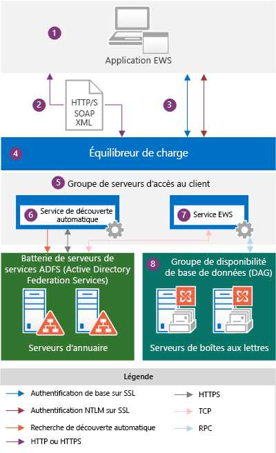
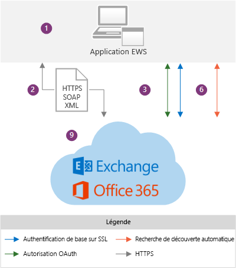

# Applications EWS et architecture Exchange

Découvrez le fonctionnement d’EWS au sein de l’architecture Exchange, et les protocoles sur lesquels EWS s’appuie.
  
Exchange Web Services (EWS) est une API multiplateformes qui permet aux applications d'accéder à des éléments de boîte aux lettres tels que des messages électroniques, des réunions et des contacts à partir d'Exchange Online, Exchange Online dans le cadre d'Office 365 ou des versions locales d'Exchange à partir d'Exchange Server 2007. [Les applications EWS](ews-application-types.md) peuvent accéder aux éléments de boîte aux lettres localement ou à distance en envoyant une requête dans un message XML basé sur SOAP. Le message SOAP est incorporé dans un message HTTP lorsqu'il est envoyé entre l'application et le serveur, ce qui signifie que tant que votre application peut publier des éléments XML via HTTP, elle peut utiliser EWS pour accéder à Exchange. 
  
## Vue d’ensemble de l’architecture Exchange

Les diagrammes suivants montrent les méthodes d’authentification et les chemins de communication utilisés par les applications EWS pour communiquer avec Exchange 2013 et Exchange Online. Du point de vue de l’application EWS, les chemins de communication sont identiques et les méthodes d’authentification varient légèrement. La principale différence réside dans la visibilité que vous avez du serveur principal Exchange.
  
**Figure 1. Application EWS et architecture locale Exchange**

  
La figure 2 illustre les mêmes chemins de communication présentés dans la figure 1, utilisés par les applications EWS pour communiquer avec Exchange Online.
  
**Figure 2. Application EWS et architecture Exchange Online**

  
Les éléments suivants sont les composants affichés dans les diagrammes :
  
1. Application EWS : il peut s'agir d'un [client, un portail ou une application de service](ews-application-types.md) et elle peut être installée sur un client ou sur un serveur d'accès au client Exchange local. Si vous utilisez l'API managée EWS pour développer l'application EWS, les assemblies de l'API managée EWS doivent être installés sur le client et [redistribués par votre application](redistribution-requirements-for-the-ews-managed-api.md).
    
2. Message XML SOAP : message XML, dans une enveloppe SOAP, incorporé dans un message HTTP/S conforme au fichier Services.wsdl sur le serveur d’accès au client. HTTPS est recommandé pour Exchange en local et est obligatoire pour Exchange Online. 
    
3. Méthodes d’authentification : les messages EWS comprennent des informations d’authentification de base, NTLM (authentification intégrée de Windows) ou OAuth dans le cadre de la charge utile HTTP. 
    
4. Équilibreur de charge : l’équilibreur de charge distribue le message à un serveur d’accès au client dans le groupe de serveurs d’accès au client. Ce composant n’est visible que dans l’architecture Exchange locale.
    
5. Groupe de serveurs d'accès au client : les serveurs d'accès au client sont organisés en un groupe à charge équilibrée, appelé groupe de serveurs d'accès au client. Les serveurs d'accès au client individuels fournissent une authentification, une redirection limitée et des services proxy. Les serveurs d'accès au client n'effectuent aucun rendu des données et aucune donnée n'est mise en file d'attente ou stockée sur un serveur d'accès au client, car il est fin et sans état. Il authentifie simplement la demande, effectue une recherche de découverte automatique, puis transmet via un proxy la demande au serveur de boîtes aux lettres. Le serveur d'accès au client conserve une relation 1:1 avec le serveur de boîtes aux lettres qui héberge les données de l'utilisateur. Le protocole HTTP (sécurisé via SSL à l'aide d'un certificat auto-signé) est utilisé entre le serveur d'accès au client et le serveur de boîtes aux lettres. Ce composant n'est visible que dans l'architecture Exchange locale.
    
6. Service de découverte automatique : le service de découverte automatique effectue une découverte des services en accédant aux services de domaine Active Directory (AD DS) pour récupérer la version de boîte aux lettres et l'emplacement du serveur de boîtes aux lettres qui héberge la copie active des données de l'utilisateur.
    
7. Service EWS : le service EWS est décrit par trois fichiers : Services.wsdl, Messages.xsd et Types.xsd, ainsi que par les assemblies de l’API managée EWS. Services.wsdl décrit le contrat entre le client et le serveur, Messages.xsd définit les messages SOAP de requête et de réponse, et Types.xsd définit les éléments utilisés dans les messages SOAP. Messages.xsd et Types.xsd contiennent toujours les dernières versions du schéma, bien qu’il existe des versions antérieures du schéma. Notez que Services.wsdl, Messages.xsd et Types.xsd sont disponibles sur le serveur d’accès au client, mais ne sont pas utilisés pour la validation du schéma : ils sont fournis à titre de référence uniquement. Les assemblies de l’API managée EWS sont fournis pour les applications clientes EWS côté serveur et sont déployés sur tous les rôles d’Exchange Server, pas seulement les serveurs d’accès au client. Ce composant n’est visible que dans l’architecture Exchange locale.
    
    La disponibilité des fonctionnalités est basée sur la version du schéma EWS ciblée par votre application. Étant donné que les schémas EWS sont compatibles en amont et en aval, si vous créez une application qui cible une version antérieure du schéma, comme Exchange 2007 SP1, votre application fonctionnera également sur une version ultérieure du schéma, comme le service Exchange 2010 SP2, ainsi que sur Exchange Online. Étant donné que les fonctionnalités et les mises à jour de fonctionnalité sont pilotées par le schéma, nous vous recommandons d'utiliser la base de code commun la plus récente ciblant les fonctionnalités EWS que vous souhaitez mettre en œuvre dans votre application cliente. De nombreuses applications peuvent cibler la version Exchange2007_SP1, car le schéma Exchange 2007 SP1 contient presque toutes les principales fonctionnalités Exchange pour travailler avec des éléments et des dossiers dans la banque d'informations Exchange. Pour plus d'informations, voir [Fonctionnalités clientes EWS](ews-client-design-overview-for-exchange.md#EWSFeatures).
    
8. Groupe de disponibilité de base de données (DAG) : les serveurs de boîtes aux lettres sont organisés en un groupe de disponibilité de base de données hautement disponible, qui peut être déployé sur un ou plusieurs centres de données. Le serveur de boîtes aux lettres contient la base de données de boîtes aux lettres et gère toutes les activités pour les boîtes aux lettres actives sur ce serveur. Tous les composants qui traitent, rendent et stockent des données sont sur le serveur de boîtes aux lettres. Les clients ne se connectent pas directement au serveur de boîtes aux lettres, toutes les connexions sont gérées par le serveur d’accès au client. Ce composant n’est visible que dans l’architecture Exchange locale.
    
9. Exchange Online et Exchange Online dans le cadre d'Office 365 : solution de messagerie hébergée qui fournit des fonctionnalités Exchange comme un service basé sur un nuage.
    
Lorsqu’une application EWS demande des informations à la banque d’informations Exchange, un message de requête XML conforme à la norme SOAP est créé et envoyé au serveur Exchange. Lorsque le serveur Exchange reçoit la requête, il vérifie les informations d’identification fournies par le client et analyse automatiquement les données XML pour trouver les données demandées. Le serveur crée alors une réponse SOAP contenant les données XML qui représentent les objets fortement typés demandés et leurs propriétés. Les données XML sont renvoyées à l’application dans une réponse HTTP. L’application désérialise ensuite les données XML et les utilise pour reformer les objets fortement typés.
  
## Protocoles et normes que les applications EWS doivent prendre en charge

Pour communiquer avec un serveur Exchange, les applications EWS doivent prendre en charge les protocoles et normes suivants.
  
**Tableau 1. Protocoles**

|**Protocole**|**Utilisation**|
|:-----|:-----|
|HTTP/S    |Permet aux applications EWS d’accéder aux données de base de données Exchange sur le réseau, que le client se trouve sur Internet ou l’intranet.    |
|SOAP 1.0    |Permet de former une enveloppe autour de la charge de messagerie. EWS implémente le protocole SOAP à l’aide de différentes parties de l’enveloppe SOAP pour activer plusieurs fonctionnalités. L’en-tête SOAP est utilisé pour l’emprunt d’identité et pour fournir des données de contrôle des versions. Le corps SOAP fournit des informations sur l’opération à exécuter et les données soumises à l’opération. SOAP s’appuie sur WSDL pour décrire les opérations à appeler.    |
|WSDL 1.0    |Décrit les liaisons, les opérations et les propriétés utilisées pour appeler les opérations EWS, dans le fichier Services.wsdl. Ce fichier, ainsi que les fichiers de schéma référencés, comprennent le contrat entre une application EWS et le serveur Exchange, et sont souvent utilisés avec les outils propres au fournisseur pour créer des applications propres à la plateforme. Le fichier WSDL se trouve dans le répertoire virtuel EWS, qui se trouve à la racine du site web.    |
|Transport Layer Security (TLS)/SSL    |Fournit des communications web sécurisées sur Internet ou l’intranet. TLS permet aux applications d’authentifier les serveurs ou, éventuellement, permet aux serveurs d’authentifier les applications EWS. Il fournit également un canal de sécurité en chiffrant les communications. TLS est la version la plus récente du protocole Secure Sockets Layer (SSL).    |
|XML/XSD    |Fournit un format de message universel pour l’échange d’informations entre le client et le serveur Exchange. XML fournit des données de base de données Exchange complexes aux applications clientes, mais dans une structure définie. L’avantage du XML réside dans le fait qu’il permet l’échange de données, même lorsqu’une application EWS et un serveur ne partagent pas de plateforme commune.    |
   
En outre, les applications EWS doivent prendre en charge les normes d’authentification suivantes :
  
- Authentification de base sur SSL, pour les applications qui ciblent Exchange Online ou Exchange local.
    
- Authentification NTLM sur SSL, pour les applications qui prennent en charge Exchange local.
    
- Authentification de jeton OAuth 2.0, pour des applications partenaires et l’interopérabilité avec Lync Server 2013 et SharePoint Server 2013.
    
## Voir aussi

- [Commencer à utiliser les services web dans Exchange](start-using-web-services-in-exchange.md)
    
- [Types d'applications EWS](ews-application-types.md)
    
- [Vue d'ensemble de la conception client EWS pour Exchange](ews-client-design-overview-for-exchange.md)
    

