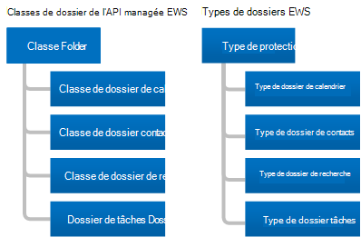

# Dossiers et éléments dans EWS dans ExchangeFolders and items in EWS in Exchange

Découvrez les dossiers et les éléments de boîte aux lettres, ainsi que la façon dont votre API managée EWS ou votre client EWS les désigne.Learn about folders and mailbox items and how your EWS Managed API or EWS client represents them.
  
Les dossiers sont l’élément d’organisation d’une boîte aux lettres Exchange.Folders are the organizing element of an Exchange mailbox. Les dossiers peuvent contenir des éléments de boîte aux lettres, tels que des messages électroniques, des contacts, des rendez-vous, des réunions et des tâches, ou ils peuvent contenir d’autres dossiers.Folders can contain mailbox items, such as email messages, contacts, appointments, meetings, and tasks, or they can contain other folders. Exchange comprend différents types de dossiers, mais les types de dossiers sont similaires.Exchange includes different types of folders, but the folder types are similar to each other. La principale différence entre elles est le type d’élément qu’elles contiennent.The main difference between them is the type of item they contain.
  
Toutefois, les éléments ont des types uniques.Items, however, have unique types. Chaque type d’élément dispose d’un ensemble de propriétés ou de schéma différent pour le définir.Each item type has a different set of properties or schema to define it. Dans cet article, nous allons étudier les types de dossiers et d’éléments disponibles, ainsi que les différences qui existent entre eux.In this article, we'll discuss the types of folders and items that are available and the differences between them.

## FoldersFolders

Les dossiers dérivent tous de la même classe de base ou du même type de base, de la classe de [dossier](https://msdn.microsoft.com/library/microsoft.exchange.webservices.data.folder%28v=EXCHG.80%29.aspx) dans l’API managée EWS ou du type de [dossier](https://msdn.microsoft.com/library/812948d8-c7db-45ce-bb3a-77233a53a974%28Office.15%29.aspx) dans EWS.Folders all derive from the same base class or base type, the [Folder](https://msdn.microsoft.com/library/microsoft.exchange.webservices.data.folder%28v=EXCHG.80%29.aspx) class in the EWS Managed API, or the [Folder](https://msdn.microsoft.com/library/812948d8-c7db-45ce-bb3a-77233a53a974%28Office.15%29.aspx) type in EWS. La figure suivante illustre les classes de l’API managée EWS et les types EWS.The following figure shows the EWS Managed API classes and EWS types. 
  
**Figure 1. Classes de dossier d’API managée EWS et types de dossiers EWS****Figure 1. EWS Managed API folder classes and EWS folder types**

  
La principale différence entre les classes de dossiers et les types de dossiers réside dans le fait que vous ne pouvez créer qu’un certain type d’élément dans chaque type de dossier.The primary difference between each of the folder classes and folder types is that you can only create a certain type of item in each type of folder. Une autre différence réside dans la façon dont le client affiche les informations dans un dossier.One other difference is in how the client displays information in a folder. Par exemple, Exchange vous permet de créer des rendez-vous dans le dossier calendrier.For example, Exchange allows you to create appointments in the Calendar folder. Vous pouvez déplacer d’autres types d’éléments dans le dossier calendrier après les avoir créés, mais Outlook ne les affiche pas.You can move other types of items into the Calendar folder after you create them, but Outlook won't display them. Outlook affiche uniquement les éléments de calendrier tels que les rendez-vous et les réunions dans le dossier calendrier, [même si un autre type d’élément existe dans le dossier](folders-and-items-in-ews-in-exchange.md#bk_item).Outlook only displays calendar items such as appointments and meetings in the Calendar folder, [even if another type of item exists in the folder](folders-and-items-in-ews-in-exchange.md#bk_item). 
  
**Tableau 1. Classes de dossier d’API managée EWS et types de dossiers EWS****Table 1. EWS Managed API folder classes and EWS folder types**

|**Classe d’API managée EWS****EWS Managed API class**|**Type EWS****EWS type**|**Valeur FolderClass****FolderClass value**|**Contains****Contains**|**Remarques****Notes**|
|:-----|:-----|:-----|:-----|:-----|
|[FolderFolder](https://msdn.microsoft.com/library/microsoft.exchange.webservices.data.folder%28v=exchg.80%29.aspx)   |[FolderFolder](https://msdn.microsoft.com/library/812948d8-c7db-45ce-bb3a-77233a53a974%28Office.15%29.aspx)   |Page. NoteIPF.Note    |Messages électroniques ou dossiers.Email messages or folders.    | Il s’agit de la classe ou du type de dossier générique pour les dossiers [WellKnownFolderName](https://msdn.microsoft.com/library/microsoft.exchange.webservices.data.wellknownfoldername%28v=exchg.80%29.aspx) d’API managée EWS et les dossiers EWS [DistinguishedFolderId](https://msdn.microsoft.com/library/50018162-2941-4227-8a5b-d6b4686bb32f%28Office.15%29.aspx) suivants :This is the generic folder class or type for the following EWS Managed API [WellKnownFolderName](https://msdn.microsoft.com/library/microsoft.exchange.webservices.data.wellknownfoldername%28v=exchg.80%29.aspx) folders and EWS [DistinguishedFolderId](https://msdn.microsoft.com/library/50018162-2941-4227-8a5b-d6b4686bb32f%28Office.15%29.aspx) folders: <ul><li>  Racine (sous-arborescence IPM)Root (IPM subtree)</li><li>NonIpmSubtreeNonIpmSubtree</li><li>Boîte de réceptionInbox</li><li>Éléments supprimésDeleted Items</li><li>BrouillonsDrafts</li><li>JournalJournal</li><li>NotesNotes  </li><li>Boîte d'envoiOutbox</li><li>Éléments envoyésSent Items</li><li>Dossier de messagesMessage Folder</li><li>Courrier indésirableJunk Email</li><li>Messagerie vocaleVoice Mail</li></ul> |
|[CalendarFolderCalendarFolder](https://msdn.microsoft.com/library/microsoft.exchange.webservices.data.calendarfolder%28v=exchg.80%29.aspx)   |[CalendarFolderCalendarFolder](https://msdn.microsoft.com/library/48687a78-e757-4c04-9641-bf4302c6b565%28Office.15%29.aspx)   |Page. Rendez-vousIPF.Appointment    |Rendez-vous et réunions.Appointments and meetings.    |Lorsqu’un utilisateur répond à une demande de réunion, le rendez-vous est ajouté à l’API managée EWS [WellKnownFolderName. Calendar](https://msdn.microsoft.com/library/microsoft.exchange.webservices.data.wellknownfoldername%28v=exchg.80%29.aspx) ou au EWS [DistinguishedFolderId. CalendarFolder](https://msdn.microsoft.com/library/50018162-2941-4227-8a5b-d6b4686bb32f%28Office.15%29.aspx) uniquement.When a user responds to a meeting request, the appointment is added to the EWS Managed API [WellKnownFolderName.Calendar](https://msdn.microsoft.com/library/microsoft.exchange.webservices.data.wellknownfoldername%28v=exchg.80%29.aspx) or the EWS [DistinguishedFolderId.CalendarFolder](https://msdn.microsoft.com/library/50018162-2941-4227-8a5b-d6b4686bb32f%28Office.15%29.aspx) only. Il s’agit des seuls dossiers qui prennent en charge l’interaction automatique avec les demandes de réunion et les réponses.These are the only folders that support automatic interaction with meeting requests and responses.    Ce type de classe de dossier ou de dossier prend en charge l’utilisation des affichages de calendrier pour renvoyer des rendez-vous et des réunions en fonction d’une date de début et d’une date de fin à l’aide de la méthode [Folder. FindItem](https://msdn.microsoft.com/library/microsoft.exchange.webservices.data.folder.finditems%28v=EXCHG.80%29.aspx) et de la classe [CalendarView](https://msdn.microsoft.com/library/microsoft.exchange.webservices.data.calendarview%28v=exchg.80%29.aspx) , ou de l’opération EWS [FindItem](https://msdn.microsoft.com/library/ebad6aae-16e7-44de-ae63-a95b24539729%28Office.15%29.aspx) et de l’élément [CalendarView](https://msdn.microsoft.com/library/a4a953b8-0710-416c-95ef-59e51eba9982%28Office.15%29.aspx) .This folder class or folder type supports the use of calendar views to return appointments and meetings based on a start date and an end date by using the EWS Managed API [Folder.FindItem](https://msdn.microsoft.com/library/microsoft.exchange.webservices.data.folder.finditems%28v=EXCHG.80%29.aspx) method and the [CalendarView](https://msdn.microsoft.com/library/microsoft.exchange.webservices.data.calendarview%28v=exchg.80%29.aspx) class, or the EWS [FindItem](https://msdn.microsoft.com/library/ebad6aae-16e7-44de-ae63-a95b24539729%28Office.15%29.aspx) operation and the [CalendarView](https://msdn.microsoft.com/library/a4a953b8-0710-416c-95ef-59e51eba9982%28Office.15%29.aspx) element.    |
|[ContactsFolderContactsFolder](https://msdn.microsoft.com/library/microsoft.exchange.webservices.data.contactsfolder%28v=exchg.80%29.aspx)   |[ContactsFolderContactsFolder](https://msdn.microsoft.com/library/6c299de8-2087-4aeb-8e66-2bc7586509a6%28Office.15%29.aspx)   |Page. PrenezIPF.Contact    |Contacts et listes de distribution.Contacts and distribution lists.    |Aucun.None.    |
|[SearchFolderSearchFolder](https://msdn.microsoft.com/library/microsoft.exchange.webservices.data.searchfolder%28v=exchg.80%29.aspx)   |[SearchFolderSearchFolder](https://msdn.microsoft.com/library/1a7d408b-2e98-4391-8834-085ed6d5757c%28Office.15%29.aspx)   |Page. NoteIPF.Note    |Le contenu est déterminé par une restriction ou un filtre.Contents are determined by a restriction or filter. Les dossiers de recherche n’ont pas de sous-dossiers.Search folders do not have subfolders.    |Les éléments qui répondent aux critères de recherche ne sont pas réellement contenus dans le dossier de recherche ; au lieu de cela, ils se trouvent ailleurs dans la boîte aux lettres.The items that meet the search criteria are not actually contained in the search folder; instead, they are located elsewhere in the mailbox.    Pour vous assurer que les dossiers de recherche sont disponibles dans Outlook, créez-les dans le dossier Finder.To ensure that Search folders are available in Outlook, create them in the Finder folder.    |
|[TasksFolderTasksFolder](https://msdn.microsoft.com/library/microsoft.exchange.webservices.data.tasksfolder%28v=exchg.80%29.aspx)   |[TasksFolderTasksFolder](https://msdn.microsoft.com/library/5a9a4612-8064-4986-b467-c44f268c64df%28Office.15%29.aspx)   |Page. TâcheIPF.Task    |Contient les éléments de travail à terminer.Contains work items to complete.    |Aucun.None.    |
   
### Structure de dossiersFolder structure

Les dossiers fournissent une structure de boîte aux lettres.Folders provide a mailbox structure. Cela inclut la sous-arborescence IPM, appelée la partie supérieure de la Banque d’informations dans EWS, dans laquelle la plupart des utilisateurs interagissent avec leur boîte aux lettres, ainsi que les dossiers système que la plupart des utilisateurs ne voient pas, qui se trouvent dans la sous-arborescence non IPM ou dans EWS.This includes the IPM Subtree, known as the Top of Information Store in EWS, where most users interact with their mailbox, as well as system folders that most users never see, which are in the Non-IPM Subtree or Root in EWS. La figure suivante illustre la structure de dossiers d’un utilisateur et indique les dossiers qui concernent les éléments de l’utilisateur et ceux qui sont des dossiers système.The following figure shows the folder structure for a user and indicates which folders are for the user's items and which are system folders.
  
**Figure 2. Dossiers d’éléments et système dans une boîte aux lettres****Figure 2. Item and system folders in a mailbox**

  
### Dossiers bien connusWell-known folders

Parmi les dossiers d’une boîte aux lettres, certains sont des dossiers spéciaux.Of the folders in a mailbox, some are special folders. Elles correspondent à des dossiers connus dans l’API managée EWS ou des dossiers uniques dans EWS.These equate to well-known folders in the EWS Managed API, or distinguished folders in EWS. Certains de ces dossiers ont des restrictions sur le nom du dossier, où ils se trouvent dans la structure de dossiers, et s’ils peuvent être supprimés.Some of these folders have restrictions on the folder name, where they are located in the folder structure, and whether they can be deleted. Les autres dossiers « génériques » (non spéciaux) n’ont pas les mêmes restrictions.Other "generic" (non-special) folders do not have the same restrictions. Il est important de vous familiariser avec les dossiers connus ou distingués suivants, car il s’agit des dossiers système, utilisateur et de recherche racine, et s’appliquent à la plupart des implémentations.It is important for you to be familiar with the following well-known or distinguished folders because they are the root system, user, and search folders, and are applicable to most implementations. 
  
**Tableau 2. Dossiers principaux connus et uniques****Table 2. Primary well-known and distinguished folders**

|**Nom convivial****Friendly name**|**Valeurs **WellKnownFolderName** de l’API MANAGÉe EWS****EWS Managed API **WellKnownFolderName** values**|**Valeurs **DISTINGUISHEDFOLDERID** EWS****EWS **DistinguishedFolderId** values**|**Description****Description**|
|:-----|:-----|:-----|:-----|
|Root (sous-arborescence non IPM)Root (Non-IPM Subtree)    |WellKnownFolderName. rootWellKnownFolderName.Root    |DistinguishedFolderId. rootDistinguishedFolderId.root    |Contient le dossier racine d’une boîte aux lettres, également appelé sous-arborescence non IPM.Contains the root folder of a mailbox, also known as the Non-IPM Subtree. Ce dossier n’a pas de parent et vous ne pouvez pas le déplacer, le copier, le renommer ou le supprimer.This folder has no parent, and you cannot move, copy, rename, or delete it. Chaque magasin de messages contient un seul dossier racine.Each message store contains only one root folder.    |
|Partie supérieure de la Banque d’informations (sous-arborescence IPM)Top of Information Store (IPM Subtree)    |WellKnownFolderName.MsgFolderRootWellKnownFolderName.MsgFolderRoot    |DistinguishedFolderId.msgfolderrootDistinguishedFolderId.msgfolderroot    |Contient la boîte de réception et les autres dossiers utilisateur.Contains the Inbox and other user folders.    |
|Finder (dossiers de recherche)Finder (Search folders)    |WellKnownFolderName. SearchFoldersWellKnownFolderName.SearchFolders    |DistinguishedFolderId. SearchFolders.DistinguishedFolderId.searchfolders.    |Contient les dossiers de recherche visibles dans Outlook.Contains search folders that are visible in Outlook.    |
   
Pour obtenir la liste complète des valeurs de propriété [WellKnownFolderName](https://msdn.microsoft.com/library/microsoft.exchange.webservices.data.folder.wellknownfoldername%28v=exchg.80%29.aspx) de l’API managée EWS, voir l’énumération [WellKnownFolderName](https://msdn.microsoft.com/library/microsoft.exchange.webservices.data.wellknownfoldername%28v=EXCHG.80%29.aspx) .For a complete list of the EWS Managed API [WellKnownFolderName](https://msdn.microsoft.com/library/microsoft.exchange.webservices.data.folder.wellknownfoldername%28v=exchg.80%29.aspx) property values, see the [WellKnownFolderName](https://msdn.microsoft.com/library/microsoft.exchange.webservices.data.wellknownfoldername%28v=EXCHG.80%29.aspx) enumeration. Pour obtenir la liste complète des valeurs **DISTINGUISHEDFOLDERID** EWS, voir [DistinguishedFolderId](https://msdn.microsoft.com/library/50018162-2941-4227-8a5b-d6b4686bb32f%28Office.15%29.aspx).For a complete list of the EWS **DistinguishedFolderId** values, see [DistinguishedFolderId](https://msdn.microsoft.com/library/50018162-2941-4227-8a5b-d6b4686bb32f%28Office.15%29.aspx).
  
### Propriétés des dossiersFolder properties

Dans l’API managée EWS, les [Propriétés de dossier](https://msdn.microsoft.com/library/microsoft.exchange.webservices.data.folder_properties%28v=exchg.80%29.aspx) sont toutes dérivées de la classe de [dossier](https://msdn.microsoft.com/library/microsoft.exchange.webservices.data.folder%28v=EXCHG.80%29.aspx) de base.In the EWS Managed API, the [folder properties](https://msdn.microsoft.com/library/microsoft.exchange.webservices.data.folder_properties%28v=exchg.80%29.aspx) are all derived from the base [Folder](https://msdn.microsoft.com/library/microsoft.exchange.webservices.data.folder%28v=EXCHG.80%29.aspx) class. Et dans EWS, tous les dossiers utilisent les éléments de dossier qui sont disponibles sur le type de [dossier](https://msdn.microsoft.com/library/812948d8-c7db-45ce-bb3a-77233a53a974%28Office.15%29.aspx) .And in EWS, all folders use the folder elements that are available on the [Folder](https://msdn.microsoft.com/library/812948d8-c7db-45ce-bb3a-77233a53a974%28Office.15%29.aspx) type. La plupart des propriétés et des éléments liés aux dossiers sont simples (ID de dossier parent, nom d’affichage, etc.), mais quelques explications supplémentaires sont nécessaires.Most of the folder-related properties and elements are straightforward (parent folder ID, display name, and so on), but a few require a little more explanation. 
  
Les avertissements suivants s’appliquent à la propriété de l’API managée EWS [. FolderClass](https://msdn.microsoft.com/library/microsoft.exchange.webservices.data.folder.folderclass%28v=EXCHG.80%29.aspx) ou à l’élément [FolderClass](https://msdn.microsoft.com/library/0041d135-2869-4612-89a5-d1aa86aa1093%28Office.15%29.aspx) EWS :The following caveats apply to the EWS Managed API [Folder.FolderClass](https://msdn.microsoft.com/library/microsoft.exchange.webservices.data.folder.folderclass%28v=EXCHG.80%29.aspx) property or the EWS [FolderClass](https://msdn.microsoft.com/library/0041d135-2869-4612-89a5-d1aa86aa1093%28Office.15%29.aspx) element: 
  
- Si ce paramètre est défini, la valeur de la propriété ou de l’élément doit être conforme à la classe dérivée ou au type du dossier.If set, the value of the property or element must agree with the derived class or type of the folder. Par exemple, la propriété ou l’élément **FolderClass** ne peut pas indiquer que le dossier est un dossier de contacts tandis que la classe ou le type du dossier indique que le dossier est un dossier de calendrier.For example, the **FolderClass** property or element can't indicate that the folder is a Contacts folder while the class or type of the folder indicates the folder is a Calendar folder. 
    
- Vous pouvez [créer des dossiers](how-to-work-with-folders-by-using-ews-in-exchange.md#bk_createfolderewsma) d’un type spécifique sans définir la propriété ou l’élément **FolderClass** , ou vous pouvez créer un dossier avec le type de dossier générique et spécifier la propriété ou l’élément **FolderClass** .You can either [create folders](how-to-work-with-folders-by-using-ews-in-exchange.md#bk_createfolderewsma) of a specific type without setting the **FolderClass** property or element, or you can create a folder with the generic folder type and specify the **FolderClass** property or element. Les deux options créent le même résultat.Both options create the same result. 
    
- Après avoir défini la valeur **FolderClass** en créant un type spécifique de dossier ou en définissant la propriété **FolderClass** ou l’élément lui-même, vous ne pouvez pas la modifier.After you set the **FolderClass** value by creating a specific type of folder or by setting the **FolderClass** property or element itself, you cannot change it. Par exemple, vous ne pouvez pas modifier un IPF. Note dossier en une erreur de page non valide. Dossier de contacts.For example, you cannot change an IPF.Note folder to an IPF.Contact folder. Toutefois, vous pouvez le remplacer par un IPF. Dossier note. contoso.You can, however, change it to an IPF.Note.Contoso folder. 
    
- Toute valeur **FolderClass** qui n’utilise pas l’un des préfixes prédéfinis est traitée comme une erreur de page non valide. Dossier de notes.Any **FolderClass** value that does not use one of the predefined prefixes is treated as an IPF.Note folder. Par exemple, une valeur **FolderClass** de IAmAFolderClass est traitée comme une erreur de page non valide. Dossier de notes.For example, a **FolderClass** value of IAmAFolderClass is treated as an IPF.Note folder. 
    
La valeur de la classe Folder est extensible.The folder class value is extensible. Cela signifie que les valeurs **FolderClass** par défaut répertoriées dans le tableau 1 sont traitées comme des préfixes et que vous pouvez ajouter des valeurs personnalisées.This means that the default **FolderClass** values listed in Table 1 are treated as prefixes and you can add custom values. Par exemple, vous pouvez créer un dossier avec une valeur **FolderClass** de IPF. Contact. contoso et il est traité comme un dossier de contacts.For example, you can create a folder with a **FolderClass** value of IPF.Contact.Contoso, and it is treated as a Contacts folder. 
  
Vous pouvez déterminer les autorisations dont dispose le client sur les dossiers, telles que supprimer, lire et modifier, à l’aide de la propriété [Folder. EffectiveRights](https://msdn.microsoft.com/library/microsoft.exchange.webservices.data.folder.effectiverights%28v=EXCHG.80%29.aspx) de l’API managée EWS ou de l’élément [EffectiveRights](https://msdn.microsoft.com/library/bf5278eb-3a1a-4d27-9d16-b8be043bb023%28Office.15%29.aspx) EWS.You can determine what permissions the client has on the folders, such as delete, read, and modify, by using the EWS Managed API [Folder.EffectiveRights](https://msdn.microsoft.com/library/microsoft.exchange.webservices.data.folder.effectiverights%28v=EXCHG.80%29.aspx) property or the EWS [EffectiveRights](https://msdn.microsoft.com/library/bf5278eb-3a1a-4d27-9d16-b8be043bb023%28Office.15%29.aspx) element. 
  
### Dossiers publicsPublic folders

Les dossiers publics sont conçus pour assurer un accès partagé et offrir une manière simple et efficace de collecter, d’organiser et de partager des informations avec d’autres personnes dans votre groupe de travail ou votre organisation.Public folders are designed for shared access and provide an easy and effective way to collect, organize, and share information with other people in your workgroup or organization. Vous pouvez également utiliser des dossiers publics pour archiver le contenu du groupe de distribution.You can also use public folders to archive distribution group content. Pour obtenir des informations détaillées sur les dossiers publics, consultez la rubrique [Public Folder Access with EWS in Exchange](public-folder-access-with-ews-in-exchange.md).For in-depth information about public folders, see [Public folder access with EWS in Exchange](public-folder-access-with-ews-in-exchange.md).

### Dossiers cachésHidden folders

Tous les dossiers créés par Exchange à la racine de la boîte aux lettres sont masqués et vous pouvez utiliser l’API managée EWS ou EWS pour masquer les autres dossiers sous la Banque d’informations.All the folders that Exchange creates at the root of the mailbox are hidden, and you can use the EWS Managed API or EWS to hide additional folders under the Top of Information Store. Pour plus d’informations sur les dossiers masqués, consultez la rubrique utilisation [de dossiers masqués à l’aide d’EWS dans Exchange](how-to-work-with-hidden-folders-by-using-ews-in-exchange.md).For more information about hidden folders, see [Work with hidden folders by using EWS in Exchange](how-to-work-with-hidden-folders-by-using-ews-in-exchange.md). 

### Dossiers de rechercheSearch folders

Les dossiers de recherche sont identiques aux dossiers ordinaires, à la seule différence qu’ils ont une propriété ou un élément qui définit le filtre de recherche.Search folders are just like regular folders, except that they have a property or element that defines the search filter. Vous pouvez créer des dossiers de recherche dans n’importe quel dossier d’une boîte aux lettres Exchange et les créer de la même manière que vous créez un autre dossier.You can create search folders in any folder in an Exchange mailbox, and you create them in the same way that you create any other folder. Toutefois, pour qu’un dossier de recherche apparaisse dans Outlook, Outlook Web App ou Outlook Live, les objets [SearchFolder](https://msdn.microsoft.com/library/microsoft.exchange.webservices.data.searchfolder%28v=exchg.80%29.aspx) que vous créez à l’aide de l’API managée EWS doivent se trouver dans le dossier [WellKnownFolderName. SearchFolders](https://msdn.microsoft.com/library/microsoft.exchange.webservices.data.wellknownfoldername%28v=exchg.80%29.aspx) , et les types [SearchFolder](https://msdn.microsoft.com/library/1a7d408b-2e98-4391-8834-085ed6d5757c%28Office.15%29.aspx) que vous créez à l’aide d’EWS doivent se trouver dans le dossier [DistinguishedFolderId. SearchFolders](https://msdn.microsoft.com/library/50018162-2941-4227-8a5b-d6b4686bb32f%28Office.15%29.aspx) .However, for a search folder to appear in Outlook, Outlook Web App, or Outlook Live, [SearchFolder](https://msdn.microsoft.com/library/microsoft.exchange.webservices.data.searchfolder%28v=exchg.80%29.aspx) objects that you create by using the EWS Managed API must be located in the [WellKnownFolderName.SearchFolders](https://msdn.microsoft.com/library/microsoft.exchange.webservices.data.wellknownfoldername%28v=exchg.80%29.aspx) folder, and [SearchFolder](https://msdn.microsoft.com/library/1a7d408b-2e98-4391-8834-085ed6d5757c%28Office.15%29.aspx) types that you create by using EWS must be located in the [DistinguishedFolderId.SearchFolders](https://msdn.microsoft.com/library/50018162-2941-4227-8a5b-d6b4686bb32f%28Office.15%29.aspx) folder. Si le dossier de recherche est créé à un autre emplacement, il est toujours disponible et vous pouvez l’afficher dans les applications clientes personnalisées.If the search folder is created in a different location, it is still available and you can view it in custom client applications. 

## ÉlémentsItems

EWS dans Exchange utilise des **éléments** pour représenter des messages électroniques individuels, des rendez-vous, des réunions, des contacts, des listes de distribution, des tâches, des publications et d’autres éléments, dans une boîte aux lettres.EWS in Exchange uses **Items** to represent individual email messages, appointments, meetings, contacts, distribution lists, tasks, posts, and other items, in a mailbox. Les éléments sont fortement typés, ce qui signifie qu’ils ont une classe ou un schéma associé spécifique, ou ne sont pas fortement typés, également appelés éléments génériques.Items are either strongly typed, which means that they have a specific associated class or schema, or not strongly typed, also known as generic items. Les éléments génériques sont des objets [Item](https://msdn.microsoft.com/library/microsoft.exchange.webservices.data.item%28v=exchg.80%29.aspx) dans l’API managée EWS et les types d' [éléments](https://msdn.microsoft.com/library/4dfe8f48-e7b4-444d-bdf9-a34e180f598b%28Office.15%29.aspx) dans EWS.Generic items are [Item](https://msdn.microsoft.com/library/microsoft.exchange.webservices.data.item%28v=exchg.80%29.aspx) objects in the EWS Managed API and [Item](https://msdn.microsoft.com/library/4dfe8f48-e7b4-444d-bdf9-a34e180f598b%28Office.15%29.aspx) types in EWS. Les éléments communs, tels que les messages électroniques, les contacts, les listes de distribution, les publications et les tâches, sont fortement typés, et vous pouvez définir des propriétés schématisées spécifiques ou des éléments sur ceux-ci.Common items like email messages, contacts, distribution lists, posts, and tasks are strongly typed, and you can set specific schematized properties or elements on them. 
  
**Tableau 3. Éléments fortement typés****Table 3. Strongly typed items**

|**Type d’élément d’API managée EWS****EWS Managed API item type**|**Élément d’élément EWS****EWS item element**|
|:-----|:-----|
|[Rendez-vousAppointment](https://msdn.microsoft.com/library/microsoft.exchange.webservices.data.appointment%28v=exchg.80%29.aspx)   |[CalendarItemCalendarItem](https://msdn.microsoft.com/library/b0c1fd27-b6da-46e5-88b8-88f00c71ba80%28Office.15%29.aspx)   |
|[ContactContact](https://msdn.microsoft.com/library/microsoft.exchange.webservices.data.contact%28v=exchg.80%29.aspx)   |[ContactContact](https://msdn.microsoft.com/library/66bfff50-7a91-4d81-b6a0-610b9962f677%28Office.15%29.aspx)   |
|[ContactGroupContactGroup](https://msdn.microsoft.com/library/microsoft.exchange.webservices.data.contactgroup%28v=exchg.80%29.aspx)   |[DistributionListDistributionList](https://msdn.microsoft.com/library/f65aea01-e870-44a2-8571-fa6c001341cc%28Office.15%29.aspx)   |
|[EmailMessageEmailMessage](https://msdn.microsoft.com/library/microsoft.exchange.webservices.data.emailmessage%28v=exchg.80%29.aspx)   |[MessageMessage](https://msdn.microsoft.com/library/2400b33c-43b2-4fc2-b6fb-275a99e0e810%28Office.15%29.aspx)   |
|[PostItemPostItem](https://msdn.microsoft.com/library/microsoft.exchange.webservices.data.postitem%28v=exchg.80%29.aspx)   |[PostItemPostItem](https://msdn.microsoft.com/library/7727ed84-9591-4a1c-bb04-12129926499b%28Office.15%29.aspx)   |
|[TaskTask](https://msdn.microsoft.com/library/microsoft.exchange.webservices.data.task%28v=exchg.80%29.aspx)   |[TaskTask](https://msdn.microsoft.com/library/7c84927e-db28-4c5d-b0b5-cbcc2b88d869%28Office.15%29.aspx)   |
   
API managée EWS les éléments fortement typés dérivent de la classe d' [élément](https://msdn.microsoft.com/library/microsoft.exchange.webservices.data.item%28v=EXCHG.80%29.aspx) de base.EWS Managed API strongly typed items derive from the base [Item](https://msdn.microsoft.com/library/microsoft.exchange.webservices.data.item%28v=EXCHG.80%29.aspx) class. Toutefois, vous utilisez généralement l’un des types dérivés figurant dans le tableau 3, et non directement avec la classe d' **élément** .However, you usually work with one of the derived types listed in Table 3, and not with the **Item** class directly. Toutefois, lorsque vous utilisez la classe [ItemCollection](https://msdn.microsoft.com/library/dd634001%28v=EXCHG.80%29.aspx) , vous pouvez travailler directement avec des instances de la classe d' **élément** .When you work with the [ItemCollection](https://msdn.microsoft.com/library/dd634001%28v=EXCHG.80%29.aspx) class, however, you might work directly with instances of the **Item** class. Dans ce cas, vous devez implémenter une logique qui détermine le type d’élément dans le magasin représenté par l’instance de la classe d' **élément** .In that case, you should implement logic that determines the type of item in the store that the instance of the **Item** class represents. Pour utiliser cet élément, vous devez effectuer une liaison à l’élément à l’aide d’une instance de la classe qui représente l’élément.To work with that item, you should bind to the item by using an instance of the class that represents the item. 
  
### Éléments dans des dossiersItems in folders

Certains dossiers ont des restrictions quant aux types d’éléments qu’ils peuvent contenir.Some folders have restrictions about the types of items that they can contain. Il s’agit de restrictions que la base de données de boîtes aux lettres Exchange applique aux dossiers, et non aux limitations d’affichage client.These are restrictions that the Exchange mailbox database applies to folders, not client view limitations. 
  
**Tableau 4. Restrictions des éléments pour les dossiers****Table 4. Item restrictions for folders**

|**Classe de dossier de l’API managée EWS****EWS Managed API Folder class**|**Type de dossier EWS****EWS Folder type**|**Restriction****Restriction**|
|:-----|:-----|:-----|
|[Classe de dossier de baseBase Folder class](https://msdn.microsoft.com/library/microsoft.exchange.webservices.data.folder%28v=exchg.80%29.aspx)   |[FolderFolder](https://msdn.microsoft.com/library/812948d8-c7db-45ce-bb3a-77233a53a974%28Office.15%29.aspx)   |Vous pouvez uniquement créer de nouveaux objets [EmailMessage](https://msdn.microsoft.com/library/microsoft.exchange.webservices.data.emailmessage%28v=exchg.80%29.aspx) de l’API managée EWS et des objets [PostItem](https://msdn.microsoft.com/library/microsoft.exchange.webservices.data.postitem%28v=exchg.80%29.aspx) , ou des types de [message](https://msdn.microsoft.com/library/2400b33c-43b2-4fc2-b6fb-275a99e0e810%28Office.15%29.aspx) EWS ou des types de **PostItem** , dans les dossiers génériques.You can only create new EWS Managed API [EmailMessage](https://msdn.microsoft.com/library/microsoft.exchange.webservices.data.emailmessage%28v=exchg.80%29.aspx) objects and [PostItem](https://msdn.microsoft.com/library/microsoft.exchange.webservices.data.postitem%28v=exchg.80%29.aspx) objects, or EWS [Message](https://msdn.microsoft.com/library/2400b33c-43b2-4fc2-b6fb-275a99e0e810%28Office.15%29.aspx) types or **PostItem** types, in the generic folders. Vous pouvez déplacer d’autres types d’éléments dans des dossiers génériques, mais il se peut que le client ne les affiche pas.You can move other item types into generic folders, but the client might not display them.    |
|[CalendarFolderCalendarFolder](https://msdn.microsoft.com/library/microsoft.exchange.webservices.data.calendarfolder%28v=exchg.80%29.aspx)   |[CalendarFolderCalendarFolder](https://msdn.microsoft.com/library/48687a78-e757-4c04-9641-bf4302c6b565%28Office.15%29.aspx)   |Vous pouvez uniquement créer des objets de [rendez-](https://msdn.microsoft.com/library/microsoft.exchange.webservices.data.appointment%28v=exchg.80%29.aspx) vous de l’API managée EWS et des types [CalendarItem](https://msdn.microsoft.com/library/b0c1fd27-b6da-46e5-88b8-88f00c71ba80%28Office.15%29.aspx) EWS dans le dossier de calendrier.You can only create new EWS Managed API [Appointment](https://msdn.microsoft.com/library/microsoft.exchange.webservices.data.appointment%28v=exchg.80%29.aspx) objects and EWS [CalendarItem](https://msdn.microsoft.com/library/b0c1fd27-b6da-46e5-88b8-88f00c71ba80%28Office.15%29.aspx) types in the Calendar folder. Vous pouvez déplacer d’autres types d’éléments dans le dossier calendrier, mais il se peut que le client ne les affiche pas.You can move other item types into the Calendar folder, but the client might not display them.    |
|[ContactsFolderContactsFolder](https://msdn.microsoft.com/library/microsoft.exchange.webservices.data.contactsfolder%28v=exchg.80%29.aspx)   |[ContactsFolderContactsFolder](https://msdn.microsoft.com/library/6c299de8-2087-4aeb-8e66-2bc7586509a6%28Office.15%29.aspx)   |Vous pouvez uniquement créer de nouveaux objets de [contact](https://msdn.microsoft.com/library/microsoft.exchange.webservices.data.contact%28v=exchg.80%29.aspx) et d’API managée EWS, [ou des types](https://msdn.microsoft.com/library/microsoft.exchange.webservices.data.contactgroup%28v=exchg.80%29.aspx) de [contacts](https://msdn.microsoft.com/library/66bfff50-7a91-4d81-b6a0-610b9962f677%28Office.15%29.aspx) EWS ou des types [DistributionList](https://msdn.microsoft.com/library/f65aea01-e870-44a2-8571-fa6c001341cc%28Office.15%29.aspx) dans le dossier contacts.You can only create new EWS Managed API [Contact](https://msdn.microsoft.com/library/microsoft.exchange.webservices.data.contact%28v=exchg.80%29.aspx) and [ContactGroup](https://msdn.microsoft.com/library/microsoft.exchange.webservices.data.contactgroup%28v=exchg.80%29.aspx) objects, or EWS [Contact](https://msdn.microsoft.com/library/66bfff50-7a91-4d81-b6a0-610b9962f677%28Office.15%29.aspx) types or [DistributionList](https://msdn.microsoft.com/library/f65aea01-e870-44a2-8571-fa6c001341cc%28Office.15%29.aspx) types in the Contacts folder. Vous pouvez déplacer d’autres types d’éléments dans le dossier contacts, mais il se peut que le client ne les affiche pas.You can move other item types into the Contacts folder, but the client might not display them    |
|[SearchFolderSearchFolder](https://msdn.microsoft.com/library/microsoft.exchange.webservices.data.searchfolder%28v=exchg.80%29.aspx)   |[SearchFolderSearchFolder](https://msdn.microsoft.com/library/1a7d408b-2e98-4391-8834-085ed6d5757c%28Office.15%29.aspx)   |Aucune restriction.No restrictions. Les éléments ne se trouvent pas réellement dans le dossier de recherche ; ils se trouvent ailleurs dans la boîte aux lettres.Items are not actually located in the Search folder; they are located elsewhere in the mailbox.    |
|[TasksFolderTasksFolder](https://msdn.microsoft.com/library/microsoft.exchange.webservices.data.tasksfolder%28v=exchg.80%29.aspx)   |[TasksFolderTasksFolder](https://msdn.microsoft.com/library/5a9a4612-8064-4986-b467-c44f268c64df%28Office.15%29.aspx)   |Vous pouvez uniquement créer des objets de [tâche](https://msdn.microsoft.com/library/microsoft.exchange.webservices.data.task%28v=exchg.80%29.aspx) de l’API managée EWS ou des types de [tâches](https://msdn.microsoft.com/library/7c84927e-db28-4c5d-b0b5-cbcc2b88d869%28Office.15%29.aspx) EWS dans le dossier tâches.You can only create new EWS Managed API [Task](https://msdn.microsoft.com/library/microsoft.exchange.webservices.data.task%28v=exchg.80%29.aspx) objects or EWS [Task](https://msdn.microsoft.com/library/7c84927e-db28-4c5d-b0b5-cbcc2b88d869%28Office.15%29.aspx) types in the Tasks folder. Vous pouvez déplacer d’autres types d’éléments dans le dossier tâches, mais il se peut que le client ne les affiche pas.You can move other item types into the Tasks folder, but the client might not display them    |

## Mise à niveau à partir de versions antérieures du produitUpgrading from earlier product versions

Les dossiers sont en grande partie restés inchangés dans les versions antérieures et actuelles du produit.Folders have for the most part remained unchanged in earlier and current product versions. Notez toutefois que les versions antérieures d’Exchange utilisent des dossiers gérés pour effectuer la gestion des enregistrements de messagerie (MRM).Note, however, that earlier versions of Exchange use managed folders to perform messaging records management (MRM). Exchange Online, Exchange Online dans le cadre d’Office 365 et les versions d’Exchange à partir d’Exchange 2013 utilisent des stratégies de rétention pour MRM.Exchange Online, Exchange Online as part of Office 365, and versions of Exchange starting with Exchange 2013 use retention policies for MRM. Vous pouvez [mettre à niveau les dossiers gérés pour utiliser des stratégies de rétention](https://technet.microsoft.com/library/dd298032%28v=exchg.150%29.aspx).You can [upgrade managed folders to use retention policies](https://technet.microsoft.com/library/dd298032%28v=exchg.150%29.aspx). 
  
Les éléments n’ont pas été modifiés dans les versions antérieures et actuelles du produit.Items have not changed in earlier and current product versions.

## Contenu de cette sectionIn this section

- [Utiliser des dossiers à l’aide d’EWS dans ExchangeWork with folders by using EWS in Exchange](how-to-work-with-folders-by-using-ews-in-exchange.md)
    
- [Utiliser des dossiers masqués à l’aide d’EWS dans ExchangeWork with hidden folders by using EWS in Exchange](how-to-work-with-hidden-folders-by-using-ews-in-exchange.md)
    
- [Utilisations d’éléments de boîte aux lettres Exchange à l’aide d’EWS dans ExchangeWork with Exchange mailbox items by using EWS in Exchange](how-to-work-with-exchange-mailbox-items-by-using-ews-in-exchange.md)
    
- [Supprimer des éléments à l’aide d’EWS dans ExchangeDelete items by using EWS in Exchange](deleting-items-by-using-ews-in-exchange.md)
    
- [Exporter et importer des éléments à l’aide d’EWS dans ExchangeExport and import items by using EWS in Exchange](exporting-and-importing-items-by-using-ews-in-exchange.md)
    
## Voir aussiSee also

- [Développer des clients de service web pour ExchangeDevelop web service clients for Exchange](develop-web-service-clients-for-exchange.md)   
- [Commencer à utiliser les services web dans ExchangeStart using web services in Exchange](start-using-web-services-in-exchange.md)   
- [Vue d'ensemble de la conception client EWS pour ExchangeEWS client design overview for Exchange](ews-client-design-overview-for-exchange.md)
    

