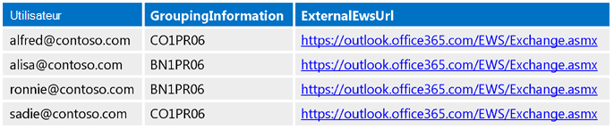
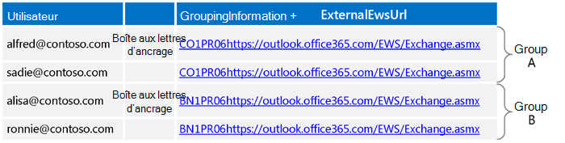
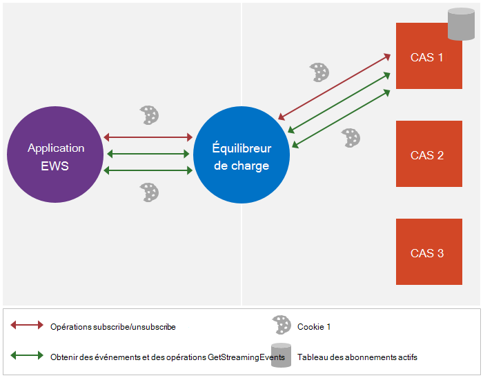
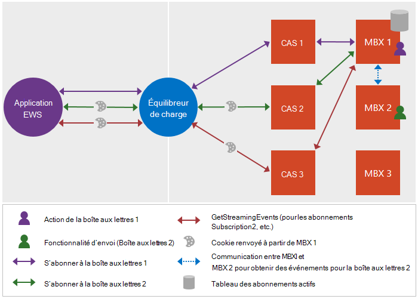

# <a name="maintain-affinity-between-a-group-of-subscriptions-and-the-mailbox-server-in-exchange"></a><span data-ttu-id="8e477-103">Conserve les affinités entre un groupe d’abonnements et le serveur de boîtes aux lettres dans Exchange</span><span class="sxs-lookup"><span data-stu-id="8e477-103">Maintain affinity between a group of subscriptions and the Mailbox server in Exchange</span></span>

<span data-ttu-id="8e477-104">Découvrez la gestion de l’affinité entre un groupe d’abonnements et le serveur de boîtes aux lettres.</span><span class="sxs-lookup"><span data-stu-id="8e477-104">Find out about maintaining the affinity between a group of subscriptions and the Mailbox server.</span></span>
  
<span data-ttu-id="8e477-105">L’affinité est l’association d’une séquence de messages de demande et réponse avec un serveur de boîtes aux lettres spécifique.</span><span class="sxs-lookup"><span data-stu-id="8e477-105">Affinity is the association of a sequence of request and response messages with a particular Mailbox server.</span></span> <span data-ttu-id="8e477-106">La plupart des fonctionnalités de Microsoft Exchange, l’affinité est gérée par le serveur.</span><span class="sxs-lookup"><span data-stu-id="8e477-106">For most functionality in Exchange, affinity is handled by the server.</span></span> <span data-ttu-id="8e477-107">Notifications, toutefois, sont une exception.</span><span class="sxs-lookup"><span data-stu-id="8e477-107">Notifications, however, are an exception.</span></span> <span data-ttu-id="8e477-108">Le client est responsable de l’affinité avec le serveur de boîtes aux lettres pour les abonnements aux notifications.</span><span class="sxs-lookup"><span data-stu-id="8e477-108">The client is responsible for maintaining the affinity with the Mailbox server for notification subscriptions.</span></span> <span data-ttu-id="8e477-109">Cette affinité permet l’équilibreur de charge et les serveurs d’accès Client entre le client et le serveur pour les abonnements aux notifications itinéraire et requêtes connexes sur le serveur de boîtes aux lettres qui gère l’abonnement.</span><span class="sxs-lookup"><span data-stu-id="8e477-109">This affinity enables the load balancer and Client Access servers between the client and the server to route notification subscriptions and related requests to the Mailbox server that maintains the subscription.</span></span> <span data-ttu-id="8e477-110">Sans affinité, la demande routée vers un autre serveur de boîtes aux lettres qui n’inclut pas les abonnements aux informations du client, ce qui peuvent provoquer une erreur [ErrorSubscriptionNotFound](http://msdn.microsoft.com/library/4b84d670-74c9-4d6d-84e7-f0a9f76f0d93%28Office.15%29.aspx) à renvoyer.</span><span class="sxs-lookup"><span data-stu-id="8e477-110">Without affinity, the request might get routed to a different Mailbox server that does not include the client's subscriptions, which can cause an [ErrorSubscriptionNotFound](http://msdn.microsoft.com/library/4b84d670-74c9-4d6d-84e7-f0a9f76f0d93%28Office.15%29.aspx) error to be returned.</span></span> 
  
## <a name="how-is-affinity-maintained"></a><span data-ttu-id="8e477-111">Comment l’affinité est conservée ?</span><span class="sxs-lookup"><span data-stu-id="8e477-111">How is affinity maintained?</span></span>
<span data-ttu-id="8e477-112"><a name="bk_howmaintained"> </a></span><span class="sxs-lookup"><span data-stu-id="8e477-112"></span></span>

<span data-ttu-id="8e477-113">Affinité dans Exchange est basé le cookie.</span><span class="sxs-lookup"><span data-stu-id="8e477-113">Affinity in Exchange is cookie based.</span></span> <span data-ttu-id="8e477-114">Le client déclenche la création du cookie en incluant des en-têtes spécifiques dans la demande d’abonnement, puis la réponse de l’abonnement contient le cookie.</span><span class="sxs-lookup"><span data-stu-id="8e477-114">The client triggers the creation of the cookie by including specific headers in the subscription request, and then the subscription response contains the cookie.</span></span> <span data-ttu-id="8e477-115">Le client envoie ensuite ce cookie dans les demandes suivantes pour vous assurer que la demande est routée vers le serveur de boîtes aux lettres de droite.</span><span class="sxs-lookup"><span data-stu-id="8e477-115">The client then sends that cookie in subsequent requests to ensure that the request is routed to the right Mailbox server.</span></span>
  
<span data-ttu-id="8e477-116">Plus précisément, l’affinité dans Exchange est gérée par les éléments suivants :</span><span class="sxs-lookup"><span data-stu-id="8e477-116">More specifically, affinity in Exchange is handled by the following:</span></span> 
  
- <span data-ttu-id="8e477-117">X-AnchorMailbox, En-tête HTTP une qui est inclus dans la demande initiale d’abonnement.</span><span class="sxs-lookup"><span data-stu-id="8e477-117">X-AnchorMailbox — An HTTP header that is included in the initial subscription request.</span></span> <span data-ttu-id="8e477-118">Il identifie la première boîte aux lettres dans un groupe de boîtes aux lettres qui partagent une affinité avec le même serveur de boîtes aux lettres.</span><span class="sxs-lookup"><span data-stu-id="8e477-118">It identifies the first mailbox in a group of mailboxes that share affinity with the same Mailbox server.</span></span>
    
- <span data-ttu-id="8e477-119">X-PreferServerAffinity — Un en-tête HTTP qui est inclus dans la demande d’abonnement initial avec l’en-tête X-AnchorMailbox et est définie sur true pour indiquer que le client demande que l’affinité être mis à jour avec le serveur de boîtes aux lettres.</span><span class="sxs-lookup"><span data-stu-id="8e477-119">X-PreferServerAffinity — An HTTP header that is included in the initial subscription request with the X-AnchorMailbox header and is set to true to indicate that the client is requesting that affinity be maintained with the Mailbox server.</span></span>
    
- <span data-ttu-id="8e477-120">X-BackEndOverrideCookie — Un cookie qui est inclus dans la réponse de l’abonnement initial et contient un cookie de l’équilibreur de charge et le serveur d’accès au Client permettent de router les demandes ultérieures sur le même serveur de boîtes aux lettres.</span><span class="sxs-lookup"><span data-stu-id="8e477-120">X-BackEndOverrideCookie — A cookie that is included in the initial subscription response and contains a cookie that the load balancer and Client Access server use to route subsequent requests to the same Mailbox server.</span></span>
    
## <a name="how-do-i-maintain-affinity-by-using-the-ews-managed-api-or-ews"></a><span data-ttu-id="8e477-121">Comment mettre à jour l’affinité à l’aide de l’API managée EWS ou EWS ?</span><span class="sxs-lookup"><span data-stu-id="8e477-121">How do I maintain affinity by using the EWS Managed API or EWS?</span></span>
<span data-ttu-id="8e477-122"><a name="bk_howdoimaintain"> </a></span><span class="sxs-lookup"><span data-stu-id="8e477-122"></span></span>

<span data-ttu-id="8e477-123">Vous pouvez utiliser les mêmes étapes pour mettre à jour une affinité pour plusieurs abonnements de boîte aux lettres et de leurs serveurs de boîtes aux lettres, quel que soit le si vous utilisez une diffusion en continu, extraits ou les notifications push, et quelle que soit la si vous ciblez une Exchange serveur local ou Exchange Online.</span><span class="sxs-lookup"><span data-stu-id="8e477-123">You can use the same steps to maintain affinity for multiple mailbox subscriptions and their Mailbox servers, regardless of whether you are using streaming, pull, or push notifications, and regardless of whether you're targeting an Exchange on-premises server or Exchange Online.</span></span>
  
1. <span data-ttu-id="8e477-124">Pour chaque boîte aux lettres, [appelez le service de découverte automatique](how-to-get-user-settings-from-exchange-by-using-autodiscover.md) et les paramètres utilisateur GroupingInformation et ExternalEwsUrl.</span><span class="sxs-lookup"><span data-stu-id="8e477-124">For each mailbox, [call Autodiscover](how-to-get-user-settings-from-exchange-by-using-autodiscover.md) and get the GroupingInformation and ExternalEwsUrl user settings.</span></span> <span data-ttu-id="8e477-125">Vous utilisez l’élément de [paramètre](http://msdn.microsoft.com/library/43db26e1-f7be-49fd-b26b-fc1b10bd3458%28Office.15%29.aspx) pour la découverte automatique SOAP, et pour la découverte automatique variole, vous utilisez l’élément [GroupingInformation](http://msdn.microsoft.com/library/2d8a007f-d79c-43c8-90e3-2c6d883f3a7c%28Office.15%29.aspx) .</span><span class="sxs-lookup"><span data-stu-id="8e477-125">For SOAP Autodiscover, you use the [Setting](http://msdn.microsoft.com/library/43db26e1-f7be-49fd-b26b-fc1b10bd3458%28Office.15%29.aspx) element, and for POX Autodiscover, you use the [GroupingInformation](http://msdn.microsoft.com/library/2d8a007f-d79c-43c8-90e3-2c6d883f3a7c%28Office.15%29.aspx) element.</span></span> 
    
2. <span data-ttu-id="8e477-126">En utilisant les paramètres GroupingInformation et ExternalEwsUrl parmi les réponses de découverte automatique, place les boîtes aux lettres avec les mêmes GroupingInformation et ExternalEwsUrl concaténée valeur dans le même groupe.</span><span class="sxs-lookup"><span data-stu-id="8e477-126">Using the GroupingInformation and ExternalEwsUrl settings from the Autodiscover responses, place mailboxes with the same ExternalEwsUrl and GroupingInformation concatenated value in the same group.</span></span> <span data-ttu-id="8e477-127">Si tous les groupes ont plus de 200 boîtes aux lettres, décomposer les groupes supplémentaires afin que chaque groupe ait pas plus de 200 boîtes aux lettres.</span><span class="sxs-lookup"><span data-stu-id="8e477-127">If any groups have more than 200 mailboxes, break the groups down further so that each group has no more than 200 mailboxes.</span></span>
    
3. <span data-ttu-id="8e477-128">Créer et utiliser un seul objet [ExchangeService](http://msdn.microsoft.com/fr-fr/library/microsoft.exchange.webservices.data.exchangeservice%28v=EXCHG.80%29.aspx) pour le reste de la procédure.</span><span class="sxs-lookup"><span data-stu-id="8e477-128">Create and use one [ExchangeService](http://msdn.microsoft.com/fr-fr/library/microsoft.exchange.webservices.data.exchangeservice%28v=EXCHG.80%29.aspx) object for the rest of the procedure.</span></span> <span data-ttu-id="8e477-129">Lorsque vous utilisez le même **ExchangeService** objet, les cookies et les en-têtes (lorsqu’ils sont définis) sont automatiquement mises à jour.</span><span class="sxs-lookup"><span data-stu-id="8e477-129">When you use the same **ExchangeService** object, cookies and headers (when they are set) are automatically maintained.</span></span> <span data-ttu-id="8e477-130">Notez que si vous ne souhaitez pas les abonnements de diffusion en continu de groupe en une seule connexion, vous pouvez créer un objet **ExchangeService** différent pour chaque utilisateur représenté.</span><span class="sxs-lookup"><span data-stu-id="8e477-130">Note that if you do not intend to group streaming subscriptions into a single connection, you are free to create a different **ExchangeService** object for each impersonated user.</span></span> 
    
4. <span data-ttu-id="8e477-131">[Envoyer un abonnement à](notification-subscriptions-mailbox-events-and-ews-in-exchange.md) la demande de l’utilisateur dont le nom d’utilisateur s’affiche lorsque tous les utilisateurs dans le groupe sont triés par ordre alphabétique (nous allons faire référence à cet utilisateur que l’utilisateur de boîte aux lettres d’ancrage).</span><span class="sxs-lookup"><span data-stu-id="8e477-131">[Send a subscription](notification-subscriptions-mailbox-events-and-ews-in-exchange.md) request for the user whose user name appears first when all users in the group are sorted alphabetically (we'll refer to this user as the anchor mailbox user).</span></span> <span data-ttu-id="8e477-132">Procédez comme suit :</span><span class="sxs-lookup"><span data-stu-id="8e477-132">Do the following:</span></span> 
    
  - <span data-ttu-id="8e477-133">Inclure l’en-tête X-AnchorMailbox avec une valeur définie à l’adresse SMTP de l’utilisateur de boîte aux lettres d’ancrage.</span><span class="sxs-lookup"><span data-stu-id="8e477-133">Include the X-AnchorMailbox header with a value set to the SMTP address of the anchor mailbox user.</span></span>
    
  - <span data-ttu-id="8e477-134">Inclure l’en-tête X-PreferServerAffinity avec une valeur est définie sur true.</span><span class="sxs-lookup"><span data-stu-id="8e477-134">Include the X-PreferServerAffinity header with a value set to true.</span></span>
    
  - <span data-ttu-id="8e477-135">Utilisez le rôle [ApplicationImpersonation](http://technet.microsoft.com/fr-fr/library/dd776119%28v=exchg.150%29.aspx) (type [ExchangeImpersonation](http://msdn.microsoft.com/library/d8cbac49-47d0-4745-a2a7-545d33f8da93%28Office.15%29.aspx) ).</span><span class="sxs-lookup"><span data-stu-id="8e477-135">Use the [ApplicationImpersonation](http://technet.microsoft.com/fr-fr/library/dd776119%28v=exchg.150%29.aspx) role (the [ExchangeImpersonation](http://msdn.microsoft.com/library/d8cbac49-47d0-4745-a2a7-545d33f8da93%28Office.15%29.aspx) type).</span></span> 
    
5. <span data-ttu-id="8e477-136">Dans la réponse de l’abonnement, obtenez la valeur X-BackEndOverrideCookie.</span><span class="sxs-lookup"><span data-stu-id="8e477-136">In the subscription response, get the X-BackEndOverrideCookie value.</span></span> <span data-ttu-id="8e477-137">Inclure cette valeur dans chacun des demandes d’abonnement suivantes pour les utilisateurs de ce groupe.</span><span class="sxs-lookup"><span data-stu-id="8e477-137">Include this value in each of the subsequent subscription requests for users in this group.</span></span>
    
6. <span data-ttu-id="8e477-138">Pour chaque utilisateur dans le groupe, envoyez une demande d’abonnement et procédez comme suit :</span><span class="sxs-lookup"><span data-stu-id="8e477-138">For each additional user in the group, send a subscription request and do the following:</span></span>
    
  - <span data-ttu-id="8e477-139">Inclure l’en-tête X-AnchorMailbox avec une valeur définie à l’adresse SMTP de l’utilisateur de boîte aux lettres d’ancrage pour le groupe.</span><span class="sxs-lookup"><span data-stu-id="8e477-139">Include the X-AnchorMailbox header with a value set to the SMTP address of the anchor mailbox user for the group.</span></span>
    
  - <span data-ttu-id="8e477-140">Inclure l’en-tête X-PreferServerAffinity avec une valeur est définie sur true.</span><span class="sxs-lookup"><span data-stu-id="8e477-140">Include the X-PreferServerAffinity header with a value set to true.</span></span>
    
  - <span data-ttu-id="8e477-141">Inclure le X-BackEndOverrideCookie qui a été retournée dans la réponse d’abonnement de l’utilisateur de boîte aux lettres d’ancrage.</span><span class="sxs-lookup"><span data-stu-id="8e477-141">Include the X-BackEndOverrideCookie that was returned in the anchor mailbox user's subscription response.</span></span>
    
  - <span data-ttu-id="8e477-142">Utilisez le rôle [ApplicationImpersonation](http://technet.microsoft.com/fr-fr/library/dd776119%28v=exchg.150%29.aspx) (type [ExchangeImpersonation](http://msdn.microsoft.com/library/d8cbac49-47d0-4745-a2a7-545d33f8da93%28Office.15%29.aspx) ).</span><span class="sxs-lookup"><span data-stu-id="8e477-142">Use the [ApplicationImpersonation](http://technet.microsoft.com/fr-fr/library/dd776119%28v=exchg.150%29.aspx) role (the [ExchangeImpersonation](http://msdn.microsoft.com/library/d8cbac49-47d0-4745-a2a7-545d33f8da93%28Office.15%29.aspx) type).</span></span> 
    
    <span data-ttu-id="8e477-143">Notez que le serveur utilise les valeurs X-PreferServerAffinity et X-BackendOverrideCookie ensemble pour effectuer le routage vers le serveur de boîtes aux lettres.</span><span class="sxs-lookup"><span data-stu-id="8e477-143">Note that the server uses the X-PreferServerAffinity and X-BackendOverrideCookie values together to perform the routing to the mailbox server.</span></span> <span data-ttu-id="8e477-144">L’en-tête X-AnchorMailbox est également requis, mais est ignorée par le serveur si les deux valeurs sont valides.</span><span class="sxs-lookup"><span data-stu-id="8e477-144">The X-AnchorMailbox header is also required, but is ignored by the server if the other two values are valid.</span></span> <span data-ttu-id="8e477-145">Si X-AnchorMailbox et X-PreferServerAffinity se trouvent dans une demande et X-BackendOverrideCookie n’est pas inclus, la valeur X-AnchorMailbox est utilisée pour router les demandes.</span><span class="sxs-lookup"><span data-stu-id="8e477-145">If X-AnchorMailbox and X-PreferServerAffinity are in a request and X-BackendOverrideCookie is not included, the X-AnchorMailbox value is used to route the requests.</span></span>
    
    <span data-ttu-id="8e477-146">Étant donné que les valeurs X-BackendOverrideCookie X-PreferServerAffinity effectuent le routage, si la boîte aux lettres d’ancrage jamais déplace vers un autre groupe ou serveur, la logique ne change pas, car le X-BackendOverrideCookie achemine la demande vers le serveur approprié pour le groupe.</span><span class="sxs-lookup"><span data-stu-id="8e477-146">Because the X-PreferServerAffinity and X-BackendOverrideCookie values perform the routing, if the anchor mailbox ever moves to another group or server, the logic does not change because the X-BackendOverrideCookie will route the request to the correct server for the group.</span></span>
    
7. <span data-ttu-id="8e477-147">Envoyer un seul [GetStreamingEvents](http://msdn.microsoft.com/library/dbe83857-c4f8-4d98-813f-e03c289697a1%28Office.15%29.aspx) ou demandes [GetEvents](http://msdn.microsoft.com/library/22d4da6b-d8a8-484f-82c4-3e4b8f5431cd%28Office.15%29.aspx) pour le groupe et procédez comme suit :</span><span class="sxs-lookup"><span data-stu-id="8e477-147">Send a single [GetStreamingEvents](http://msdn.microsoft.com/library/dbe83857-c4f8-4d98-813f-e03c289697a1%28Office.15%29.aspx) or [GetEvents](http://msdn.microsoft.com/library/22d4da6b-d8a8-484f-82c4-3e4b8f5431cd%28Office.15%29.aspx) requests for the group, and do the following:</span></span> 
    
  - <span data-ttu-id="8e477-148">Inclure les valeurs de [SubscriptionId](http://msdn.microsoft.com/library/3f86c178-2311-4844-82db-c2a0e469d116%28Office.15%29.aspx) retournées dans chacun des réponses abonnement individuels pour les boîtes aux lettres dans le groupe.</span><span class="sxs-lookup"><span data-stu-id="8e477-148">Include the [SubscriptionId](http://msdn.microsoft.com/library/3f86c178-2311-4844-82db-c2a0e469d116%28Office.15%29.aspx) values returned in each of the individual subscription responses for mailboxes in the group.</span></span> 
    
  - <span data-ttu-id="8e477-149">Si plus de 200 abonnements existent pour le groupe, créer plusieurs demandes.</span><span class="sxs-lookup"><span data-stu-id="8e477-149">If more than 200 subscriptions exist for the group, create multiple requests.</span></span> <span data-ttu-id="8e477-150">Le nombre maximal de valeurs [SubscriptionId](http://msdn.microsoft.com/library/3f86c178-2311-4844-82db-c2a0e469d116%28Office.15%29.aspx) à inclure dans une requête est 200.</span><span class="sxs-lookup"><span data-stu-id="8e477-150">The maximum number of [SubscriptionId](http://msdn.microsoft.com/library/3f86c178-2311-4844-82db-c2a0e469d116%28Office.15%29.aspx) values to include in a request is 200.</span></span> 
    
  - <span data-ttu-id="8e477-151">Si vous avez besoin de plus de connexions sont disponibles pour la boîte aux lettres cible, utilisez le compte de service pour emprunter l’identité de la boîte aux lettres d’ancrage pour le groupe ; Sinon, n’utilisez pas l’emprunt d’identité.</span><span class="sxs-lookup"><span data-stu-id="8e477-151">If you need more connections than are available to the target mailbox, use the service account to impersonate the anchor mailbox for the group; otherwise, do not use impersonation.</span></span> <span data-ttu-id="8e477-152">Dans l’idéal, vous souhaitez emprunter l’identité d’une boîte aux lettres unique par demande [GetStreamingEvents](http://msdn.microsoft.com/library/dbe83857-c4f8-4d98-813f-e03c289697a1%28Office.15%29.aspx) ou [GetEvents](http://msdn.microsoft.com/library/22d4da6b-d8a8-484f-82c4-3e4b8f5431cd%28Office.15%29.aspx) afin que vous rencontrez jamais les limites de limitation.</span><span class="sxs-lookup"><span data-stu-id="8e477-152">Ideally, you want to impersonate a unique mailbox per [GetStreamingEvents](http://msdn.microsoft.com/library/dbe83857-c4f8-4d98-813f-e03c289697a1%28Office.15%29.aspx) or [GetEvents](http://msdn.microsoft.com/library/22d4da6b-d8a8-484f-82c4-3e4b8f5431cd%28Office.15%29.aspx) request so that you never encounter throttling limits.</span></span> 
    
  - <span data-ttu-id="8e477-153">Utilisez ApplicationImpersonation si vous avez besoin de [plus de connexions sont disponibles pour la boîte aux lettres cible](how-to-maintain-affinity-between-group-of-subscriptions-and-mailbox-server.md#bk_throttling); Sinon, n’utilisez pas ApplicationImpersonation.</span><span class="sxs-lookup"><span data-stu-id="8e477-153">Use ApplicationImpersonation if you need [more connections than are available to the target mailbox](how-to-maintain-affinity-between-group-of-subscriptions-and-mailbox-server.md#bk_throttling); otherwise, do not use ApplicationImpersonation.</span></span>
    
  - <span data-ttu-id="8e477-154">Inclure l’en-tête X-PreferServerAffinity et affectez-lui la valeur true.</span><span class="sxs-lookup"><span data-stu-id="8e477-154">Include the X-PreferServerAffinity header and set it to true.</span></span> <span data-ttu-id="8e477-155">Cette valeur est automatiquement incluse si vous utilisez l’objet **ExchangeService** que vous avez créé à l’étape 2.</span><span class="sxs-lookup"><span data-stu-id="8e477-155">This value is automatically included if you are using the **ExchangeService** object that you created in step 2.</span></span> 
    
  - <span data-ttu-id="8e477-156">Inclure le X-BackEndOverrideCookie pour le groupe (le X-BackEndOverrideCookie qui a été retournée dans la réponse d’abonnement de l’utilisateur de boîte aux lettres d’ancrage).</span><span class="sxs-lookup"><span data-stu-id="8e477-156">Include the X-BackEndOverrideCookie for the group (the X-BackEndOverrideCookie that was returned in the anchor mailbox user's subscription response).</span></span> <span data-ttu-id="8e477-157">Cette valeur est automatiquement incluse si vous utilisez l’objet **ExchangeService** que vous avez créé à l’étape 2.</span><span class="sxs-lookup"><span data-stu-id="8e477-157">This value is automatically included if you are using the **ExchangeService** object that you created in step 2.</span></span> 
    
8. <span data-ttu-id="8e477-158">Transmettre les événements renvoyés vers un thread distinct pour traitement.</span><span class="sxs-lookup"><span data-stu-id="8e477-158">Pass the returned events to a separate thread for processing.</span></span>
    
## <a name="what-throttling-values-do-i-need-to-take-into-consideration"></a><span data-ttu-id="8e477-159">Les valeurs de limitation ai-je besoin de prendre en considération ?</span><span class="sxs-lookup"><span data-stu-id="8e477-159">What throttling values do I need to take into consideration?</span></span>
<span data-ttu-id="8e477-160"><a name="bk_throttling"> </a></span><span class="sxs-lookup"><span data-stu-id="8e477-160"></span></span>

<span data-ttu-id="8e477-161">Lorsque vous planifiez votre implémentation de notification, vous souhaiterez tenir compte des deux valeurs : le nombre de connexions et le nombre d’abonnements.</span><span class="sxs-lookup"><span data-stu-id="8e477-161">As you plan your notification implementation, you'll want to take two values into consideration: the number of connections, and the number of subscriptions.</span></span> <span data-ttu-id="8e477-162">Le tableau suivant répertorie les valeurs par défaut pour chaque paramètre [de limitation](ews-throttling-in-exchange.md) et la façon dont les paramètres sont utilisés.</span><span class="sxs-lookup"><span data-stu-id="8e477-162">The following table lists the default values for each [throttling](ews-throttling-in-exchange.md) setting and how the settings are used.</span></span> <span data-ttu-id="8e477-163">Pour chaque valeur, le budget est affecté à la boîte aux lettres cible.</span><span class="sxs-lookup"><span data-stu-id="8e477-163">For each value, the budget is allocated to the target mailbox.</span></span> <span data-ttu-id="8e477-164">Pour cette raison, à l’aide de l’emprunt d’identité pour obtenir des connexions supplémentaires est une étape obligatoire dans de nombreux scénarios.</span><span class="sxs-lookup"><span data-stu-id="8e477-164">For this reason, using impersonation to gain additional connections is a required step in many scenarios.</span></span> 
  
<span data-ttu-id="8e477-165">**Le tableau 1. Limitation des valeurs par défaut**</span><span class="sxs-lookup"><span data-stu-id="8e477-165">**Table 1. Default throttling values**</span></span>

|<span data-ttu-id="8e477-166">**Zone de compte**</span><span class="sxs-lookup"><span data-stu-id="8e477-166">**Area of consideration**</span></span>|<span data-ttu-id="8e477-167">**Paramètres de limitation**</span><span class="sxs-lookup"><span data-stu-id="8e477-167">**Throttling setting**</span></span>|<span data-ttu-id="8e477-168">**Valeur par défaut**</span><span class="sxs-lookup"><span data-stu-id="8e477-168">**Default value**</span></span>|<span data-ttu-id="8e477-169">**Description**</span><span class="sxs-lookup"><span data-stu-id="8e477-169">**Description**</span></span>|
|:-----|:-----|:-----|:-----|
|<span data-ttu-id="8e477-170">Connexions de diffusion en continu</span><span class="sxs-lookup"><span data-stu-id="8e477-170">Streaming connections</span></span>  <br/> |<span data-ttu-id="8e477-171">Par défaut négatif la limite de connexion</span><span class="sxs-lookup"><span data-stu-id="8e477-171">Default hanging connection limit</span></span>  <br/> |<span data-ttu-id="8e477-172">10 pour Exchange Online</span><span class="sxs-lookup"><span data-stu-id="8e477-172">10 for Exchange Online</span></span>  <br/> <span data-ttu-id="8e477-173">3 pour Exchange 2013</span><span class="sxs-lookup"><span data-stu-id="8e477-173">3 for Exchange 2013</span></span>  <br/> |<span data-ttu-id="8e477-174">Le nombre maximal de connexions simultanées en continu ayant un compte peut ouvre en même temps sur le serveur.</span><span class="sxs-lookup"><span data-stu-id="8e477-174">The maximum number of concurrent streaming connections that an account can have open on the server at one time.</span></span> <span data-ttu-id="8e477-175">Pour travailler au sein de cette limite, utilisez un compte de service avec le rôle ApplicationImpersonation pour les boîtes aux lettres cible et emprunter l’identité du premier utilisateur dans chaque groupe de ID d’abonnement lors de l’obtention de diffusée en continu des événements.</span><span class="sxs-lookup"><span data-stu-id="8e477-175">To work within this limit, use a service account with the ApplicationImpersonation role assigned for the target mailboxes, and impersonate the first user in each subscription ID group when getting streamed events.</span></span>  <br/> |
|<span data-ttu-id="8e477-176">Connexions pull ou push</span><span class="sxs-lookup"><span data-stu-id="8e477-176">Pull or push connections</span></span>  <br/> |<span data-ttu-id="8e477-177">EWSMaxConcurrency</span><span class="sxs-lookup"><span data-stu-id="8e477-177">EWSMaxConcurrency</span></span>  <br/> |<span data-ttu-id="8e477-178">27</span><span class="sxs-lookup"><span data-stu-id="8e477-178">27</span></span>  <br/> |<span data-ttu-id="8e477-179">Le nombre maximal de connexions simultanées de type pull ou push (demandes qui ont été reçus mais pas encore répondus) qui un compte permettre être ouverts sur le serveur en même temps.</span><span class="sxs-lookup"><span data-stu-id="8e477-179">The maximum number of concurrent pull or push connections (requests that have been received but not yet responded to) that an account can have open on the server at one time.</span></span>  <br/> |
|<span data-ttu-id="8e477-180">Abonnements</span><span class="sxs-lookup"><span data-stu-id="8e477-180">Subscriptions</span></span>  <br/> |<span data-ttu-id="8e477-181">EWSMaxSubscriptions</span><span class="sxs-lookup"><span data-stu-id="8e477-181">EWSMaxSubscriptions</span></span>  <br/> |<span data-ttu-id="8e477-182">20 pour Exchange Online</span><span class="sxs-lookup"><span data-stu-id="8e477-182">20 for Exchange Online</span></span>  <br/> <span data-ttu-id="8e477-183">5000 pour Exchange 2013</span><span class="sxs-lookup"><span data-stu-id="8e477-183">5000 for Exchange 2013</span></span>  <br/> |<span data-ttu-id="8e477-184">Le nombre maximal d’abonnements nonexpired ayant un compte peut en même temps.</span><span class="sxs-lookup"><span data-stu-id="8e477-184">The maximum number of nonexpired subscriptions that an account can have at one time.</span></span> <span data-ttu-id="8e477-185">Cette valeur est diminue lorsque l’abonnement est créé sur le serveur.</span><span class="sxs-lookup"><span data-stu-id="8e477-185">This value is decremented when the subscription is created on the server.</span></span>  <br/> |
   
<span data-ttu-id="8e477-186">L’exemple suivant montre comment les budgets sont gérés entre une boîte aux lettres cible et le compte de service qui a le rôle [ApplicationImpersonation](http://technet.microsoft.com/fr-fr/library/dd776119%28v=exchg.150%29.aspx) pour les boîtes aux lettres cible.</span><span class="sxs-lookup"><span data-stu-id="8e477-186">The following example shows how budgets are handled between any target mailbox and the service account that has the [ApplicationImpersonation](http://technet.microsoft.com/fr-fr/library/dd776119%28v=exchg.150%29.aspx) role assigned for the target mailboxes.</span></span> 
  
- <span data-ttu-id="8e477-187">ServiceAccount1 (sa1) emprunte l’identité du nombre d’utilisateurs (m1, m2, m3 et ainsi de suite) et crée des abonnements pour chaque boîte aux lettres.</span><span class="sxs-lookup"><span data-stu-id="8e477-187">ServiceAccount1 (sa1) impersonates many users (m1, m2, m3, and so on) and creates subscriptions for each mailbox.</span></span> <span data-ttu-id="8e477-188">Notez que lorsque les abonnements sont créés, le propriétaire de l’abonnement est sa1, afin que lorsque sa1 ouvre une connexion avec les abonnements, EWS impose que les abonnements sont détenues par sa1.</span><span class="sxs-lookup"><span data-stu-id="8e477-188">Note that when the subscriptions are created, the subscription owner is sa1, so when sa1 opens a connection with the subscriptions, EWS enforces that the subscriptions are owned by sa1.</span></span>
    
- <span data-ttu-id="8e477-189">Sa1 peut ouvrir la connexion de la manière suivante :</span><span class="sxs-lookup"><span data-stu-id="8e477-189">Sa1 can open the connection in the following ways:</span></span>
    
1. <span data-ttu-id="8e477-190">Sans l’emprunt d’identité, donc la connexion est chargée par rapport à sa1.</span><span class="sxs-lookup"><span data-stu-id="8e477-190">Without impersonation, so the connection is charged against sa1.</span></span>
    
2. <span data-ttu-id="8e477-191">À l’emprunt d’identité des utilisateurs — m1, par exemple, afin que la connexion est facturée par rapport à une copie du budget de m1.</span><span class="sxs-lookup"><span data-stu-id="8e477-191">By impersonating any of the users — m1 for example — so that the connection is charged against a copy of m1's budget.</span></span> <span data-ttu-id="8e477-192">(M1 lui-même peut ouvrir des dix connexions via Exchange Online et tous les comptes de service à emprunt d’identité m1 peuvent ouvrir des dix connexions à l’aide du budget copié.)</span><span class="sxs-lookup"><span data-stu-id="8e477-192">(M1 itself can open ten connections by using Exchange Online, and all service accounts impersonating m1 can open ten connections by using the copied budget.)</span></span>
    
- <span data-ttu-id="8e477-193">Si la limite de connexion est atteint, les solutions de contournement suivantes sont disponibles :</span><span class="sxs-lookup"><span data-stu-id="8e477-193">If the connection limit is hit, the following workarounds are available:</span></span>
    
  - <span data-ttu-id="8e477-194">Si l’option 1 est utilisée, l’administrateur peut créer plusieurs comptes de service pour emprunter l’identité des utilisateurs.</span><span class="sxs-lookup"><span data-stu-id="8e477-194">If option 1 is used, the administrator can create multiple service accounts to impersonate additional users.</span></span>
    
  - <span data-ttu-id="8e477-195">Si l’option 2 est utilisée, le code peut emprunter l’identité d’un autre utilisateur, m2 par exemple.</span><span class="sxs-lookup"><span data-stu-id="8e477-195">If option 2 is used, the code can impersonate another user — m2 for example.</span></span>
    
## <a name="example-maintaining-affinity-between-a-group-of-subscriptions-and-the-mailbox-server"></a><span data-ttu-id="8e477-196">Exemple : Gestion de l’affinité entre un groupe d’abonnements et le serveur de boîtes aux lettres</span><span class="sxs-lookup"><span data-stu-id="8e477-196">Example: Maintaining affinity between a group of subscriptions and the Mailbox server</span></span>
<span data-ttu-id="8e477-197"><a name="bk_ce"> </a></span><span class="sxs-lookup"><span data-stu-id="8e477-197"></span></span>

<span data-ttu-id="8e477-198">OK, nous allons le voir en action.</span><span class="sxs-lookup"><span data-stu-id="8e477-198">Okay, let's see it in action.</span></span> <span data-ttu-id="8e477-199">L’exemple de code suivant montre comment les utilisateurs de groupe et permet de gérer l’affinité avec le serveur de boîtes aux lettres les en-têtes X-AnchorMailbox et X-PreferServerAffinity et le cookie X-BackendOverrideCookie.</span><span class="sxs-lookup"><span data-stu-id="8e477-199">The following code example shows you how to group users and use the X-AnchorMailbox and X-PreferServerAffinity headers and the X-BackendOverrideCookie cookie to maintain affinity with the Mailbox server.</span></span> <span data-ttu-id="8e477-200">Les en-têtes et étant le cookie d’avancement de l’histoire de l’affinité, cet exemple montre comment se concentre sur les demandes EWS XML et les réponses.</span><span class="sxs-lookup"><span data-stu-id="8e477-200">Because the headers and the cookie are of primary importance in the affinity story, this example focuses on the EWS XML requests and responses.</span></span> <span data-ttu-id="8e477-201">Pour créer le corps des demandes d’abonnement et des réponses à l’aide de l’API managée EWS, voir [notifications de flux de données sur les événements de boîte aux lettres à l’aide de EWS dans Exchange](how-to-stream-notifications-about-mailbox-events-by-using-ews-in-exchange.md) et [extraire les notifications concernant les événements de boîte aux lettres à l’aide de EWS dans Exchange](how-to-pull-notifications-about-mailbox-events-by-using-ews-in-exchange.md).</span><span class="sxs-lookup"><span data-stu-id="8e477-201">To use the EWS Managed API to create the body of the subscription requests and responses, see [Stream notifications about mailbox events by using EWS in Exchange](how-to-stream-notifications-about-mailbox-events-by-using-ews-in-exchange.md) and [Pull notifications about mailbox events by using EWS in Exchange](how-to-pull-notifications-about-mailbox-events-by-using-ews-in-exchange.md).</span></span> <span data-ttu-id="8e477-202">Cette section inclut notamment des étapes supplémentaires pour maintenir l’affinité et en ajoutant les en-têtes à vos demandes.</span><span class="sxs-lookup"><span data-stu-id="8e477-202">This section includes additional steps particular to maintaining affinity and adding the headers to your requests.</span></span>
  
<span data-ttu-id="8e477-203">Cet exemple comporte quatre utilisateurs : alfred@contoso.com, alisa@contoso.com, ronnie@contoso.com et sadie@contoso.com.</span><span class="sxs-lookup"><span data-stu-id="8e477-203">This example has four users: alfred@contoso.com, alisa@contoso.com, ronnie@contoso.com, and sadie@contoso.com.</span></span> <span data-ttu-id="8e477-204">La figure suivante illustre le GroupingInformation et ExternalEwsUrl [paramètres de découverte automatique](how-to-get-user-settings-from-exchange-by-using-autodiscover.md) pour les utilisateurs.</span><span class="sxs-lookup"><span data-stu-id="8e477-204">The following figure shows the GroupingInformation and ExternalEwsUrl [Autodiscover settings](how-to-get-user-settings-from-exchange-by-using-autodiscover.md) for the users.</span></span> 
  
<span data-ttu-id="8e477-205">**La figure 1. Paramètres de découverte automatique permet de boîtes aux lettres de groupe**</span><span class="sxs-lookup"><span data-stu-id="8e477-205">**Figure 1. Autodiscover settings used to group mailboxes**</span></span>


  
<span data-ttu-id="8e477-207">Utiliser les paramètres de réponses de la découverte automatique, les boîtes aux lettres sont regroupés par la valeur concaténée des paramètres GroupingInformation et ExternalEwsUrl.</span><span class="sxs-lookup"><span data-stu-id="8e477-207">Using the settings from the Autodiscover responses, the mailboxes are grouped by the concatenated value of the GroupingInformation and ExternalEwsUrl settings.</span></span> <span data-ttu-id="8e477-208">Dans cet exemple, Alfred et Sadie ont les mêmes valeurs, afin qu’ils sont dans un groupe, et Alisa et Ronnie partagent les mêmes valeurs, ils se trouvent dans un autre groupe.</span><span class="sxs-lookup"><span data-stu-id="8e477-208">In this example, Alfred and Sadie have the same values, so they are in one group, and Alisa and Ronnie share the same values, so they are in another group.</span></span>
  
<span data-ttu-id="8e477-209">**La figure 2. Création de groupes de boîtes aux lettres**</span><span class="sxs-lookup"><span data-stu-id="8e477-209">**Figure 2. Creating mailbox groups**</span></span>


  
<span data-ttu-id="8e477-211">Pour les besoins de cet exemple, nous nous concentrerons sur le groupe A. Nous utiliser les mêmes étapes pour le groupe B, mais les utiliser une autre valeur X-AnchorMailbox pour ce groupe.</span><span class="sxs-lookup"><span data-stu-id="8e477-211">For the purpose of this example, we'll focus on Group A. We would use the same steps for group B, but use a different X-AnchorMailbox value for that group.</span></span>
  
<span data-ttu-id="8e477-212">À l’aide [ApplicationImpersonation](http://technet.microsoft.com/fr-fr/library/dd776119%28v=exchg.150%29.aspx), créer la demande d’abonnement pour la boîte aux lettres d’ancrage (alfred@contoso.com), avec l’en-tête X-AnchorMailbox défini le leur adresse de messagerie et une valeur de l’en-tête X-PreferServerAffinity de la valeur true.</span><span class="sxs-lookup"><span data-stu-id="8e477-212">Using [ApplicationImpersonation](http://technet.microsoft.com/fr-fr/library/dd776119%28v=exchg.150%29.aspx), create the subscription request for the anchor mailbox (alfred@contoso.com), with the X-AnchorMailbox header set to the their email address and an X-PreferServerAffinity header value of true.</span></span> <span data-ttu-id="8e477-213">Définition des valeurs de ces deux en-tête déclenche le serveur pour créer un X-BackEndOverrideCookie pour la réponse.</span><span class="sxs-lookup"><span data-stu-id="8e477-213">Setting these two header values will trigger the server to create an X-BackEndOverrideCookie for the response.</span></span>
  
<span data-ttu-id="8e477-214">Si vous utilisez l’API managée EWS, utilisez la méthode[Add](http://msdn.microsoft.com/fr-fr/library/cy7xta5e) [en-têtes](http://msdn.microsoft.com/fr-fr/library/microsoft.exchange.webservices.data.exchangeservice_members%28v=exchg.80%29.aspx)pour ajouter les en-têtes de deux à votre demande d’abonnement, comme indiqué.</span><span class="sxs-lookup"><span data-stu-id="8e477-214">If you're using the EWS Managed API, use the [HttpHeaders](http://msdn.microsoft.com/fr-fr/library/microsoft.exchange.webservices.data.exchangeservice_members%28v=exchg.80%29.aspx)[Add](http://msdn.microsoft.com/fr-fr/library/cy7xta5e) method to add the two headers to your subscription request, as shown.</span></span> 
  
```cs
service.HttpHeaders.Add("X-AnchorMailbox", Mailbox.SMTPAddress);
service.HttpHeaders.Add("X-PreferServerAffinity", "true");
```

<span data-ttu-id="8e477-215">Donc demande d’abonnement de Alfred se présente comme suit.</span><span class="sxs-lookup"><span data-stu-id="8e477-215">So Alfred's subscription request looks like this.</span></span>
  
```XML
POST https://outlook.office365.com/EWS/Exchange.asmx HTTP/1.1
Content-Type: text/xml; charset=utf-8
Accept: text/xml
User-Agent: ExchangeServicesClient/15.00.0516.014
X-AnchorMailbox: alfred@contoso.com
X-PreferServerAffinity: true
Host: outlook.office365.com
<?xml version="1.0" encoding="utf-8"?>
<soap:Envelope xmlns:xsi="http://www.w3.org/2001/XMLSchema-instance" xmlns:m="http://schemas.microsoft.com/exchange/services/2006/messages" xmlns:t="http://schemas.microsoft.com/exchange/services/2006/types" xmlns:soap="http://schemas.xmlsoap.org/soap/envelope/">
  <soap:Header>
    <t:RequestServerVersion Version="Exchange2013" />
    <t:ExchangeImpersonation>
      <t:ConnectingSID>
        <t:SmtpAddress>alfred@contoso.com</t:SmtpAddress>
      </t:ConnectingSID>
    </t:ExchangeImpersonation>
  </soap:Header>
  <soap:Body>
    <m:Subscribe>
      <m:StreamingSubscriptionRequest>
        <t:FolderIds>
          <t:DistinguishedFolderId Id="inbox" />
        </t:FolderIds>
        <t:EventTypes>
          <t:EventType>NewMailEvent</t:EventType>
        </t:EventTypes>
      </m:StreamingSubscriptionRequest>
    </m:Subscribe>
  </soap:Body>
</soap:Envelope>
```

<span data-ttu-id="8e477-216">Le message XML suivant est la réponse à la demande d’abonnement de Alfred, et il inclut la X-BackEndOverrideCookie.</span><span class="sxs-lookup"><span data-stu-id="8e477-216">The following XML message is the response to Alfred's subscription request, and it includes the X-BackEndOverrideCookie.</span></span> <span data-ttu-id="8e477-217">Renvoyer ce cookie pour toutes les requêtes suivantes pour les utilisateurs de ce groupe.</span><span class="sxs-lookup"><span data-stu-id="8e477-217">Resend this cookie for all subsequent requests for users in this group.</span></span> <span data-ttu-id="8e477-218">Notez que la réponse contienne également des cookies supplémentaires, telles que le cookie exchangecookie utilisés par Exchange 2010.</span><span class="sxs-lookup"><span data-stu-id="8e477-218">Notice that the response also contains additional cookies, such as the exchangecookie cookie used by Exchange 2010.</span></span> <span data-ttu-id="8e477-219">Exchange Online, Exchange Online dans le cadre d’Office 365 et les versions d’Exchange commençant par Exchange 2013, ignorer exchangecookie si elle est incluse dans les demandes d’abonnement suivantes.</span><span class="sxs-lookup"><span data-stu-id="8e477-219">Exchange Online, Exchange Online as part of Office 365, and versions of Exchange starting with Exchange 2013, ignore exchangecookie if it is included in subsequent subscription requests.</span></span>
  
```XML
HTTP/1.1 200 OK
Content-Type: text/xml; charset=utf-8
Set-Cookie: exchangecookie=ddb8c383aef34c7694132aa679744feb; expires=Thu, 25-Sep-2014 18:42:45 GMT; path=/;
    HttpOnly
Set-Cookie: X-BackEndOverrideCookie=CO1PR06MB222.namprd06.prod.outlook.com~1941996295; path=/; secure; HttpOnly
Set-Cookie: X-BackEndCookie=alfred@contoso.com=Ox8XKzcXLxg==; 
    expires=Wed, 25-Sep-2013 18:52:49 GMT; path=/EWS; secure; HttpOnly
<?xml version="1.0" encoding="utf-8"?>
<s:Envelope xmlns:s="http://schemas.xmlsoap.org/soap/envelope/">
  <s:Header>
    <h:ServerVersionInfo MajorVersion="15"
                         MinorVersion="0"
                         MajorBuildNumber="775"
                         MinorBuildNumber="7"
                         Version="V2_4"
                         xmlns:h="http://schemas.microsoft.com/exchange/services/2006/types"
                         xmlns="http://schemas.microsoft.com/exchange/services/2006/types"
                         xmlns:xsd="http://www.w3.org/2001/XMLSchema"
                         xmlns:xsi="http://www.w3.org/2001/XMLSchema-instance"/>
  </s:Header>
  <s:Body xmlns:xsi="http://www.w3.org/2001/XMLSchema-instance"
          xmlns:xsd="http://www.w3.org/2001/XMLSchema">
    <m:SubscribeResponse xmlns:m="http://schemas.microsoft.com/exchange/services/2006/messages"
                         xmlns:t="http://schemas.microsoft.com/exchange/services/2006/types">
      <m:ResponseMessages>
        <m:SubscribeResponseMessage ResponseClass="Success">
          <m:ResponseCode>NoError</m:ResponseCode>
          <m:SubscriptionId>JgBjbzFwcjA2bWIyMjIubmFtcHJkMDYucHJvZC5vdXRsb29rLmNvbRAAAAAUeGk+7JFdSaFM8/NI/gQQpVdgZX6H0Ag=</m:SubscriptionId>
        </m:SubscribeResponseMessage>
      </m:ResponseMessages>
    </m:SubscribeResponse>
  </s:Body>
</s:Envelope>
```

<span data-ttu-id="8e477-220">À l’aide de la X-BackEndOverrideCookie à partir de la réponse de Alfred et l’en-tête X-AnchorMailbox, la demande d’abonnement est créée pour Sadie, l’autre membre de la demande d’abonnement de Sadie groupe A. se présente comme suit.</span><span class="sxs-lookup"><span data-stu-id="8e477-220">Using the X-BackEndOverrideCookie from Alfred's response and the X-AnchorMailbox header, the subscription request is created for Sadie, the other member of Group A. Sadie's subscription request looks like this.</span></span>
  
```XML
POST https://outlook.office365.com/EWS/Exchange.asmx HTTP/1.1
Content-Type: text/xml; charset=utf-8
Accept: text/xml
User-Agent: ExchangeServicesClient/15.00.0516.014
X-AnchorMailbox: alfred@consoso.com
X-PreferServerAffinity: true
Host: outlook.office365.com
Cookie: X-BackEndOverrideCookie=CO1PR06MB222.namprd06.prod.outlook.com~1941996295
<?xml version="1.0" encoding="utf-8"?>
<soap:Envelope xmlns:xsi="http://www.w3.org/2001/XMLSchema-instance" xmlns:m="http://schemas.microsoft.com/exchange/services/2006/messages" xmlns:t="http://schemas.microsoft.com/exchange/services/2006/types" xmlns:soap="http://schemas.xmlsoap.org/soap/envelope/">
  <soap:Header>
    <t:RequestServerVersion Version="Exchange2013" />
    <t:ExchangeImpersonation>
      <t:ConnectingSID>
        <t:SmtpAddress>sadie@consoso.com </t:SmtpAddress>
      </t:ConnectingSID>
    </t:ExchangeImpersonation>
  </soap:Header>
  <soap:Body>
    <m:Subscribe>
      <m:StreamingSubscriptionRequest>
        <t:FolderIds>
          <t:DistinguishedFolderId Id="inbox" />
        </t:FolderIds>
        <t:EventTypes>
          <t:EventType>NewMailEvent</t:EventType>
        </t:EventTypes>
      </m:StreamingSubscriptionRequest>
    </m:Subscribe>
  </soap:Body>
</soap:Envelope>

```

<span data-ttu-id="8e477-221">Réponse d’abonnement de Sadie se présente comme suit.</span><span class="sxs-lookup"><span data-stu-id="8e477-221">Sadie's subscription response looks like this.</span></span> <span data-ttu-id="8e477-222">Notez qu’il ne comprend pas le X-BackEndOverrideCookie.</span><span class="sxs-lookup"><span data-stu-id="8e477-222">Note that it does not include the X-BackEndOverrideCookie.</span></span> <span data-ttu-id="8e477-223">Le client est chargé de la mise en cache de cette valeur pour les demandes ultérieures.</span><span class="sxs-lookup"><span data-stu-id="8e477-223">The client is responsible for caching that value for future requests.</span></span>
  
```XML
HTTP/1.1 200 OK
Content-Type: text/xml; charset=utf-8
Set-Cookie: exchangecookie=640ea858f69d47ff8cce8b44c337f6d9; path=/
Set-Cookie: X-BackEndCookie=alfred@contoso.com=Ox8XKzcXLxg==; 
   expires= Wed, 25-Sep-2013 18:53:06 GMT; path=/EWS; secure; HttpOnly
<?xml version="1.0" encoding="utf-8"?>
<s:Envelope xmlns:s="http://schemas.xmlsoap.org/soap/envelope/">
  <s:Header>
    <h:ServerVersionInfo MajorVersion="15"
                         MinorVersion="0"
                         MajorBuildNumber="775"
                         MinorBuildNumber="7"
                         Version="V2_4"
                         xmlns:h="http://schemas.microsoft.com/exchange/services/2006/types"
                         xmlns="http://schemas.microsoft.com/exchange/services/2006/types"
                         xmlns:xsd="http://www.w3.org/2001/XMLSchema"
                         xmlns:xsi="http://www.w3.org/2001/XMLSchema-instance"/>
  </s:Header>
  <s:Body xmlns:xsi="http://www.w3.org/2001/XMLSchema-instance"
          xmlns:xsd="http://www.w3.org/2001/XMLSchema">
    <m:SubscribeResponse xmlns:m="http://schemas.microsoft.com/exchange/services/2006/messages"
                         xmlns:t="http://schemas.microsoft.com/exchange/services/2006/types">
      <m:ResponseMessages>
        <m:SubscribeResponseMessage ResponseClass="Success">
          <m:ResponseCode>NoError</m:ResponseCode>
          <m:SubscriptionId>JgBjbzFwcjA2bWIyMjIubmFtcHJkMDYucHJvZC5vdXRsb29rLmNvbRAAAAB4EQOy2pfrQJfM3hzs/nZJIZssan6H0Ag=</m:SubscriptionId>
        </m:SubscribeResponseMessage>
      </m:ResponseMessages>
    </m:SubscribeResponse>
  </s:Body>
</s:Envelope>
```

<span data-ttu-id="8e477-224">Une demande d’opération [GetStreamingEvents](http://msdn.microsoft.com/library/dbe83857-c4f8-4d98-813f-e03c289697a1%28Office.15%29.aspx) [SubscriptionId](http://msdn.microsoft.com/library/3f86c178-2311-4844-82db-c2a0e469d116%28Office.15%29.aspx) les valeurs à partir des réponses de l’abonnement a été créée pour tous les abonnements dans le groupe.</span><span class="sxs-lookup"><span data-stu-id="8e477-224">Using the [SubscriptionId](http://msdn.microsoft.com/library/3f86c178-2311-4844-82db-c2a0e469d116%28Office.15%29.aspx) values from the subscription responses, a [GetStreamingEvents](http://msdn.microsoft.com/library/dbe83857-c4f8-4d98-813f-e03c289697a1%28Office.15%29.aspx) operation request was created for all the subscriptions in the group.</span></span> <span data-ttu-id="8e477-225">Car il y a moins de 200 abonnements dans ce groupe, elles sont toutes envoyées dans une requête.</span><span class="sxs-lookup"><span data-stu-id="8e477-225">Because there are less than 200 subscriptions in this group, they are all sent in one request.</span></span> <span data-ttu-id="8e477-226">L’en-tête X-PreferServerAffinity est défini sur true et la X-BackEndOverrideCookie est inclus.</span><span class="sxs-lookup"><span data-stu-id="8e477-226">The X-PreferServerAffinity header is set to true and the X-BackEndOverrideCookie is included.</span></span> 
  
```XML
POST https://outlook.office365.com/EWS/Exchange.asmx HTTP/1.1
Content-Type: text/xml; charset=utf-8
Accept: text/xml
User-Agent: ExchangeServicesClient/15.00.0516.014
X-AnchorMailbox: alfred@contoso.com
X-PreferServerAffinity: true
Host: outlook.office365.com
Cookie: X-BackEndOverrideCookie=CO1PR06MB222.namprd06.prod.outlook.com~1941996295
<?xml version="1.0" encoding="utf-8"?>
<soap:Envelope xmlns:xsi="http://www.w3.org/2001/XMLSchema-instance" xmlns:m="http://schemas.microsoft.com/exchange/services/2006/messages" xmlns:t="http://schemas.microsoft.com/exchange/services/2006/types" xmlns:soap="http://schemas.xmlsoap.org/soap/envelope/">
  <soap:Header>
    <t:RequestServerVersion Version="Exchange2013" />
    <t:ExchangeImpersonation>
      <t:ConnectingSID>
        <t:SmtpAddress>sadie@contoso.com</t:SmtpAddress>
      </t:ConnectingSID>
    </t:ExchangeImpersonation>
  </soap:Header>
  <soap:Body>
    <m:GetStreamingEvents>
      <m:SubscriptionIds>
        <t:SubscriptionId>JgBjbzFwcjA2bWIyMjIubmFtcHJkMDYucHJvZC5vdXRsb29rLmNvbRAAAAB4EQOy2pfrQJfM3hzs/nZJIZssan6H0Ag=</t:SubscriptionId>
        <t:SubscriptionId>JgBjbzFwcjA2bWIyMjIubmFtcHJkMDYucHJvZC5vdXRsb29rLmNvbRAAAAAUeGk+7JFdSaFM8/NI/gQQpVdgZX6H0Ag=</t:SubscriptionId>
      </m:SubscriptionIds>
      <m:ConnectionTimeout>10</m:ConnectionTimeout>
    </m:GetStreamingEvents>
  </soap:Body>
</soap:Envelope>
```

<span data-ttu-id="8e477-227">Les événements retournés sont ensuite transmis à un thread distinct pour le traitement.</span><span class="sxs-lookup"><span data-stu-id="8e477-227">The returned events are then passed to a separate thread for processing.</span></span>
  
## <a name="how-has-affinity-changed"></a><span data-ttu-id="8e477-228">Comment l’affinité a changé ?</span><span class="sxs-lookup"><span data-stu-id="8e477-228">How has affinity changed?</span></span>
<span data-ttu-id="8e477-229"><a name="bk_howchanged"> </a></span><span class="sxs-lookup"><span data-stu-id="8e477-229"></span></span>

<span data-ttu-id="8e477-230">Dans Exchange 2010, les abonnements sont conservés sur le serveur d’accès au Client, comme le montre la Figure 3.</span><span class="sxs-lookup"><span data-stu-id="8e477-230">In Exchange 2010, subscriptions are maintained on the Client Access server, as shown in Figure 3.</span></span> <span data-ttu-id="8e477-231">Dans les versions d’Exchange Exchange 2010 au plus tard, les abonnements sont conservés sur le serveur de boîtes aux lettres, comme le montre la Figure 4.</span><span class="sxs-lookup"><span data-stu-id="8e477-231">In versions of Exchange later than Exchange 2010, subscriptions are maintained on the Mailbox server, as shown in Figure 4.</span></span>
  
<span data-ttu-id="8e477-232">**La figure 3. Processus de maintien de l’affinité dans Exchange 2010**</span><span class="sxs-lookup"><span data-stu-id="8e477-232">**Figure 3. Process for maintaining affinity in Exchange 2010**</span></span>


  
<span data-ttu-id="8e477-234">**La figure 4. Processus de maintien de l’affinité dans Exchange Online et Exchange 2013**</span><span class="sxs-lookup"><span data-stu-id="8e477-234">**Figure 4. Process for maintaining affinity in Exchange Online and Exchange 2013**</span></span>


  
<span data-ttu-id="8e477-236">Dans Exchange 2010, le client seulement sait l’adresse de l’équilibrage de charge et l’exchangecookie renvoyée par le serveur garantit que la demande est routée vers le serveur d’accès au Client droite.</span><span class="sxs-lookup"><span data-stu-id="8e477-236">In Exchange 2010, the client only knows the address of the load balancer, and the exchangecookie that is returned by the server ensures that the request is routed to the right Client Access server.</span></span> <span data-ttu-id="8e477-237">Toutefois, dans les versions ultérieures, l’équilibrage de charge et les rôles de serveur d’accès au Client ont router les demandes de manière appropriée avant qu’ils n’atteignent le serveur de boîtes aux lettres.</span><span class="sxs-lookup"><span data-stu-id="8e477-237">However, in later versions, the load balancer and the Client Access server roles both have to route the requests appropriately before they get to the Mailbox server.</span></span> <span data-ttu-id="8e477-238">Pour faire que des informations supplémentaires sont nécessaires, c’est pourquoi les nouveaux en-têtes et les cookies ont été apportées.</span><span class="sxs-lookup"><span data-stu-id="8e477-238">To do that, additional information is required, which is why the new headers and cookie were introduced.</span></span> <span data-ttu-id="8e477-239">La [Notification d’abonnements, les événements de boîte aux lettres et EWS dans Exchange](notification-subscriptions-mailbox-events-and-ews-in-exchange.md) explique comment les abonnements sont conservées dans Exchange 2013.</span><span class="sxs-lookup"><span data-stu-id="8e477-239">The article [Notification subscriptions, mailbox events, and EWS in Exchange](notification-subscriptions-mailbox-events-and-ews-in-exchange.md) explains how subscriptions are maintained in Exchange 2013.</span></span> 
  
<span data-ttu-id="8e477-240">Vous pouvez remarquer que l’exchangecookie qui utilise Exchange 2010 est toujours retourné par une version ultérieure.</span><span class="sxs-lookup"><span data-stu-id="8e477-240">You might notice that the exchangecookie that Exchange 2010 uses is still returned by later versions.</span></span> <span data-ttu-id="8e477-241">Il n’existe aucun dommage, y compris ce cookie dans les requêtes, mais ignorent les versions ultérieures d’Exchange.</span><span class="sxs-lookup"><span data-stu-id="8e477-241">There's no harm in including this cookie in requests, but later versions of Exchange ignore it.</span></span>
  
## <a name="see-also"></a><span data-ttu-id="8e477-242">Voir aussi</span><span class="sxs-lookup"><span data-stu-id="8e477-242">See also</span></span>

- [<span data-ttu-id="8e477-243">Abonnements à des notifications, événements de boîte aux lettres et EWS dans Exchange</span><span class="sxs-lookup"><span data-stu-id="8e477-243">Notification subscriptions, mailbox events, and EWS in Exchange</span></span>](notification-subscriptions-mailbox-events-and-ews-in-exchange.md)
- [<span data-ttu-id="8e477-244">Notifications de flux de données sur les événements de boîte aux lettres à l’aide de EWS dans Exchange</span><span class="sxs-lookup"><span data-stu-id="8e477-244">Stream notifications about mailbox events by using EWS in Exchange</span></span>](how-to-stream-notifications-about-mailbox-events-by-using-ews-in-exchange.md)
- [<span data-ttu-id="8e477-245">Extraction des notifications concernant les événements de boîte aux lettres à l’aide de EWS dans Exchange</span><span class="sxs-lookup"><span data-stu-id="8e477-245">Pull notifications about mailbox events by using EWS in Exchange</span></span>](how-to-pull-notifications-about-mailbox-events-by-using-ews-in-exchange.md)
- [<span data-ttu-id="8e477-246">Gestion des erreurs liées à la notification dans EWS dans Exchange</span><span class="sxs-lookup"><span data-stu-id="8e477-246">Handling notification-related errors in EWS in Exchange</span></span>](handling-notification-related-errors-in-ews-in-exchange.md)
- [<span data-ttu-id="8e477-247">Modifications dans la gestion de l’affinité pour les abonnements EWS...</span><span class="sxs-lookup"><span data-stu-id="8e477-247">Changes in Managing Affinity for EWS Subscriptions…</span></span>](http://blogs.msdn.com/b/mstehle/archive/2013/04/17/changes-in-managing-affinity-for-ews-subscriptions.aspx)
- [<span data-ttu-id="8e477-248">Limitation EWS dans Exchange</span><span class="sxs-lookup"><span data-stu-id="8e477-248">EWS throttling in Exchange</span></span>](ews-throttling-in-exchange.md)
    

