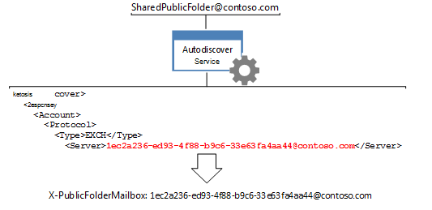

# <a name="route-public-folder-hierarchy-requests"></a>Acheminer les demandes de hiérarchie de dossier public

Toutes les demandes d’informations sur les dossiers publics qui nécessitent une connaissance de la hiérarchie de dossiers publics, telles que le déplacement, la mise à jour, la suppression ou la recherche de dossiers publics, doivent être acheminées vers la boîte aux lettres de hiérarchie de dossiers publics par défaut pour l’utilisateur donné. Pour router les demandes vers cette boîte aux lettres, vous devez définir les **en-têtes X-AnchorMailbox** et **X-PublicFolderMailbox** sur des valeurs spécifiques renvoyées par le service de découverte automatique. 
  
**Vue d’ensemble des dossiers publics**

|En-tête|De quoi ai-je besoin ?|Comment puis-je l’obtenir ?|
|:-----|:-----|:-----|
|**X-AnchorMailbox** <br/> |Valeur [PublicFolderInformation](https://msdn.microsoft.com/library/dn751006%28v=exchg.150%29.aspx) d’une réponse SOAP de découverte automatique [GetUserSettings,](https://msdn.microsoft.com/library/office/dd877096%28v=exchg.150%29.aspx) qui devient la valeur de l’en-tête **X-AnchorMailbox.**<br/><br/> | 1. Envoyez une **demande GetUserSetting** avec l’adresse SMTP de la boîte aux lettres de l’utilisateur.<br/><br/>2. Mettre en cache la valeur de **l’élément PublicFolderInformation** que le service de découverte automatique renvoie. Il peut s’agit d’un appel de découverte automatique existant dans votre code, d’un nouvel appel [GetUserSettings](#bk_getpfinfoewsma) de l’API gérée EWS ou d’une demande [SOAP GetUserSettings.](#bk_getpfinfoews)  <br/><br/>3. Utilisez **l’élément PublicFolderInformation** pour remplir la valeur de l’en-tête **X-AnchorMailbox.** La valeur de **l’élément PublicFolderInformation** est une adresse SMTP.  <br/> |
|**X-PublicFolderMailbox** <br/> |Valeur [serveur](https://msdn.microsoft.com/library/bb204084%28v=exchg.150%29.aspx) d’une réponse de découverte automatique [POX,](https://msdn.microsoft.com/library/bb204082%28v=exchg.150%29.aspx)qui devient la valeur de l’en-tête **X-PublicFolderMailbox.**<br/><br/> |1. [Appelez le](#bk_makeautodrequest) service de découverte automatique POX à l’aide de l’adresse de messagerie **X-AnchorMailbox.**  <br/><br/>2. Utilisez l’élément **Server** renvoyé par le service de découverte automatique pour remplir la valeur de l’en-tête **X-PublicFolderMailbox.** La valeur de **X-PublicFolderMailbox** est une adresse SMTP où le nom d’utilisateur est un GUID.  <br/> |

<br/>

Une fois que vous avez déterminé les valeurs d’en-tête, incluez-les lorsque vous faites des demandes de hiérarchie [de dossiers publics.](#bk_setheadervalues)
  
Les étapes de cet article sont spécifiques aux demandes de hiérarchie de dossiers publics. Pour déterminer si votre demande est une hiérarchie de dossiers publics ou une demande de contenu, voir [Routing public folder requests](public-folder-access-with-ews-in-exchange.md#bk_routing).
  
## <a name="determine-the-value-of-the-x-anchormailbox-header-by-using-the-ews-managed-api"></a>Déterminer la valeur de l’en-tête X-AnchorMailbox à l’aide de l’API gérée EWS
<a name="bk_getpfinfoewsma"> </a>

Pour récupérer la valeur [POX (PublicFolderInformation)](https://msdn.microsoft.com/library/a221aa9e-b4ac-4ec5-aa42-7e2a69e8eaa6%28Office.15%29.aspx) à l’aide de l’API gérée EWS, vous pouvez mettre en cache la valeur de l’élément **PublicFolderInformation** qu’un appel existant au service de découverte automatique renvoie ou effectuer un nouvel appel. 
  
Si vous faites un nouvel appel, vous pouvez obtenir les paramètres utilisateur à l’aide de l’API gérée [EWS](how-to-get-user-settings-from-exchange-by-using-autodiscover.md#bk_Managed)Obtenir les paramètres utilisateur à l’aide de l’API gérée [EWS](how-to-get-user-settings-from-exchange-by-using-autodiscover.md#bk_Managed) à votre code, puis appeler l’exemple de méthode **GetUserSettings** à l’aide du code suivant, qui récupère uniquement la valeur de l’élément **PublicFolderInformation.** Incluez l’adresse SMTP de l’utilisateur de boîte aux lettres comme paramètre d’entrée. 
  
```cs
GetUserSettingsResponse userResponse = GetUserSettings(adservice, "sonyaf@contoso.com", 3, UserSettingName.PublicFolderInformation);
Console.WriteLine("X-AnchorMailbox value for public folder hierarchy requests: {0}", userResponse.Settings[UserSettingName.PublicFolderInformation]);
```

Une fois le code en cours d’exécution, les informations suivantes s’affichent sur la console :
  
`X-AnchorMailbox for public folder hierarchy requests: SharedPublicFolder@contoso.com`

Maintenant que vous avez la valeur **PublicFolderInformation,** incluez-la comme valeur pour l’en-tête X-AnchorMailbox dans toutes les demandes de hiérarchie de dossiers publics. 
  
`X-AnchorMailbox: SharedPublicFolder@contoso.com`

## <a name="determine-the-value-of-the-x-anchormailbox-header-using-soap"></a>Déterminer la valeur de l’en-tête X-AnchorMailbox à l’aide de SOAP
<a name="bk_getpfinfoews"> </a>

L’exemple de code suivant montre comment récupérer la valeur **PublicFolderInformation** à l’aide de l’opération SOAP [GetUserSettings.](https://msdn.microsoft.com/library/dd877096%28v=exchg.150%29.aspx) L’utilisateur de boîte aux lettres est spécifié dans l’élément [Mailbox](https://msdn.microsoft.com/library/dd877076%28v=exchg.150%29.aspx) et l’élément [RequestedSettings](https://msdn.microsoft.com/library/office/dd877107%28v=exchg.150%29.aspx) limite la réponse à la valeur [PublicFolderInformation.](https://msdn.microsoft.com/library/dn751006%28v=exchg.150%29.aspx) 
  
```XML
<?xml version="1.0" encoding="utf-8"?>
<soap:Envelope xmlns:a="http://schemas.microsoft.com/exchange/2010/Autodiscover"
               xmlns:wsa="http://www.w3.org/2005/08/addressing"
               xmlns:xsi="http://www.w3.org/2001/XMLSchema-instance"
               xmlns:soap="http://schemas.xmlsoap.org/soap/envelope/">
  <soap:Header>
    <a:RequestedServerVersion>Exchange2007_SP1</a:RequestedServerVersion>
    <wsa:Action>https://schemas.microsoft.com/exchange/2010/Autodiscover/Autodiscover/GetUserSettings</wsa:Action>
    <wsa:To>https://pod51042.outlook.com/autodiscover/autodiscover.svc</wsa:To>
  </soap:Header>
  <soap:Body>
    <a:GetUserSettingsRequestMessage xmlns:a="http://schemas.microsoft.com/exchange/2010/Autodiscover">
      <a:Request>
        <a:Users>
          <a:User>
            <a:Mailbox>sonyaf@contoso.com</a:Mailbox>
          </a:User>
        </a:Users>
        <a:RequestedSettings>
          <a:Setting>PublicFolderInformation</a:Setting>
        </a:RequestedSettings>
      </a:Request>
    </a:GetUserSettingsRequestMessage>
  </soap:Body>
</soap:Envelope>
```

La réponse inclut la **valeur PublicFolderInformation.** 
  
```XML
<UserSetting i:type="StringSetting">
    <Name>PublicFolderInformation</Name>
    <Value>SharedPublicFolder@contoso.com</Value>
</UserSetting>
```

Maintenant que vous avez la valeur **PublicFolderInformation,** incluez-la comme valeur pour l’en-tête X-AnchorMailbox dans toutes les demandes de hiérarchie de dossiers publics. 
  
`X-AnchorMailbox: SharedPublicFolder@contoso.com`

## <a name="make-an-autodiscover-request-to-determine-the-x-publicfolderinformation-value"></a>Effectuer une demande de découverte automatique pour déterminer la valeur X-PublicFolderInformation
<a name="bk_makeautodrequest"> </a>

Effectuer une demande de découverte automatique à l’aide de l’adresse SMTP **PublicFolderInformation,** qui est maintenant utilisée comme **valeur X-AnchorMailbox.** Utilisez la [Exchange 2013](https://code.msdn.microsoft.com/exchange/Exchange-2013-Get-user-7e22c86e) : obtenir des paramètres utilisateur avec un exemple de code de découverte automatique pour appeler le service de découverte automatique, car il simplifie le processus de découverte automatique pour vous. Cet exemple de code utilise les arguments de ligne de commande répertoriés dans le tableau suivant pour appeler le service de découverte automatique POX sur l’adresse SMTP **PublicFolderInformation.** 
  
|**Argument de ligne de commande**|**Description**|
|:-----|:-----|
|emailAddress  <br/> |Adresse **SMTP PublicFolderInformation.**  <br/> |
|-skipSOAP  <br/> | Utilisez les demandes de découverte automatique POX pour ce scénario.  <br/> |
|-auth authEmailAddress  <br/> |Adresse de messagerie de l’utilisateur de la boîte aux lettres, utilisée pour l’authentification. Vous serez invité à entrer le mot de passe de l’utilisateur de la boîte aux lettres lorsque vous exécuterez l’exemple.  <br/> |
   
Par exemple, lorsque SharedPublicFolder@contoso.com est l’adresse SMTP de l’élément **PublicFolderInformation** et sonyaf@contoso.com est l’utilisateur de boîte aux lettres, les arguments de ligne de commande doivent ressembler à ceci. 
  
`SharedPublicFolder@contoso.com -skipSOAP -auth sonyaf@contoso.com`

Lorsque vous exécutez **la Exchange 2013** : obtenir les paramètres utilisateur avec l’exemple de découverte automatique, la dernière réponse de découverte automatique doit être réussie et inclure tous les paramètres utilisateur associés au GUID de boîte aux lettres. La [valeur serveur](https://msdn.microsoft.com/library/bb204084%28v=exchg.150%29.aspx) associée à l’élément [Type](https://msdn.microsoft.com/library/office/bb204223%28v=exchg.150%29.aspx) de protocole EXCH est la valeur d’en-tête **X-PublicFolderInformation.** [](https://msdn.microsoft.com/library/bb204278%28v=exchg.150%29.aspx) 
  
```XML
<Autodiscover xmlns="http://schemas.microsoft.com/exchange/autodiscover/responseschema/2006">
  <Response xmlns="http://schemas.microsoft.com/exchange/autodiscover/outlook/responseschema/2006a">
    …
    <Account>
      <AccountType>email</AccountType>
      <Action>settings</Action>
      <Protocol>
        <Type>EXCH</Type>
        <Server>1ec2a236-ed93-4f88-b9c6-33e63fa4aa44@contoso.com</Server>

```

Par ailleurs, si vous ne souhaitez pas utiliser la Exchange **2013** : obtenir les paramètres  utilisateur avec l’exemple de découverte automatique, vous pouvez obtenir la valeur Serveur en générant une liste de points de terminaison de découverte [automatique,](how-to-generate-a-list-of-autodiscover-endpoints.md)puis en envoyant la demande de découverte automatique POX suivante à chaque URL jusqu’à ce que vous receviez une réponse réussie. SharedPublicFolder@contoso.com est la valeur de **l’en-tête X-PublicFolderMailbox.** 
  
```XML
<?xml version="1.0" encoding="utf-8"?>
<Autodiscover xmlns="http://schemas.microsoft.com/exchange/autodiscover/outlook/requestschema/2006">
  <Request>
    <EMailAddress>SharedPublicFolder@contoso.com</EMailAddress>
    <AcceptableResponseSchema>https://schemas.microsoft.com/exchange/autodiscover/outlook/responseschema/2006a</AcceptableResponseSchema>
  </Request>
</Autodiscover>
```

Pour plus d’informations sur le processus de découverte automatique, voir Découverte automatique pour [Exchange](autodiscover-for-exchange.md) [,](how-to-generate-a-list-of-autodiscover-endpoints.md)Générer une liste de points de terminaison de découverte automatique et Obtenir les [paramètres](how-to-get-user-settings-from-exchange-by-using-autodiscover.md)utilisateur à partir de Exchange à l’aide de la découverte automatique .
  
## <a name="set-the-values-of-the-x-anchormailbox-and-x-publicfoldermailbox-headers"></a>Définir les valeurs des en-têtes X-AnchorMailbox et X-PublicFolderMailbox
<a name="bk_setheadervalues"> </a>

En utilisant la valeur de l’adresse SMTP **PublicFolderInformation** acquise dans Determine [the value of the X-AnchorMailbox header by using the EWS Managed API](#bk_getpfinfoewsma) or Determine the value of the [X-AnchorMailbox header using SOAP](#bk_getpfinfoews) and the **Server** value acquired in Make [an Autodiscover request to determine the X-PublicFolderInformation value](#bk_makeautodrequest), set the values of **X-AnchorMailbox** and **X-PublicFolderMailbox** headers in your public folder content request. 
  
Par exemple, pour une adresse SMTP **PublicFolderInformation**  de SharedPublicFolder@contoso.com et une valeur de serveur de 1ec2a236-ed93-4f88-b9c6-33e63fa4aa44@contoso.com, incluez les en-têtes suivants lors des appels aux méthodes ou opérations suivantes. 
  
`X-AnchorMailbox: SharedPublicFolder@contoso.com` <br/>
`X-PublicFolderMailbox: 1ec2a236-ed93-4f88-b9c6-33e63fa4aa44@contoso.com`

**Appels de dossiers publics qui nécessitent les en-têtes X-AnchorMailbox et X-PublicFolder**

|**Méthodes d'API managée EWS**|**Opérations EWS**|
|:-----|:-----|
|[Folder.FindFolders](https://msdn.microsoft.com/library/microsoft.exchange.webservices.data.folder.findfolders%28v=exchg.80%29.aspx) <br/> [Folder.Delete](https://msdn.microsoft.com/library/microsoft.exchange.webservices.data.folder.delete%28v=exchg.80%29.aspx) <br/> [Folder.Update](https://msdn.microsoft.com/library/microsoft.exchange.webservices.data.folder.update%28v=exchg.80%29.aspx) <br/> [Folder.Move](https://msdn.microsoft.com/library/microsoft.exchange.webservices.data.folder.move%28v=exchg.80%29.aspx) <br/> |[CreateFolder](https://msdn.microsoft.com/library/6f6c334c-b190-4e55-8f0a-38f2a018d1b3%28Office.15%29.aspx) <br/> [FindFolder](https://msdn.microsoft.com/library/7a9855aa-06cc-45ba-ad2a-645c15b7d031%28Office.15%29.aspx) <br/> [DeleteFolder](https://msdn.microsoft.com/library/b0f92682-4895-4bcf-a4a1-e4c2e8403979%28Office.15%29.aspx) <br/> [UpdateFolder](https://msdn.microsoft.com/library/3494c996-b834-4813-b1ca-d99642d8b4e7%28Office.15%29.aspx) <br/> [MoveFolder](https://msdn.microsoft.com/library/c7233966-6c87-4a14-8156-b1610760176d%28Office.15%29.aspx) <br/> |
   
Pour ajouter ces en-têtes à l’aide de l’API gérée EWS, utilisez la [méthode HttpHeaders.Add.](https://msdn.microsoft.com/library/system.net.http.headers.httpheaders.add%28v=vs.118%29.aspx) 
  
```cs
service.HttpHeaders.Add("X-AnchorMailbox", "SharedPublicFolder@contoso.com");service.HttpHeaders.Add("X-PublicFolderMailbox", "1ec2a236-ed93-4f88-b9c6-33e63fa4aa44@contoso.com");
```

Par exemple, le code suivant montre une requête [FindFolder](https://msdn.microsoft.com/library/7a9855aa-06cc-45ba-ad2a-645c15b7d031%28Office.15%29.aspx) avec l’en-tête **X-AnchorMailbox** et **X-PublicFolderMailbox** définies sur les valeurs récupérées dans les exemples de cet article. 
  
```XML
POST https://outlook.office365.com/EWS/Exchange.asmx HTTP/1.1
Content-Type: text/xml; charset=utf-8
User-Agent: SoapSender1.0
X-AnchorMailbox: SharedPublicFolder@contoso.com
X-PublicFolderMailbox: 1ec2a236-ed93-4f88-b9c6-33e63fa4aa44@contoso.com
Host: outlook.office365.com
Content-Length: 1174
Expect: 100-continue
Connection: Keep-Alive
<?xml version="1.0" encoding="utf-8"?>
<soap:Envelope xmlns:xsi="http://www.w3.org/2001/XMLSchema-instance" xmlns:m="http://schemas.microsoft.com/exchange/services/2006/messages" xmlns:t="http://schemas.microsoft.com/exchange/services/2006/types" xmlns:soap="http://schemas.xmlsoap.org/soap/envelope/">
  <soap:Header>
    <t:RequestServerVersion Version="Exchange2013_SP1" />
  </soap:Header>
  <soap:Body>
    <m:FindFolder Traversal="Shallow">
      <m:FolderShape>
        <t:BaseShape>AllProperties</t:BaseShape>
      </m:FolderShape>
      <m:IndexedPageFolderView MaxEntriesReturned="1" Offset="0" BasePoint="Beginning" />
      <m:Restriction>
        <t:IsEqualTo>
          <t:FieldURI FieldURI="folder:DisplayName" />
          <t:FieldURIOrConstant>
            <t:Constant Value="My Public Contacts" />
          </t:FieldURIOrConstant>
        </t:IsEqualTo>
      </m:Restriction>
      <m:ParentFolderIds>
        <t:FolderId Id="AQEuAAADy/LIWjRCp0GFb0W6aGPbwwEARg5aCLUc8k6wLfl1c0a/2AAAAwIAAAA=" ChangeKey="AQAAABYAAABGDloItRzyTrAt+XVzRr/YAABdo/XB" />
      </m:ParentFolderIds>
    </m:FindFolder>
  </soap:Body>
</soap:Envelope>
```

## <a name="see-also"></a>Voir aussi

- [Accéder aux dossiers publics avec EWS dans Exchange](public-folder-access-with-ews-in-exchange.md)    
- [Acheminer les demandes de contenu de dossier public](how-to-route-public-folder-content-requests.md)    
- [Obtenir les paramètres utilisateur à l’aide de l’API gérée EWS](how-to-get-user-settings-from-exchange-by-using-autodiscover.md#bk_Managed)
    

