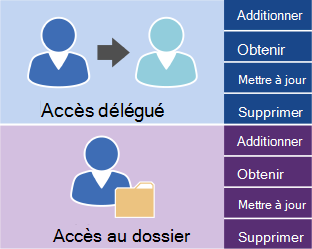

# Gestion de l’accès des utilisateurs à l’aide d’EWS dans ExchangeManaging user access by using EWS in Exchange

Découvrez les options disponibles pour la gestion de l’accès aux comptes d’utilisateurs à votre serveur Exchange.Find out what your options are for managing user account access to your Exchange server.
  
Les services Web Exchange (EWS) et l’API managée EWS fournissent un nombre limité d’opérations que vous pouvez utiliser pour gérer les comptes sur Exchange Online, Exchange Online dans le cadre d’Office 365 ou une version d’Exchange à partir d’Exchange 2013.Exchange Web Services (EWS) and the EWS managed API provide a limited number of operations that you can use to manage accounts on Exchange Online, Exchange Online as part of Office 365, or a version of Exchange starting with Exchange 2013. Vous pouvez utiliser les opérations illustrées dans la figure suivante pour gérer les délégués et définir des autorisations d’accès aux dossiers pour d’autres comptes.You can use the operations shown in the following figure to manage delegates and to set folder access permissions for other accounts. 
  
**Opérations EWS pour l’accès aux délégués et aux dossiers****EWS operations for delegate and folder access**

  
Si votre application a besoin d’un contrôle supplémentaire sur les comptes sur un serveur Exchange, vous pouvez utiliser les cmdlets Exchange Management Shell pour gérer les comptes.If your application needs additional control over the accounts on an Exchange server, you can use Exchange Management Shell cmdlets to manage the accounts. Vous pouvez appeler les cmdlets de l’environnement de commande Exchange Management Shell en effectuant l’une des opérations suivantes :You can call the Exchange Management Shell cmdlets by doing one of the following:
  
- Écriture d’une application à l’aide de C# ou de Visual Basic qui appelle les cmdlets de l’environnement de commande Exchange Management Shell.Writing an application using C# or Visual Basic that calls the Exchange Management Shell cmdlets. Vous pouvez consulter l’exemple de code de la documentation de l’API de l’environnement de commande [Exchange Management Shell](../management/exchange-management-shell.md) pour savoir comment appeler une cmdlet.You can look at the sample code in the [Exchange Management Shell API documentation](../management/exchange-management-shell.md) to learn how to call a cmdlet. 
    
- Utilisation de scripts Windows PowerShell et Windows PowerShell pour appeler des applets de commande Exchange Management Shell.Using Windows PowerShell and Windows PowerShell scripts to call Exchange Management Shell cmdlets. Vous trouverez une liste complète d' [Exchange Server PowerShell (Exchange Management Shell)](https://docs.microsoft.com/powershell/exchange/exchange-server/exchange-management-shell?view=exchange-ps), ainsi que des exemples qui montrent comment les utiliser.You can find a complete list of the [Exchange Server PowerShell (Exchange Management Shell)](https://docs.microsoft.com/powershell/exchange/exchange-server/exchange-management-shell?view=exchange-ps), along with examples that show how to use them. 
    
## Voir aussiSee also

- [Configuration de votre application EWSSetting up your EWS application](setting-up-your-ews-application.md)   
- [Applets de commande Exchange 2013Exchange 2013 Cmdlets](https://docs.microsoft.com/powershell/exchange/?view=exchange-ps)  
    

