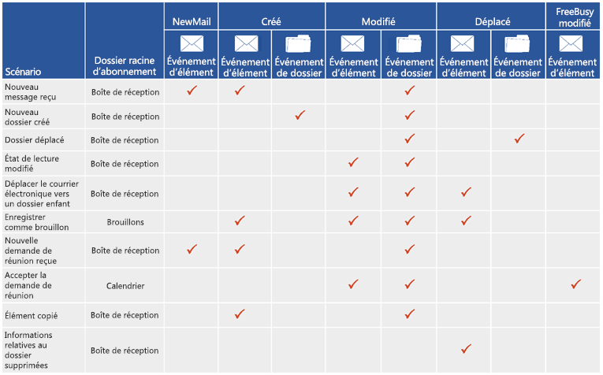

# Abonnements à des notifications, événements de boîte aux lettres et EWS dans ExchangeNotification subscriptions, mailbox events, and EWS in Exchange

Découvrez les abonnements à des notifications et les événements de boîte aux lettres dans les services EWS dans Exchange.Find out about notification subscriptions and mailbox event in EWS in Exchange.
  
Vous pouvez utiliser l'API managée des services EWS et les services web Exchange (EWS) pour vous abonner et recevoir des notifications lorsque des événements se produisent dans une boîte aux lettres, ou dans un ou plusieurs des dossiers d'une boîte aux lettres. Trois types d'abonnements sont disponibles : notifications de diffusion en continu, notifications de type pull et notifications Push. Chacun de ces types d'abonnements utilise différentes techniques pour recevoir ou récupérer les notifications.You can use both the EWS Managed API and Exchange Web Services (EWS) to subscribe to receive notifications when events occur in a mailbox, or in one or more of the folders in a mailbox. Three subscription types are available: streaming notifications, pull notifications, and push notifications. Each of these subscription types uses different techniques to receive or retrieve the notifications.
  
## Obtenir des notifications - quelles sont les options dont je dispose ?Getting notifications - what are my options?

EWS inclut trois types d'abonnements qui fonctionnent indépendamment pour informer le client de modifications sur le serveur. Quel que soit le type d'abonnement choisi, en fin de compte, vous aurez accès aux mêmes événements de notification - tout dépend de comment vous les obtenez.EWS includes three subscription types that work independently to notify the client of changes on the server. No matter which subscription type you choose, you'll have access to all the same notification events in the end - it's just a matter of how you get them.
  
**Tableau 1. Types d'abonnements****Table 1. Subscription types**

|**Option****Option**|**Description****Description**|**Me convient-il ?****Is it right for me?**|
|:-----|:-----|:-----|
|Notifications de diffusion en continuStreaming notifications    |Notifications envoyées par le serveur via une connexion qui reste ouverte pendant une période de temps spécifiée.Notifications that are sent by the server through a connection that remains open for a specified period of time.    |Les notifications de diffusion en continu sont généralement recommandées pour la plupart des applications. Elles sont semblables aux notifications Push et offrent le meilleur des deux mondes. Une fois que vous avez établi votre abonnement aux notifications, la connexion reste ouverte pendant 30 minutes pour permettre au serveur de renvoyer les notifications au client. Vous n 'avez pas à demander de mises à jour, comme vous le feriez avec un abonnement par extraction, et vous n'avez pas à créer d'application d'écouteur de service web, comme vous le feriez avec un abonnement Push.Streaming notifications are generally recommended for most applications. They're similar to pull and push notifications, and offer the best of both worlds. After you establish your notification subscription, the connection remains open for up to 30 minutes to allow the server to push notifications back to the client. No need to request updates, like you would with a pull subscription, and you don't have to create a web service listener application like you would with a push subscription.    |
|Notifications de type pullPull notifications    |Notifications qui sont demandées (ou extraites) par le client.Notifications that are requested (or pulled) by the client.    |Les notifications de type pull sont généralement plus appropriées pour les clients à faible couplage, lorsque le client n'est pas connecté au réseau de manière fiable. Les notifications de type pull peuvent créer un trafic excessif entre le client et le serveur car le client envoie des demandes fréquentes au serveur pour récupérer des notifications, et toutes les demandes n'entraînent pas des notifications récupérées.Pull notifications are generally most appropriate for loosely coupled clients, where the client is not reliably connected to the network. Pull notifications can create excess traffic between the client and the server because the client is sending frequent requests to the server to retrieve notifications, and not all requests result in notifications retrieved.    |
|Notifications pushPush notifications    |Notifications envoyées (ou poussées) par le serveur vers un service web côté client via une adresse de rappel.Notifications that are sent (or pushed) by the server to a client-side web service via a callback address.    |En règle générale, les notifications Push fournissent une latence de notification plus faible que les notifications pull et sont adaptées aux clients à couplage étroit auxquels le serveur dispose d'un accès fiable, et il est possible d'accéder au client par le biais d'une adresse IP. Toutefois, les notifications Push ont été laissées de côté depuis l'arrivée des notifications de diffusion en continu dans Exchange 2010. Si possible, nous vous recommandons d'utiliser des notifications de diffusion en continu à la place des notifications Push par la suite. Les notifications Push exigent que vous écriviez une application d'écouteur vers laquelle les notifications sont envoyées. Cela a un léger avantage sur les notifications pull dans la mesure où cela permet de réduire le trafic réseau, mais cela ajoute de la surcharge car une application distincte est requise.Generally, push notifications provide for smaller notification latency than pull notifications and are suited for tightly coupled clients to which the server has reliable access and the client is IP addressable. However, push notifications have fallen out of favor since the advent of streaming notifications in Exchange 2010. If possible, we recommend that you use streaming notifications instead of push notifications going forward. Push notifications require that you write a listener application, which is where the notifications are pushed to. This has a slight benefit over pull notifications in that it reduces wire traffic, but it adds overhead by requiring a separate application.    |
   
## À quels événements EWS puis-je m’abonner ?What EWS events can I subscribe to?

Les types d'événements EWS auxquels les clients peuvent s'abonner sont définis par l'énumération [EventType](https://msdn.microsoft.com/library/microsoft.exchange.webservices.data.eventtype%28v=exchg.80%29.aspx) pour l'API managée EWS ou l'élément [EventType](https://msdn.microsoft.com/library/04b70f9e-c226-4130-958e-0db0275cf58b%28Office.15%29.aspx) pour EWS. Les événements EWS suivants sont disponibles pour l'abonnement :The types of EWS events that clients subscribe to are defined by the [EventType](https://msdn.microsoft.com/library/microsoft.exchange.webservices.data.eventtype%28v=exchg.80%29.aspx) enumeration for the EWS Managed API or the [EventType](https://msdn.microsoft.com/library/04b70f9e-c226-4130-958e-0db0275cf58b%28Office.15%29.aspx) element for EWS. The following EWS events are available for subscription: 
  
- NewMail : un nouveau message est arrivé dans la boîte de réception.NewMail — A new message arrived in the Inbox.
    
- Deleted : un message a été supprimé définitivement de la boîte de réception. Pour en savoir plus sur les notifications des éléments supprimés, voir [Suppression d'éléments à l'aide de EWS dans Exchange](deleting-items-by-using-ews-in-exchange.md) et [Extraction des notifications pour les événements liés à la suppression des boîtes aux lettres EWS dans Exchange](pull-notifications-for-ews-deletion-related-mailbox-events-in-exchange.md).Deleted — A message was hard deleted from the Inbox. To learn more about deleted item notifications, see [Deleting items by using EWS in Exchange](deleting-items-by-using-ews-in-exchange.md) and [Pull notifications for EWS deletion-related mailbox events in Exchange](pull-notifications-for-ews-deletion-related-mailbox-events-in-exchange.md).
    
- Modified : un élément ou un dossier a été modifié.Modified — An item or folder was changed.
    
- Moved : un élément ou un dossier a été déplacé.Moved — An item or folder was moved. 
    
- Copied : un élément ou un dossier a été copié.Copied — An item or folder was copied.
    
- Created : Un élément ou un dossier a été créé.Created — An item or folder was created. 
    
- FreeBusyChanged : les informations de disponibilité d'un utilisateur a été modifiées.FreeBusyChanged — A user's free busy information has been changed.
    
Un autre type d'événement EWS, l'événement Status, est défini par l'élément [EventType](https://msdn.microsoft.com/library/microsoft.exchange.webservices.data.eventtype%28v=exchg.80%29.aspx), mais vous ne vous abonnez pas à cet événement. Au lieu de cela, il est envoyé par le serveur pour vérifier l'état du client pour les notifications Push et de diffusion en continu uniquement. Le client doit répondre aux besoins de cet événement ou le client expirera.Another EWS event type, the Status event, is defined by the [EventType](https://msdn.microsoft.com/library/microsoft.exchange.webservices.data.eventtype%28v=exchg.80%29.aspx) element, but you don't subscribe to this event. Instead, it's sent by the server to check the status of the client for streaming and push notifications only. The client needs to respond to this event or the client will time out. 
  
Une seule action de l'utilisateur entraîne souvent la création de plusieurs notifications. Pour illustrer cela, la figure suivante illustre quelques scénarios courants et les notifications créées pour chacun d'eux. Les paramètres du client ont un impact sur les notifications reçues, donc il ne s'agit pas d'une liste exhaustive de toutes les options de configuration et des notifications qui en résultent.A single user action often results in the creation of multiple notifications. To illustrate this, the following figure shows some common scenarios and the notifications created for each one. Client settings have an impact on the notifications received, so this is not an exhaustive list of all the configuration options and resulting notifications.
  
**Figure 1. Types d'événements renvoyés par les abonnements à des notifications****Figure 1. Event types returned by notification subscriptions**

  
La Figure 1 simplifie le processus de notification. En réalité, plusieurs notifications (même plusieurs notifications du même type) peuvent être créées pour une seule action de l'utilisateur. Par exemple, dans le cas d'une opération de déplacement de dossier, trois événements de dossier sont créés : un pour le dossier en cours de modification, un pour l'ancien dossier parent et un pour le nouveau dossier parent. Étant donné qu'un grand nombre d'événements peut être déclenché pour une seule opération, nous vous recommandons de [générer un délai d'attente de quelques secondes dans vos opérations de synchronisation](mailbox-synchronization-and-ews-in-exchange.md#bk_bestpractices), afin d'effectuer la synchronisation uniquement lorsque l'action est terminée, plutôt qu'en cours d'opération.Figure 1 simplifies the notification process. In reality, multiple notifications (even multiple notifications of the same type) can be created for a single user action. For example, in the case of a folder move operation, three folder events are created: one for the folder being modified, one for the old parent folder, and one for the new parent folder. Because numerous events can be fired for a single operation, we recommend that you [build a wait time of a few seconds into your synchronization operations](mailbox-synchronization-and-ews-in-exchange.md#bk_bestpractices), so that you only synchronize when the action is complete, instead of partway through the operation.
  
Il est également important de savoir que les paramètres de configuration choisis par chaque utilisateur affectent les notifications qui sont créées. Par exemple, les données de disponibilité de certains utilisateurs sont mises à jour automatiquement et l'événement FreeBusyChanged est créé à la réception d'une nouvelle demande de réunion, même avant d'avoir lu l'élément. Pour d'autres utilisateurs, les données de disponibilité ne sont pas mises à jour et l'événement FreeBusyChanged n'est pas créé tant que la réunion n'a pas été acceptée. Ces paramètres peuvent avoir un impact considérable sur les notifications créées par le serveur.It's also important to realize that the configuration settings that each user chooses will affect which notifications are created. For example, some users' free busy data is updated automatically and the FreeBusyChanged event is created when a new meeting request is received, even before they've read the item. For other users, free busy data isn't updated and the FreeBusyChanged event isn't created until after the meeting has been accepted. These settings can have a considerable impact on the notifications created by the server.
  
## Comment fonctionnent les notifications EWS ?How do EWS notifications work?

Les notifications EWS sont gérées par abonnement. En règle générale il existe un abonnement par boîte aux lettres et, dans l'abonnement à la boîte aux lettres, vous pouvez vous abonner à une partie ou à l'intégralité des dossiers. Vous choisissez le type de notification auquel vous souhaitez vous abonner (diffusion en continu, pull ou Push) et le type d'événement que vous souhaitez recevoir (NewMail, Created, Deleted, Modified, etc.) puis vous créez un abonnement. Les événements EWS sont ensuite envoyés de manière asynchrone du serveur de boîte aux lettres au client. (Leçon d'histoire : les événements sont synchrones dans Exchange 2007, et les événements sont stockés sur le serveur d'accès au client dans Exchange 2010, mais pas plus !).EWS notifications are handled on a subscription basis. Typically there's one subscription per mailbox, and within the mailbox subscription you can subscribe to some or all folders. You decide what kind of notification to subscribe to (streaming, pull, or push) and what kind of events you'd like to receive (NewMail, Created, Deleted, Modified, etc.), and then you create a subscription. The EWS events are then sent asynchronously from the mailbox server to the client. (History lesson: events are synchronous in Exchange 2007 - and events are stored on the Client Access server in Exchange 2010, but no more!).
  
La manière dont les notifications sont envoyées au client varie selon le type d'abonnement. Cette section décrit le fonctionnement de chaque type d'abonnement de façon plus détaillée.Depending on the type of subscription you have, the ways in which the notifications are sent to the client vary. This section describes how each type of subscription works in more detail.
  
### Notifications de diffusion en continu EWSEWS streaming notifications

Les notifications de diffusion en continu reposent sur une demande GET en attente sur le serveur pour maintenir une connexion d'abonnement de diffusion en continu ouverte, afin que tous les événements qui se produisent lorsque la connexion est active soient diffusés en continu au client immédiatement. Plusieurs notifications peuvent être envoyées au cours d'une seule connexion et la connexion reste ouverte jusqu'à l'expiration de l'intervalle, ou pendant une période maximale de 30 minutes. Après expiration de la connexion, le client renvoie la demande GET en attente. La Figure 2 illustre le fonctionnement des abonnements de diffusion en continu et des notifications de diffusion en continu.Streaming notifications rely on a hanging get request on the server to keep a streaming subscription connection open, so that any events that occur while the connection is active are streamed to the client immediately. Multiple notifications can be sent over the course of a single connection, and the connection stays open until the interval expires, or for a maximum of 30 minutes. After the connection expires, the client sends the hanging get request again. Figure 2 shows how streaming subscriptions and streaming notifications work.
  
**Figure 2. Vue d'ensemble des notifications de diffusion en continu****Figure 2. Streaming notification overview**

  
Pour plus d'informations sur la création de notifications de diffusion en continu, voir [Notifications de flux concernant les événements de boîte aux lettres à l'aide de EWS dans Exchange](how-to-stream-notifications-about-mailbox-events-by-using-ews-in-exchange.md).For information about creating streaming notifications, see [Stream notifications about mailbox events by using EWS in Exchange](how-to-stream-notifications-about-mailbox-events-by-using-ews-in-exchange.md).
  
### Notifications de type pull EWSEWS pull notifications

Les notifications de type pull reposent sur le client qui fait la demande de notifications sur un intervalle qu'il gère. Cela peut entraîner des réponses GetEvents sans notifications. La Figure 3 illustre le fonctionnement des abonnements et des notifications de type pull.Pull notifications rely on the client asking for the notifications on an interval that the client manages. This can result in GetEvents responses with no notifications. Figure 3 shows how pull subscriptions and pull notifications work.
  
**Figure 3. Vue d'ensemble des notifications de type pull****Figure 3. Pull notification overview**

  
Pour plus d'informations sur la création des notifications de type pull, voir [Notifications de type pull concernant les événements de boîte aux lettres à l'aide de EWS dans Exchange](how-to-pull-notifications-about-mailbox-events-by-using-ews-in-exchange.md).For information about creating pull notifications, see [Pull notifications about mailbox events by using EWS in Exchange](how-to-pull-notifications-about-mailbox-events-by-using-ews-in-exchange.md).
  
### Notifications Push EWSEWS push notifications

Les notifications Push reposent sur le serveur qui renvoie les notifications au client. Le trafic existe uniquement s'il existe une notification. La Figure 4 illustre le fonctionnement des abonnements et des notifications Push.Push notifications rely on the server pushing notifications back to the client. There's only traffic if there's a notification. Figure 4 shows how push subscriptions and push notifications work.
  
**Figure 4. Vue d'ensemble des notifications Push****Figure 4. Push notification overview**

Si vous utilisez des [notifications Push avec Exchange 2010](https://msdn.microsoft.com/library/db1f8523-fa44-483f-bdb6-ab5939b52eee%28Office.15%29.aspx), envisagez de mettre votre application à niveau pour [utiliser des notifications de diffusion en continu](https://code.msdn.microsoft.com/exchange/Exchange-2013-Set-push-82738cc5). Ainsi, vous n'avez pas besoin d'une application distincte pour recevoir les événements.If you are using [push notifications with Exchange 2010](https://msdn.microsoft.com/library/db1f8523-fa44-483f-bdb6-ab5939b52eee%28Office.15%29.aspx), consider upgrading your application to [use streaming notifications](https://code.msdn.microsoft.com/exchange/Exchange-2013-Set-push-82738cc5), so that you don't need a separate application to receive the events.

  
## Comment s’abonner à des notifications ?How do I subscribe to notifications?

Selon le type d'abonnement que vous souhaitez créer, vous disposez de plusieurs options pour vous abonner à des notifications.Depending on the type of subscription you'd like to create, you have a number of options to choose from for subscribing to notifications.
  
**Tableau 2. Opérations et méthodes permettant de s'abonner à des notifications****Table 2. Operations and methods for subscribing to notifications**

|**Type d'abonnement****Subscription type**|**Opération EWS****EWS operation**|**Méthodes d'API managée EWS****EWS Managed API methods**|**Fonction****What it does**|
|:-----|:-----|:-----|:-----|
|Diffusion en continuStreaming    |[Opération d'abonnementSubscribe operation](https://msdn.microsoft.com/library/f17c3d08-c79e-41f1-ba31-6e41e7aafd87%28Office.15%29.aspx)   |[Méthode ExchangeService.BeginSubscribeToStreamingNotificationsExchangeService.BeginSubscribeToStreamingNotifications method](https://msdn.microsoft.com/library/microsoft.exchange.webservices.data.exchangeservice.beginsubscribetostreamingnotifications%28v=exchg.80%29.aspx)   [Méthode ExchangeService.BeginSubscribeToStreamingNotificationsOnAllFoldersExchangeService.BeginSubscribeToStreamingNotificationsOnAllFolders method](https://msdn.microsoft.com/library/microsoft.exchange.webservices.data.exchangeservice.beginsubscribetostreamingnotificationsonallfolders%28v=exchg.80%29.aspx)   [Méthode ExchangeService.SubscribeToStreamingNotificationsOnAllFoldersExchangeService.SubscribeToStreamingNotificationsOnAllFolders method](https://msdn.microsoft.com/library/microsoft.exchange.webservices.data.exchangeservice.subscribetostreamingnotifications%28v=exchg.80%29.aspx)   |Crée une demande pour s’abonner aux notifications de diffusion en continu.Creates a request to subscribe to streaming notifications.    |
|PullPull    |[Opération d'abonnementSubscribe operation](https://msdn.microsoft.com/library/f17c3d08-c79e-41f1-ba31-6e41e7aafd87%28Office.15%29.aspx)   |[Méthode ExchangeService.BeginSubscribeToPullNotificationsExchangeService.BeginSubscribeToPullNotifications method](https://msdn.microsoft.com/library/microsoft.exchange.webservices.data.exchangeservice.beginsubscribetopullnotifications%28v=exchg.80%29.aspx)   [Méthode ExchangeService.BeginSubscribeToPullNotificationsOnAllFoldersExchangeService.BeginSubscribeToPullNotificationsOnAllFolders method](https://msdn.microsoft.com/library/microsoft.exchange.webservices.data.exchangeservice.beginsubscribetopullnotificationsonallfolders%28v=exchg.80%29.aspx)   [Méthode ExchangeService.SubscribeToPullNotificationsExchangeService.SubscribeToPullNotifications method](https://msdn.microsoft.com/library/microsoft.exchange.webservices.data.exchangeservice.subscribetopullnotifications%28v=exchg.80%29.aspx)   [Méthode ExchangeService.SubscribeToPullNotificationsOnAllFoldersExchangeService.SubscribeToPullNotificationsOnAllFolders method](https://msdn.microsoft.com/library/microsoft.exchange.webservices.data.exchangeservice.subscribetopullnotificationsonallfolders%28v=exchg.80%29.aspx)   |Crée une demande pour s’abonner aux notifications de type pull.Creates a request to subscribe to pull notifications.    |
|PushPush    |[Opération d'abonnementSubscribe operation](https://msdn.microsoft.com/library/f17c3d08-c79e-41f1-ba31-6e41e7aafd87%28Office.15%29.aspx)   |[Méthode surchargée ExchangeService.BeginSubscribeToPushNotificationsExchangeService.BeginSubscribeToPushNotifications overloaded method](https://msdn.microsoft.com/library/microsoft.exchange.webservices.data.exchangeservice.beginsubscribetopushnotifications%28v=exchg.80%29.aspx)   [Méthode surchargée ExchangeService.BeginSubscribeToPushNotificationsOnAllFoldersExchangeService.BeginSubscribeToPushNotificationsOnAllFolders overload method](https://msdn.microsoft.com/library/microsoft.exchange.webservices.data.exchangeservice.beginsubscribetopushnotificationsonallfolders%28v=exchg.80%29.aspx)   [Méthode surchargée ExchangeService.SubscribeToPushNotificationsExchangeService.SubscribeToPushNotifications overloaded method](https://msdn.microsoft.com/library/microsoft.exchange.webservices.data.exchangeservice.subscribetopushnotifications%28v=exchg.80%29.aspx)   [Méthode surchargée ExchangeService.SubscribeToPushNotificationsOnAllFoldersExchangeService.SubscribeToPushNotificationsOnAllFolders overloaded method](https://msdn.microsoft.com/library/microsoft.exchange.webservices.data.exchangeservice.subscribetopushnotificationsonallfolders%28v=exchg.80%29.aspx)   |Crée une demande pour s’abonner aux notifications Push.Creates a request to subscribe to push notifications.    |
   
## Comment obtenir des événements EWS ?How do I get EWS events?

Une fois que l’abonnement est créé, la façon dont les événements réels sont envoyés au client dépend du type d’abonnement.After the subscription is created, the way in which the actual events are sent to the client depends on the subscription type. 
  
Pour les notifications de diffusion en continu, une connexion d’abonnement de diffusion en continu doit être créée puis l’abonnement est ajouté à la connexion.For streaming notifications, a streaming subscription connection must be created, and then the subscription is added to the connection. Vous pouvez en savoir plus sur ce processus dans [Notifications de flux concernant les événements de boîte aux lettres à l'aide de EWS dans Exchange](how-to-stream-notifications-about-mailbox-events-by-using-ews-in-exchange.md).You can read more about this process in [Stream notifications about mailbox events by using EWS in Exchange](how-to-stream-notifications-about-mailbox-events-by-using-ews-in-exchange.md). 
  
Pour les notifications de type pull, l’objet de l’abonnement a été initialisé lors de la création de l’abonnement. Par conséquent, il vous suffit d’appeler l’opération ou la méthode **GetEvent** pour récupérer les événements à partir du serveur.For pull notifications, the subscription object was initialized when the subscription was created, so you just have to call the **GetEvent** method or operation to retrieve the events from the server. Vous pouvez en savoir plus sur ce processus dans [Notifications de type pull concernant les événements de boîte aux lettres à l'aide de EWS dans Exchange](how-to-pull-notifications-about-mailbox-events-by-using-ews-in-exchange.md).You can read more about this in [Pull notifications about mailbox events by using EWS in Exchange](how-to-pull-notifications-about-mailbox-events-by-using-ews-in-exchange.md). 
  
Le tableau suivant répertorie les opérations et les classes nécessaires pour récupérer des événements.The following table lists the operations and classes required to retrieve events. 
  
**Tableau 3. Éléments et classes pour créer une connexion et obtenir des événements****Table 3. Elements and classes for creating a connection and getting events**

|**Type d'abonnement****Subscription type**|**Opération EWS****EWS operation**|**Méthode d'API managée EWS****EWS Managed API method**|**Fonction****What it does**|
|:-----|:-----|:-----|:-----|
|Diffusion en continuStreaming    |[Opération de GetStreamingEventsGetStreamingEvents operation](https://msdn.microsoft.com/library/8da95423-72bc-4034-90a8-162eedcd059b%28Office.15%29.aspx)   |[Méthode StreamingSubscriptionConnection.AddSubscriptionStreamingSubscriptionConnection.AddSubscription method](https://msdn.microsoft.com/library/microsoft.exchange.webservices.data.streamingsubscriptionconnection.addsubscription%28v=exchg.80%29.aspx)   |Crée une demande GET en attente sur le serveur, à laquelle une réponse est donnée lorsque des événements se produisent.Creates a hanging get request on the server, which is responded to when events occur.    |
|PullPull    |[Opération de GetEventsGetEvents operation](https://msdn.microsoft.com/library/f268efe5-9a1a-41a2-b6a6-51fcde7720a1%28Office.15%29.aspx)   |[Méthode PullSubscription.GetEventsPullSubscription.GetEvents method](https://msdn.microsoft.com/library/microsoft.exchange.webservices.data.pullsubscription.getevents%28v=exchg.80%29.aspx)   |Obtient des événements de notification de type pull à partir du serveur.Gets pull notification events from the server.    |
|PushPush    |Non applicable.Not applicable.    |Non applicableNot applicable.    |Les notifications Push sont envoyées automatiquement à l'écouteur de service web (l'URL de rappel spécifiée dans la demande d'abonnement). Aucune opération ni méthode supplémentaire ne doit être appelée.Push notifications are automatically sent to the web service listener (the callback URL specified in the subscription request). No additional methods or operations need to be called.    |
   
## Comment résilier des abonnements à des notifications ?How do I unsubscribe to notifications?

Le tableau suivant répertorie les différentes façons de résilier chaque type d’abonnement.The following table lists the ways in which you can unsubscribe to each type of subscription.
  
**Tableau 4. Opérations et méthodes de résiliation d'abonnement aux notifications****Table 4. Operations and methods for unsubscribing to notifications**

|**Type d'abonnement****Subscription type**|**EWS****EWS**|**API managée EWS****EWS Managed API**||
|:-----|:-----|:-----|:-----|
|Diffusion en continuStreaming    |[Opération de résiliation d'abonnementUnsubscribe operation](https://msdn.microsoft.com/library/994a9d2b-1501-4804-90f0-12bd914496ec%28Office.15%29.aspx)   |[Méthode StreamingSubscription.BeginUnsubscribeStreamingSubscription.BeginUnsubscribe method](https://msdn.microsoft.com/library/microsoft.exchange.webservices.data.streamingsubscription.beginunsubscribe%28v=exchg.80%29.aspx)   [Méthode StreamingSubscription.EndUnsubscribeStreamingSubscription.EndUnsubscribe method](https://msdn.microsoft.com/library/microsoft.exchange.webservices.data.streamingsubscription.endunsubscribe%28v=exchg.80%29.aspx)   [Méthode StreamingSubscription.UnsubscribeStreamingSubscription.Unsubscribe method](https://msdn.microsoft.com/library/microsoft.exchange.webservices.data.streamingsubscription.unsubscribe%28v=exchg.80%29.aspx)   ||
|PullPull    |[Opération de résiliation d'abonnementUnsubscribe operation](https://msdn.microsoft.com/library/994a9d2b-1501-4804-90f0-12bd914496ec%28Office.15%29.aspx)   |[Méthode PullSubscription.BeginUnsubscribePullSubscription.BeginUnsubscribe method](https://msdn.microsoft.com/library/microsoft.exchange.webservices.data.pullsubscription.beginunsubscribe%28v=exchg.80%29.aspx)   [Méthode PullSubscription.EndUnsubscribePullSubscription.EndUnsubscribe method](https://msdn.microsoft.com/library/microsoft.exchange.webservices.data.pullsubscription.endunsubscribe%28v=exchg.80%29.aspx)   [Méthode PullSubscription.UnsubscribePullSubscription.Unsubscribe method](https://msdn.microsoft.com/library/microsoft.exchange.webservices.data.pullsubscription.unsubscribe%28v=exchg.80%29.aspx)   ||
|PushPush    |Renvoie **Unsubscribe** dans l'élément [StatusFrequency](https://msdn.microsoft.com/library/917474e2-a426-4166-b825-53783a41dad4%28Office.15%29.aspx) de [SendNotificationResponseMessage](https://msdn.microsoft.com/library/2c6d681b-67ac-4331-bc6b-a2e709b638e3%28Office.15%29.aspx)Return **Unsubscribe** in the [StatusFrequency](https://msdn.microsoft.com/library/917474e2-a426-4166-b825-53783a41dad4%28Office.15%29.aspx) element of the [SendNotificationResponseMessage](https://msdn.microsoft.com/library/2c6d681b-67ac-4331-bc6b-a2e709b638e3%28Office.15%29.aspx)   |Non applicable. Laissez plutôt expirer l'abonnement.Not applicable. Let the subscription time out instead.    ||
   
Autrement, vous pouvez laisser expirer chacun des abonnements.Alternatively, you can let each of the subscriptions time out. 
  
**Tableau 5. Délais d'expiration de l'abonnement****Table 5. Subscription time-outs**

|**Type d'abonnement****Subscription type**|**Valeur du délai d'expiration dans EWS****Timeout value in EWS**|**Valeur du délai d'expiration dans l'API managée EWS****Timeout value in the EWS Managed API**|**Gestion des délais d'expiration****Timeout handling**|
|:-----|:-----|:-----|:-----|
|Diffusion en continuStreaming    |Élément [ConnectionTimeout](https://msdn.microsoft.com/library/14da68a0-bcca-4281-a774-47644baa4ee9%28Office.15%29.aspx)[ConnectionTimeout](https://msdn.microsoft.com/library/14da68a0-bcca-4281-a774-47644baa4ee9%28Office.15%29.aspx) element    | Paramètre  *lifetime*  de la méthode [StreamingSubscriptionConnection](https://msdn.microsoft.com/library/microsoft.exchange.webservices.data.streamingsubscriptionconnection.streamingsubscriptionconnection%28v=exchg.80%29.aspx) constructor*lifetime*  parameter of the [StreamingSubscriptionConnection](https://msdn.microsoft.com/library/microsoft.exchange.webservices.data.streamingsubscriptionconnection.streamingsubscriptionconnection%28v=exchg.80%29.aspx) constructor    |Pour l'API managée EWS, une fois le délai d'expiration passé, l'événement [OnDisconnect](https://msdn.microsoft.com/library/microsoft.exchange.webservices.data.streamingsubscriptionconnection.ondisconnect%28v=exchg.80%29.aspx) se produit. Si la méthode [StreamingSubscriptionConnection.Open](https://msdn.microsoft.com/library/microsoft.exchange.webservices.data.streamingsubscriptionconnection.open%28v=exchg.80%29.aspx) n'est pas appelée, la connexion est fermée.  For the EWS Managed API, after the timeout value elapses, the [OnDisconnect](https://msdn.microsoft.com/library/microsoft.exchange.webservices.data.streamingsubscriptionconnection.ondisconnect%28v=exchg.80%29.aspx) event is raised. If the [StreamingSubscriptionConnection.Open](https://msdn.microsoft.com/library/microsoft.exchange.webservices.data.streamingsubscriptionconnection.open%28v=exchg.80%29.aspx) method is not called, the connection is closed.    Pour EWS, une fois le délai expiration écoulé, le message [GetUserConfigurationResponse](https://msdn.microsoft.com/library/5e418c91-c836-4de0-a80d-f0dad0c684d7%28Office.15%29.aspx) renvoie une valeur [ConnectionStatus](https://msdn.microsoft.com/library/4300f9d6-8bf9-48c2-9f07-d80197864e17%28Office.15%29.aspx) Closed.For EWS, after the timeout value elapses, the [GetUserConfigurationResponse](https://msdn.microsoft.com/library/5e418c91-c836-4de0-a80d-f0dad0c684d7%28Office.15%29.aspx) message returns a [ConnectionStatus](https://msdn.microsoft.com/library/4300f9d6-8bf9-48c2-9f07-d80197864e17%28Office.15%29.aspx) value of Closed.    |
|PullPull    |Élément [Timeout](https://msdn.microsoft.com/library/c2e1ca5a-6667-4f6f-aac4-89de33bddc54%28Office.15%29.aspx)[Timeout](https://msdn.microsoft.com/library/c2e1ca5a-6667-4f6f-aac4-89de33bddc54%28Office.15%29.aspx) element    | Paramètre  *timeout*  de la méthode [SubscribeToPullNotification](https://msdn.microsoft.com/library/microsoft.exchange.webservices.data.exchangeservice.subscribetopullnotifications%28v=exchg.80%29.aspx)*timeout*  parameter of the [SubscribeToPullNotification](https://msdn.microsoft.com/library/microsoft.exchange.webservices.data.exchangeservice.subscribetopullnotifications%28v=exchg.80%29.aspx) method    |Une fois que le délai d’expiration s’est écoulé, le serveur supprime l’abonnement.After the timeout value elapses, the server deletes the subscription.    |
|PushPush    |Élément [StatusFrequency](https://msdn.microsoft.com/library/917474e2-a426-4166-b825-53783a41dad4%28Office.15%29.aspx)[StatusFrequency](https://msdn.microsoft.com/library/917474e2-a426-4166-b825-53783a41dad4%28Office.15%29.aspx) element    | Paramètre  *frequency*  de la méthode [SubscribeToPushNotification](https://msdn.microsoft.com/library/microsoft.exchange.webservices.data.exchangeservice.subscribetopushnotifications%28v=exchg.80%29.aspx)*frequency*  parameter of the [SubscribeToPushNotification](https://msdn.microsoft.com/library/microsoft.exchange.webservices.data.exchangeservice.subscribetopushnotifications%28v=exchg.80%29.aspx) method    |Si le serveur ne reçoit pas de réponse à une notification Push ou à un statut ping, il réessaie d'envoyer la notification plusieurs fois avant de cesser d'envoyer les notifications. Pour plus d'informations, voir [StatusFrequency](https://msdn.microsoft.com/library/917474e2-a426-4166-b825-53783a41dad4%28Office.15%29.aspx).  If the server does not receive a response to a push notification or status ping, it retries sending the notification several times before it stops sending the notifications. For more information, see [StatusFrequency](https://msdn.microsoft.com/library/917474e2-a426-4166-b825-53783a41dad4%28Office.15%29.aspx).    |
   
## Est-il possible de limiter les abonnements ?Can I limit subscriptions?

Dans un déploiement local, vous pouvez limiter le nombre d'abonnements par utilisateur avec le [paramètre de limitation EwsMaxSubscriptions](ews-throttling-in-exchange.md) de la stratégie de limitation. Cette stratégie peut être appliquée à tous les utilisateurs ou à des utilisateur spécifiques uniquement. La stratégie de limitation **EwsMaxSubscriptions** n'est pas configurable pour Exchange Online.In an on-premises deployment, you can limit the number of subscriptions per user with the [EwsMaxSubscriptions throttling parameter](ews-throttling-in-exchange.md) of the throttling policy. That policy can be applied to all users or just specific users. The **EwsMaxSubscriptions** throttling policy is not configurable for Exchange Online. 
  
## Dans cette sectionIn this section

- [Notifications de flux concernant les événements de boîte aux lettres à l'aide de EWS dans ExchangeStream notifications about mailbox events by using EWS in Exchange](how-to-stream-notifications-about-mailbox-events-by-using-ews-in-exchange.md)
    
- [Notifications de type pull concernant les événements de boîte aux lettres à l'aide de EWS dans ExchangePull notifications about mailbox events by using EWS in Exchange](how-to-pull-notifications-about-mailbox-events-by-using-ews-in-exchange.md)
    
- [Conserver l’affinité entre un groupe d'abonnements et le serveur de boîtes aux lettres dans ExchangeMaintain affinity between a group of subscriptions and the Mailbox server in Exchange](how-to-maintain-affinity-between-group-of-subscriptions-and-mailbox-server.md)
    
- [Gestion des erreurs liées à la notification dans EWS dans ExchangeHandling notification-related errors in EWS in Exchange](handling-notification-related-errors-in-ews-in-exchange.md)
    
## Voir aussiSee also

- [Développer des clients de service web pour ExchangeDevelop web service clients for Exchange](develop-web-service-clients-for-exchange.md)
- [Référence des services web pour ExchangeWeb services reference for Exchange](../web-service-reference/web-services-reference-for-exchange.md)
- [Commencer à utiliser les services web dans ExchangeStart using web services in Exchange](start-using-web-services-in-exchange.md)
- [Synchronisation de la boîte aux lettres et les services EWS d'ExchangeMailbox synchronization and EWS in Exchange](mailbox-synchronization-and-ews-in-exchange.md)
- [Exemple d'application de notification PushPush Notification Sample Application](https://msdn.microsoft.com/library/db1f8523-fa44-483f-bdb6-ab5939b52eee%28Office.15%29.aspx)
    

