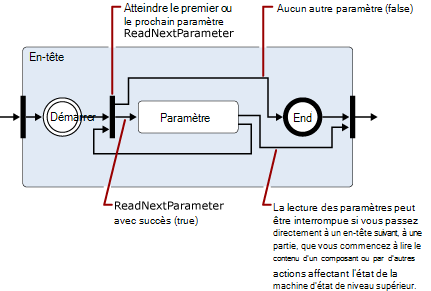

# Lecture et de modification des messages dans le pipeline de transport Exchange 2013

En savoir plus sur les classes .NET Framework que vous pouvez utiliser dans Exchange 2013 agents de transport pour lire, écrire et modifier les messages.
  
**S’applique à :** Exchange Server 2013
  
- Classes utilisées pour lire, écrire ou modifier les messages
- Espace de noms encodeurs
- espace de noms de fichier iCalendar
- Espace de noms MIME
- Espace de noms TextConverters
- Espace de noms TNEF
- espace de noms de carte de visite
  
Messages transitant via le pipeline de transport, l’agent de transport peut lire, écrire et convertir le contenu des messages entre les différents formats de données. Par exemple, vous pouvez lire et écrire des données MIME, identifier les messages entrants qui se trouvent dans UUEncode ou format Quoted-printable (qp), puis convertir les standard utilisé par votre organisation, ou lire et ensuite enregistrement les informations de calendrier ou d’un contact associé messages entrants. 
  
Vous pouvez également identifier le contenu qui représente une menace de sécurité et déplacer ou supprimer le contenu ou les messages qui contiennent par exemple, en supprimant les liens dans un message HTML.
  
Cet article fournit des informations sur les classes .NET Framework que vous pouvez utiliser pour lire, écrire et modifier les messages.
  
> [!CAUTION]
> La plupart des propriétés et paramètres de la conversion de contenu API autorisent les valeurs suffisante pour provoquer des problèmes de performances, y compris les attaques par déni de service. Lorsque vous utilisez l’API de conversion de contenu dans un agent de transport, vous devez implémenter les limites sur les tailles de valeur de propriété et le paramètre que vous prenez en charge pour la lecture ou écriture afin de limiter la consommation des ressources par l’agent. 

## Classes utilisées pour lire, écrire ou modifier les messages

Le tableau suivant répertorie les classes .NET Framework que vous pouvez utiliser pour lire, écrire et modifier des messages électroniques.
  
**Traitement des espaces de noms message .NET framework**

|**Espace de noms .NET framework**|**Classes**|
|:-----|:-----|
|[Microsoft.Exchange.Data.Mime.Encoders](https://msdn.microsoft.com/library/Microsoft.Exchange.Data.Mime.Encoders.aspx)   |Contient des classes pour coder et décoder mémoire, une classe de flux encodeur qui accepte l’une des classes encodeur ou un décodeur contenues dans une énumération associée, et [le codeur ByteEncoder](https://msdn.microsoft.com/library/Microsoft.Exchange.Data.Mime.Encoders.ByteEncoder.aspx) la classe de base et classe d’exception [ByteEncoderException](https://msdn.microsoft.com/library/Microsoft.Exchange.Data.Mime.Encoders.ByteEncoderException.aspx) pour les encodeurs et des décodeurs.    |
|[Microsoft.Exchange.Data.ContentTypes.iCalendar](https://msdn.microsoft.com/library/Microsoft.Exchange.Data.ContentTypes.iCalendar.aspx)   |Contient les types qui vous permettent de lire et écrire des flux de données qui contiennent des informations de calendrier. Inclut un calendrier de lecteur et writer, un objet exception, un objet de périodicité et structures et énumérations qui vous aident à renvoient les informations relatives aux éléments de calendrier.    |
|[Microsoft.Exchange.Data.Mime](https://msdn.microsoft.com/library/Microsoft.Exchange.Data.Mime.aspx)   |Contient des classes, des structures, énumérations et délégués que vous pouvez utiliser pour créer, lire, écrire, Parcourir, coder et décoder des données MIME. Comprend un lecteur de flux et enregistreur qui vous permet de transférer uniquement accès en lecture et écriture pour les flux de données MIME, ainsi que les méthodes basées sur le modèle DOM et classes que vous pouvez utiliser sur des documents MIME.    |
|[Microsoft.Exchange.Data.TextConverters](https://msdn.microsoft.com/library/Microsoft.Exchange.Data.TextConverters.aspx)   |Contient les classes, structures, énumérations et délégués qui vous permettent de lire et écrire un flux de données et effectuer des conversions entre les types de données spécifiques ; par exemple, le code HTML au Format RTF (RICH Text Format). Convertisseurs de texte permettent de modifier le format d’un flux de document à partir d’un formulaire vers un autre ainsi que supprimer des éléments d’un document qui peut poser un risque de sécurité de façon sélective.    |
|[Microsoft.Exchange.Data.ContentTypes.Tnef](https://msdn.microsoft.com/library/Microsoft.Exchange.Data.ContentTypes.Tnef.aspx)   |Contient un lecteur de flux avant uniquement et enregistreur, une classe d’exception et structures et énumérations qui facilitent la lecture et l’écriture de données Neutral Encapsulation Format TNEF (Transport).    |
|[Microsoft.Exchange.Data.ContentTypes.vCard](https://msdn.microsoft.com/library/Microsoft.Exchange.Data.ContentTypes.vCard.aspx)   |Contient un lecteur de flux avant uniquement et enregistreur, une classe d’exception et structures et énumérations qui facilitent la lecture et l’écriture des données de contact au format vCard.    |
   
## Espace de noms encodeurs

L’espace de noms encodeurs contient des classes pour coder et décoder mémoire. Il héritent de la classe de base [le codeur ByteEncoder](https://msdn.microsoft.com/library/Microsoft.Exchange.Data.Mime.Encoders.ByteEncoder.aspx) . Classes de coder et décoder pour Base64, BinHex, Quoted-printable (qp) et Unix-to-Unix (Uu). Les classes suivantes sont utilisées pour coder et décoder mémoire : 
  
- [Base64Encoder](https://msdn.microsoft.com/library/Microsoft.Exchange.Data.Mime.Encoders.Base64Encoder.aspx)
    
- [Base64Decoder](https://msdn.microsoft.com/library/Microsoft.Exchange.Data.Mime.Encoders.Base64Decoder.aspx)
    
- [BinHexEncoder](https://msdn.microsoft.com/library/Microsoft.Exchange.Data.Mime.Encoders.BinHexEncoder.aspx)
    
- [BinHexDecoder](https://msdn.microsoft.com/library/Microsoft.Exchange.Data.Mime.Encoders.BinHexDecoder.aspx)
    
- [QPEncoder](https://msdn.microsoft.com/library/Microsoft.Exchange.Data.Mime.Encoders.QPEncoder.aspx)
    
- [QPDecoder](https://msdn.microsoft.com/library/Microsoft.Exchange.Data.Mime.Encoders.QPDecoder.aspx)
    
- [UUEncoder](https://msdn.microsoft.com/library/Microsoft.Exchange.Data.Mime.Encoders.UUEncoder.aspx)
    
- [UUDecoder](https://msdn.microsoft.com/library/Microsoft.Exchange.Data.Mime.Encoders.UUDecoder.aspx)
    
Les encodeurs et décodeurs héritent de la classe de base [le codeur ByteEncoder](https://msdn.microsoft.com/library/Microsoft.Exchange.Data.Mime.Encoders.ByteEncoder.aspx) et utilisent la classe d’exception [ByteEncoderException](https://msdn.microsoft.com/library/Microsoft.Exchange.Data.Mime.Encoders.ByteEncoderException.aspx) pour la gestion des erreurs. 
  
En outre, l’espace de noms contient la classe [MacBinaryHeader](https://msdn.microsoft.com/library/Microsoft.Exchange.Data.Mime.Encoders.MacBinaryHeader.aspx) , qui identifie les fichiers MacBinary codé et lit leur en-tête de fichier associé. 
  
Enfin, la classe [EncoderStream](https://msdn.microsoft.com/library/Microsoft.Exchange.Data.Mime.Encoders.EncoderStream.aspx) effectue une conversion sur un flux de données au lieu d’un objet en mémoire. Cette classe accepte une des classes encodeur ou un décodeur et lit ou écrit en fonction de l’énumération [EncoderStreamAccess](https://msdn.microsoft.com/library/Microsoft.Exchange.Data.Mime.Encoders.EncoderStreamAccess.aspx) associée. 
  
## espace de noms de fichier iCalendar

L’espace de noms iCalendar fournit un lecteur avant uniquement rédacteur pour les données iCalendar, en plus des structures de prise en charge et les classes pour la création, l’accès à et modification de flux de fichier iCalendar.
  
Les classes [CalendarReader](https://msdn.microsoft.com/library/Microsoft.Exchange.Data.ContentTypes.iCalendar.CalendarReader.aspx) et [CalendarWriter](https://msdn.microsoft.com/library/Microsoft.Exchange.Data.ContentTypes.iCalendar.CalendarWriter.aspx) sont utilisées pour lire et écrire des données de flux de fichier iCalendar. 
  
Le CalendarReader prend un [flux](https://msdn.microsoft.com/library/System.IO.Stream.aspx) lisible en tant qu’argument à ses constructeurs. Vous pouvez ensuite utiliser les méthodes [ReadFirstChildComponent](https://msdn.microsoft.com/library/Microsoft.Exchange.Data.ContentTypes.iCalendar.CalendarReader.ReadFirstChildComponent.aspx) , [ReadNextSiblingComponent](https://msdn.microsoft.com/library/Microsoft.Exchange.Data.ContentTypes.iCalendar.CalendarReader.ReadNextSiblingComponent.aspx) et [ReadNextComponent](https://msdn.microsoft.com/library/Microsoft.Exchange.Data.ContentTypes.iCalendar.CalendarReader.ReadNextComponent.aspx) à accès séquentiel les composants iCalendar dans le flux de données. Selon la valeur que vous avez définies pour la propriété [ComplianceMode](https://msdn.microsoft.com/library/Microsoft.Exchange.Data.ContentTypes.iCalendar.CalendarReader.ComplianceMode.aspx) , erreurs dans le flux de fichier iCalendar provoquent une exception est levée ou entraînera la propriété [ComplianceStatus](https://msdn.microsoft.com/library/Microsoft.Exchange.Data.ContentTypes.iCalendar.CalendarReader.ComplianceStatus.aspx) être définie sur une valeur autre que [conforme](https://msdn.microsoft.com/library/Microsoft.Exchange.Data.ContentTypes.iCalendar.CalendarComplianceStatus.Compliant.aspx) . Vous pouvez vérifier cette propriété pour découvrir des problèmes avec les données entrantes iCalendar. 
  
La classe [CalendarWriter](https://msdn.microsoft.com/library/Microsoft.Exchange.Data.ContentTypes.iCalendar.CalendarWriter.aspx) prend un [flux de données](https://msdn.microsoft.com/library/System.IO.Stream.aspx) accessible en écriture en tant qu’argument à ses constructeurs. 
  
## Espace de noms MIME

L’espace de noms MIME fournit des classes qui vous permettent de créer, accéder et modifier des documents MIME. Vous pouvez travailler avec des documents MIME en utilisant soit une méthode basée sur le DOM ou stream.
  
### Classe MimeDocument et le DOM MIME

La classe [MimeDocument](https://msdn.microsoft.com/library/Microsoft.Exchange.Data.Mime.MimeDocument.aspx) permet l’accès à un document MIME DOM. Utiliser les objets de ce type lorsque vous avez la mémoire disponible pour charger un modèle DOM entière et que vous devez vive pour les en-têtes et le contenu du message. 
  
Chargement des données dans un objet [MimeDocument](https://msdn.microsoft.com/library/Microsoft.Exchange.Data.Mime.MimeDocument.aspx) en utilisant les méthodes [GetLoadStream](https://msdn.microsoft.com/library/Microsoft.Exchange.Data.Mime.MimeDocument.GetLoadStream.aspx) ou [charger](https://msdn.microsoft.com/library/Microsoft.Exchange.Data.Mime.MimeDocument.Load.aspx) . Vous pouvez puis parcourir la hiérarchie du DOM et créer, modifier ou supprimer des données MIME. Une fois que vous avez modifié les données MIME, vous pouvez l’écrire dans un flux à l’aide d’une des méthodes [WriteTo](https://msdn.microsoft.com/library/Microsoft.Exchange.Data.Mime.MimeNode.WriteTo.aspx) . 
  
La figure suivante illustre la structure des données dans un objet [MimeDocument](https://msdn.microsoft.com/library/Microsoft.Exchange.Data.Mime.MimeDocument.aspx) . 
  
**La figure 1. Structure d’objets MimeDocument**

  
### Classes MimeReader et MimeWriter et basée sur les flux de données d’analyse MIME

Les classes [MimeReader](https://msdn.microsoft.com/library/Microsoft.Exchange.Data.Mime.MimeReader.aspx) et [MimeWriter](https://msdn.microsoft.com/library/Microsoft.Exchange.Data.Mime.MimeWriter.aspx) activer l’accès avant uniquement pour les flux de données MIME. Utilisez ces classes lorsque vous n’avez pas à modifier les données MIME qui requiert des données qui a déjà été lire ou écrites. Par exemple, si vous souhaitez imprimer des messages qui correspondent à un format prédéfini, la classe [MimeWriter](https://msdn.microsoft.com/library/Microsoft.Exchange.Data.Mime.MimeWriter.aspx) peut être idéale. 
  
La classe [MimeDocument](https://msdn.microsoft.com/library/Microsoft.Exchange.Data.Mime.MimeDocument.aspx) encapsule un modèle DOM. Les classes [MimeReader](https://msdn.microsoft.com/library/Microsoft.Exchange.Data.Mime.MimeReader.aspx) et [MimeWriter](https://msdn.microsoft.com/library/Microsoft.Exchange.Data.Mime.MimeWriter.aspx) représentent les ordinateurs de l’état. Leur modification de l’état en fonction de l’entrée reçu et les méthodes appelées. Les figures 2 à 5 sont les diagrammes de transition d’état simplifiée qui montrent, pour l’objet [MimeReader](https://msdn.microsoft.com/library/Microsoft.Exchange.Data.Mime.MimeReader.aspx) , les méthodes sont valides pour appeler à partir de chaque état et l’état qui provoquera. 
  
Pour utiliser ces diagrammes, suivez les flèches d’un état à l’autre, en notant les appels de méthode ou renvoyer les valeurs qui provoquent l’état à modifier. Par exemple, dans le premier schéma, supposons que vous êtes au début de l’objet stream qui appartient à la MimeReader que vous avez créée. Pour obtenir l’état des en-têtes de composant, appelez [ReadNextPart](https://msdn.microsoft.com/library/Microsoft.Exchange.Data.Mime.MimeReader.ReadNextPart.aspx) ou [ReadFirstChildPart](https://msdn.microsoft.com/library/Microsoft.Exchange.Data.Mime.MimeReader.ReadFirstChildPart.aspx) , dans cet ordre. Si les en-têtes (autrement dit, si le MIME est correct), vous entrez dans l’état d’en-têtes de composant. Dans le cas contraire, une exception est levée. 
  
**La figure 2. Diagramme de transition d’état simplifié pour les objets MimeReader**

  
> [!NOTE]
> Figures 3, 4 et 5, développent États affichées dans les diagrammes précédentes. 
  
**La figure 3. Développement de l’état des en-têtes de composants à partir de la Figure 2**

  
**La figure 4. Développement de l’état d’en-tête de la Figure 3 lorsqu’un paramètre a été trouvée dans un en-tête**

  
> [!NOTE]
> L’état représenté par la Figure 5 est récursive, si vous rencontrez un groupe d’adresses, vous pouvez utiliser la propriété [GroupRecipientReader](https://msdn.microsoft.com/library/Microsoft.Exchange.Data.Mime.MimeAddressReader.GroupRecipientReader.aspx) pour lire les adresses dans le groupe. 
  
**La figure 5. Développement de l’état d’en-tête de la Figure 3 lorsqu’une adresse ou un groupe d’adresses**

  
Afficher les diagrammes de transition d’état simplifié pour l’objet [MimeWriter](https://msdn.microsoft.com/library/Microsoft.Exchange.Data.Mime.MimeWriter.aspx) les figures 6 et 7. 
  
> [!NOTE]
> La figure 7 s’appuie sur l’état des en-têtes de composants montre la Figure 6. 
  
**La figure 6. Diagramme de transition d’état simplifié pour les objets MimeWriter**

  
**La figure 7. Développement de l’état des en-têtes de composants à partir de la Figure 6**

  
## Espace de noms TextConverters

L’espace de noms TextConverters contient les types qui prennent en charge la conversion du contenu des messages électroniques. Ces types peuvent effectuer la conversion de page de codes, supprimer le code HTML qui n’est pas sécurisé et effectuer des transformations de corps de messages électroniques. L’espace de noms [Microsoft.Exchange.Data.TextConverters](https://msdn.microsoft.com/library/Microsoft.Exchange.Data.TextConverters.aspx) comprend les classes suivantes qui dérivent de la classe abstraite [TextConverter](https://msdn.microsoft.com/library/Microsoft.Exchange.Data.TextConverters.TextConverter.aspx) : 
  
- [EnrichedToHtml](https://msdn.microsoft.com/library/Microsoft.Exchange.Data.TextConverters.EnrichedToHtml.aspx)
    
- [EnrichedToText](https://msdn.microsoft.com/library/Microsoft.Exchange.Data.TextConverters.EnrichedToText.aspx)
    
- [HtmlToEnriched](https://msdn.microsoft.com/library/Microsoft.Exchange.Data.TextConverters.HtmlToEnriched.aspx)
    
- [HtmlToHtml](https://msdn.microsoft.com/library/Microsoft.Exchange.Data.TextConverters.HtmlToHtml.aspx)
    
- [HtmlToRtf](https://msdn.microsoft.com/library/Microsoft.Exchange.Data.TextConverters.HtmlToRtf.aspx)
    
- [HtmlToText](https://msdn.microsoft.com/library/Microsoft.Exchange.Data.TextConverters.HtmlToText.aspx)
    
- [RtfCompressedToRtf](https://msdn.microsoft.com/library/Microsoft.Exchange.Data.TextConverters.RtfCompressedToRtf.aspx)
    
- [RtfToHtml](https://msdn.microsoft.com/library/Microsoft.Exchange.Data.TextConverters.RtfToHtml.aspx)
    
- [RtfToRtf](https://msdn.microsoft.com/library/Microsoft.Exchange.Data.TextConverters.RtfToRtf.aspx)
    
- [RtfToRtfCompressed](https://msdn.microsoft.com/library/Microsoft.Exchange.Data.TextConverters.RtfToRtfCompressed.aspx)
    
- [RtfToText](https://msdn.microsoft.com/library/Microsoft.Exchange.Data.TextConverters.RtfToText.aspx)
    
- [TextToHtml](https://msdn.microsoft.com/library/Microsoft.Exchange.Data.TextConverters.TextToHtml.aspx)
    
- [TextToRtf](https://msdn.microsoft.com/library/Microsoft.Exchange.Data.TextConverters.TextToRtf.aspx)
    
- [TextToText](https://msdn.microsoft.com/library/Microsoft.Exchange.Data.TextConverters.TextToText.aspx)
    
Ces convertisseurs de texte permettent de modifier le format d’un flux de documents ou pour supprimer les éléments qui ne sont pas sécurisés à partir d’un document HTML. Ces classes peuvent être utilisées par eux-mêmes pour effectuer une conversion à l’aide d’un seul appel à une des méthodes de conversion dans la classe de base [TextConverter](https://msdn.microsoft.com/library/Microsoft.Exchange.Data.TextConverters.TextConverter.aspx) , ou il peuvent être passés à un constructeur du convertisseur, qui utilise pour effectuer des lectures convertis ou écrit. 
  
La fonctionnalité héritée de la classe de base est utile pour effectuer des conversions lorsque vous avez suffisamment d’espace pour stocker le document original et sa sortie convertie, ou lorsque vous souhaitez stocker les résultats de la conversion. La méthode **Convert** prend d’entrée et les flux de sortie, lecteurs de texte ou des auteurs de texte et convertit le contenu de l’entrée à la sortie associée. 
  
Également inclus dans l’espace de noms sont le lecteur de texte suivantes, rédacteur et classes de flux :
  
- [ConverterReader](https://msdn.microsoft.com/library/Microsoft.Exchange.Data.TextConverters.ConverterReader.aspx) — dérivés **System.IO.TextReader**. 
    
- [ConverterWriter](https://msdn.microsoft.com/library/Microsoft.Exchange.Data.TextConverters.ConverterWriter.aspx) — dérivés **System.IO.TextWriter**. 
    
- [ConverterStream](https://msdn.microsoft.com/library/Microsoft.Exchange.Data.TextConverters.ConverterStream.aspx) — dérivé de **System.IO.Stream**. 
    
Ceux-ci sont utilisés pour effectuer des conversions lorsque vous n’avez pas suffisamment d’espace pour stocker l’original ni sa sortie converti, lorsque vous recevez l’entrée d’ou envoyez la sortie dans un flux de données, ou lorsque vous souhaitez que la sortie uniquement à des fins de recherche ou de l’indexation et par conséquent ne souhaitez pas stocker le résultat d’une conversion.
  
## Espace de noms TNEF

L’espace de noms Tnef contient les classes et les types qui permettent aux avant uniquement en fonction des flux de lecture et écriture de données TNEF. Le format TNEF est un format de données qui est utilisé pour encapsuler des propriétés MAPI pour les clients qui ne peuvent pas interpréter MAPI.
  
Les classes [TnefReader](https://msdn.microsoft.com/library/Microsoft.Exchange.Data.ContentTypes.Tnef.TnefReader.aspx) et [TnefWriter](https://msdn.microsoft.com/library/Microsoft.Exchange.Data.ContentTypes.Tnef.TnefWriter.aspx) fournissent les fonctionnalités principales dans l’espace de noms [Microsoft.Exchange.Data.ContentTypes.Tnef](https://msdn.microsoft.com/library/Microsoft.Exchange.Data.ContentTypes.Tnef.aspx) . 
  
La classe [TnefReader](https://msdn.microsoft.com/library/Microsoft.Exchange.Data.ContentTypes.Tnef.TnefReader.aspx) prend un flux lisible en tant qu’argument à ses constructeurs. Vous utiliserez la méthode [ReadNextAttribute](https://msdn.microsoft.com/library/Microsoft.Exchange.Data.ContentTypes.Tnef.TnefReader.ReadNextAttribute.aspx) de manière séquentielle lire les attributs dans le flux TNEF. Une fois que vous avez lu un attribut, vous pouvez accéder à plus d’informations sur l’attribut à l’aide d’une des propriétés en lecture seule sur l’objet [TnefReader](https://msdn.microsoft.com/library/Microsoft.Exchange.Data.ContentTypes.Tnef.TnefReader.aspx) , en plus de l’obtention d’un [TnefPropertyReader](https://msdn.microsoft.com/library/Microsoft.Exchange.Data.ContentTypes.Tnef.TnefPropertyReader.aspx) pour lire la propriété en cours. Vous pouvez aussi accéder directement à l’attribut en cours à l’aide de la méthode [ReadAttributeRawValue](https://msdn.microsoft.com/library/Microsoft.Exchange.Data.ContentTypes.Tnef.TnefReader.ReadAttributeRawValue.aspx) . 
  
La classe [TnefWriter](https://msdn.microsoft.com/library/Microsoft.Exchange.Data.ContentTypes.Tnef.TnefWriter.aspx) prend un [flux de données](https://msdn.microsoft.com/library/System.IO.Stream.aspx) accessible en écriture en tant qu’argument à ses constructeurs. La classe [TnefWriter](https://msdn.microsoft.com/library/Microsoft.Exchange.Data.ContentTypes.Tnef.TnefWriter.aspx) fournit plusieurs méthodes permettant d’écrire des données dans ce flux. 
  
## espace de noms de carte de visite

L’espace de noms vCard contient les classes, les structures et énumérations utilisées pour lire et écrire des informations de contact contenues dans un message électronique qui est au format vCard. L’espace de noms contient un lecteur de contact et enregistreur, une classe d’exception, un lecteur de propriété, un lecteur de paramètre et énumérations qui vous permettent de lire les données de carte de visite associées à un message électronique de prise en charge.
  
## Voir aussi

- [Agents de transport dans Exchange](transport-agents-in-exchange-2013.md)  
- [Concepts de l’agent d’Exchange 2013 de transport](transport-agent-concepts-in-exchange-2013.md) 
- [Référence de l’agent de transport pour Exchange 2013](transport-agent-reference-for-exchange-2013.md)
- [Types de média MIME](http://www.iana.org/assignments/media-types)
    

